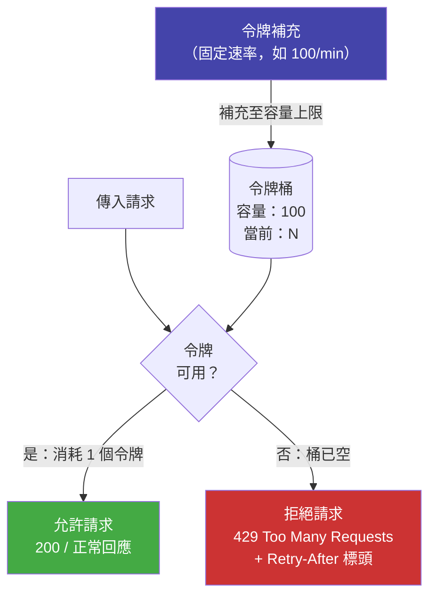

# [BEE-266] 限流與節流

:::info
透過控制客戶端在單位時間內的請求數量，保護服務免於濫用、確保資源公平分配並防止過載。選擇適合你流量模式的演算法，並清楚地將限制資訊傳達給客戶端。
:::

## 背景

公開的 API 端點是共享資源。若無任何限制，任何單一客戶端——無論是行為異常的整合、設定錯誤的重試迴圈或刻意的攻擊——都可能占用不成比例的伺服器容量，導致所有其他客戶端的服務品質下降甚至中斷。

限流（Rate Limiting）是強制執行請求量上限的機制。它並非表示你的 API 脆弱，而是一份合約：告知客戶端可以以多快的速度呼叫你，並提供他們維持在合約範圍內所需的資訊。

限流的必要性在業界早已確立。Stripe 長期公開他們的做法（stripe.com/blog/rate-limiters），指出限流器與負載卸載器是保護其支付基礎設施免受流量突增與惡意客戶端侵害的核心工具。Cloudflare 將其 WAF 限流架構設計在邊緣節點運作，在流量抵達原始伺服器之前便予以攔截（developers.cloudflare.com/waf/rate-limiting-rules）。IETF httpapi 工作組也正在制定透過回應標頭向客戶端傳達限流狀態的標準（datatracker.ietf.org/doc/html/draft-ietf-httpapi-ratelimit-headers）。

限流同時解決三個問題：

- **防止濫用** — 阻止單一客戶端壟斷共享容量
- **確保公平** — 保障所有客戶端獲得相稱的存取機會，不受其請求積極程度影響
- **防止過載** — 作為 API 層的負載卸載閥（參見 [BEE-12005](graceful-degradation.md)），防止流量突增向資料庫及下游服務蔓延

## 原則

**在每個公開介面套用限流。選擇適合流量模式的限流演算法。在每個回應中傳達限制及其當前狀態。超過限制時返回 HTTP 429 並附上 `Retry-After` 標頭。從多個維度套用限制。在執行多個實例時實施分散式限流。**

## 四種核心演算法

### 令牌桶（Token Bucket）

令牌桶最多持有 `capacity` 個令牌。令牌以固定的 `refill_rate` 補充（例如每分鐘 100 個）。每個請求消耗一個令牌。若令牌可用，請求被允許；若桶已空，請求被拒絕並返回 429。

令牌桶是公開 API 中最廣泛採用的演算法。它允許最多 `capacity` 次的短期突增，同時將長期平均速率維持在 `refill_rate`。閒置的客戶端會累積令牌，因此可以進行一次突發呼叫——這符合真實的使用模式（例如行動應用程式啟動時取得初始資料）。

### 漏桶（Leaky Bucket）

漏桶將請求接受進一個固定大小的佇列，並以恆定的洩漏速率處理。若佇列已滿，新請求被拒絕。

相較於令牌桶允許突增，漏桶強制執行嚴格的恆定吞吐量。它更適合流量整形（smoothing bursty clients）而非限流（rejecting violators）。適用於網路入口或下游消費者無法處理突增的情境。

### 固定窗口計數器（Fixed Window Counter）

將時間切分為固定窗口（例如第 0–59 秒、第 60–119 秒）。計算每個客戶端在當前窗口的請求數；超過限制則拒絕。

固定窗口實作簡單、記憶體效率高。已知弱點是**邊界突增問題**：客戶端可以在窗口結束前的最後一刻發出 `limit` 個請求，在窗口重置後的第一秒再發出 `limit` 個，在兩秒內送出 `2 * limit` 個請求而不觸發限流器。對精確度要求低的使用情境（內部服務配額、儀表板 API）可接受此行為；若 API 面對對抗性客戶端，建議改用滑動窗口。

### 滑動窗口（日誌與計數器）

**滑動窗口日誌：** 將每個請求的時間戳儲存在有序集合中。每次新請求到來時，移除超出窗口的時間戳，計算剩餘數量並決定允許或拒絕。準確但在大規模下記憶體消耗高。

**滑動窗口計數器：** 實用的近似做法。分別維護當前窗口與前一窗口的計數。估算請求數為：

```
estimated_count = prev_count * (1 - elapsed_fraction) + curr_count
```

此近似值誤差在幾個百分比以內，每個客戶端僅需兩個計數器。它消除了邊界突增問題，同時避免了完整日誌的記憶體成本。Redis 官方限流教學（redis.io/tutorials/howtos/ratelimiting）推薦此方法作為分散式限流的最佳預設選擇。

### 演算法比較

| 演算法 | 允許突增 | 邊界突增 | 記憶體成本 | 複雜度 |
|---|---|---|---|---|
| 令牌桶 | 是（上限為容量） | 否 | 低 | 低 |
| 漏桶 | 否（嚴格洩漏速率） | 否 | 低 | 低 |
| 固定窗口計數器 | 是 | 是 | 極低 | 極低 |
| 滑動窗口日誌 | 是 | 否 | 高 | 中 |
| 滑動窗口計數器 | 是（近似） | 否 | 低 | 低 |

## 令牌桶流程



## 限流維度

限流沿一個或多個**維度**套用，這些維度是區分不同客戶端的識別符。

| 維度 | 識別符 | 使用情境 |
|---|---|---|
| 每 API 金鑰 | `X-API-Key` 標頭值 | 多租戶 API 的租戶配額 |
| 每使用者 | 已認證使用者 ID | 已認證 API 的每使用者公平性 |
| 每 IP 位址 | 客戶端 IP（含 CIDR 分組） | 未認證端點、登入保護 |
| 每端點 | `(api_key, route)` 複合鍵 | 高成本與低成本操作採用不同限制 |
| 全域 | 所有客戶端的聚合 | 服務的絕對容量上限 |

同時套用多個維度。一個請求可以通過每使用者限制，但若服務飽和仍可被全域限制拒絕。

**按方案分級限制：** 依訂閱方案區分限流上限。免費層 API 金鑰可能允許每分鐘 60 個請求；付費金鑰允許 1,000 個；企業金鑰允許 10,000 個。在 API 金鑰中編碼方案層級，或從認證存儲中查詢。對所有客戶端套用相同限制，無論方案為何，既不公平也是收益設計的失誤。

## HTTP 回應協定

### HTTP 429 Too Many Requests

當請求被拒絕時，返回 `429 Too Many Requests`。務必包含 `Retry-After` 標頭。若沒有此標頭，客戶端無法判斷何時重試，通常會立即重試或在短暫固定延遲後重試，形成雷鳴群效應，讓服務持續承壓。

```
HTTP/1.1 429 Too Many Requests
Retry-After: 30
Content-Type: application/json

{
  "error": "rate_limit_exceeded",
  "message": "API 請求頻率超過限制，請在 30 秒後重試。",
  "retry_after": 30
}
```

### RateLimit 標頭（IETF 草案）

IETF 草案 `draft-ietf-httpapi-ratelimit-headers` 定義了在每個回應中傳達配額狀態的標準標頭——不僅限於 429 回應。在所有回應中包含這些標頭，讓客戶端能在達到限制之前主動降速。

```
RateLimit-Limit: 100
RateLimit-Remaining: 23
RateLimit-Reset: 1712530860
Retry-After: 30
```

| 標頭 | 含義 |
|---|---|
| `RateLimit-Limit` | 當前窗口允許的最大請求數 |
| `RateLimit-Remaining` | 當前窗口剩餘的請求數 |
| `RateLimit-Reset` | 當前窗口重置的 Unix 時間戳 |
| `Retry-After` | 重試前應等待的秒數（僅在 429 時） |

行為良好的客戶端會讀取 `RateLimit-Remaining`，在其趨近於零時降低請求速率，從而完全避免 429 回應。

## 使用 Redis 的分散式限流

單一進程內的計數器在執行超過一個實例時即失效。若三個實例各自允許每分鐘 100 個請求，實際限制變成 300。需要共享狀態。

**使用 Lua 腳本的令牌桶（Redis）：**

```
# 令牌桶 + Redis：原子性地檢查並消耗
# 鍵：rate_limit:{api_key}
# 欄位：tokens（浮點數）、last_refill（Unix 時間戳）

# 使用 Lua 腳本原子寫入，避免 TOCTOU 競爭條件
EVAL """
local key = KEYS[1]
local capacity = tonumber(ARGV[1])
local refill_rate = tonumber(ARGV[2])
local now = tonumber(ARGV[3])

local state = redis.call('HMGET', key, 'tokens', 'last_refill')
local tokens = tonumber(state[1]) or capacity
local last_refill = tonumber(state[2]) or now

local elapsed = now - last_refill
tokens = math.min(capacity, tokens + elapsed * refill_rate)

if tokens >= 1 then
    tokens = tokens - 1
    redis.call('HMSET', key, 'tokens', tokens, 'last_refill', now)
    redis.call('EXPIRE', key, 3600)
    return {1, math.floor(tokens)}   -- 允許，剩餘令牌數
else
    redis.call('HMSET', key, 'tokens', tokens, 'last_refill', now)
    return {0, 0}                    -- 拒絕，剩餘令牌數
end
""" 1 rate_limit:{api_key} {capacity} {refill_rate} {now}
```

使用 Lua 腳本至關重要。Redis 原子性地執行 Lua 腳本——讀取與寫入之間不會有其他命令介入——從而消除若在應用程式邏輯中夾帶 `MULTI/EXEC` 所會引入的時間差競爭條件（TOCTOU）。

GitHub 工程部落格描述了他們如何使用分片複製的 Redis 架構擴展 API 限流器，每分鐘處理數百萬次 API 呼叫，同時維持一致性（github.blog/engineering/infrastructure/how-we-scaled-github-api-sharded-replicated-rate-limiter-redis/）。

**完整範例——每 API 金鑰每分鐘 100 個請求：**

```
# 請求攜帶標頭：X-API-Key: ak_live_abc123
# 容量：100，補充速率：100/60 令牌/秒（約 1.67/秒）

# Redis 鍵：rate_limit:ak_live_abc123
# Lua 腳本返回：{1, 42} => 允許，剩餘 42 個令牌

# 回應標頭：
RateLimit-Limit: 100
RateLimit-Remaining: 42
RateLimit-Reset: 1712530860

# 在 60 秒內發出 100 個請求後，桶已空。
# 下一個請求返回：{0, 0} => 拒絕

HTTP/1.1 429 Too Many Requests
RateLimit-Limit: 100
RateLimit-Remaining: 0
RateLimit-Reset: 1712530860
Retry-After: 17
```

## 不同層的限流

在多個層套用限流。每一層有不同的範圍和執行點。

| 層 | 保護對象 | 粒度 | 負責方 |
|---|---|---|---|
| 邊緣 / CDN | 原始伺服器免受網路流量侵害 | 按 IP、地理位置 | 基礎設施 / 平台團隊 |
| API 閘道 | 閘道後方的所有服務 | 按 API 金鑰、路由、租戶 | 平台團隊 |
| 應用程式 | 個別服務端點 | 按使用者、資源、操作 | 服務團隊 |
| 資料庫 | 連線池與查詢速率 | 每服務全域 | 服務團隊 |

僅依賴邊緣限流是不夠的。內部服務之間的相互呼叫完全繞過了邊緣。沒有應用程式層限流的內部服務，在流量突增時同樣可能被其他內部呼叫者打垮。

## 限流（Rate Limiting）與節流（Throttling）的區別

這兩個術語相關但有所不同。

**限流（Rate Limiting）** 是二元執行：請求數量超過閾值時，請求被以 429 拒絕，直到窗口重置。客戶端負責退讓。

**節流（Throttling）** 是漸進式控制：伺服器減慢對客戶端請求的處理速度（或客戶端自行限制出站速率），以維持在容量範圍內，而不是直接拒絕請求。被節流的客戶端可能會看到延遲增加，而非 429 錯誤。

在實務中，大多數 API 文件將「限流」與「節流」交替使用。在實作層面的操作區別是：限流器拒絕；節流器延遲或降低吞吐量。許多系統同時實現兩者——在達到限流上限時拒絕，在低於限流的軟性閾值時延遲或降速。

## 優雅處理被限流的請求

從客戶端角度（以及服務呼叫其他服務時），收到 429 並非傳統意義上的錯誤，而是退讓的信號。完整的重試退讓指引參見 [BEE-12002](retry-strategies-and-exponential-backoff.md)。關鍵要點：

- 讀取 `Retry-After`，不要在該時間之前重試。
- 在重試時加入隨機抖動（jitter），避免多個客戶端同步發起重試。
- 實作每客戶端的請求佇列並設定深度限制，而非立即觸發重試。
- 將 429 回應作為獨立指標記錄。持續的高 429 率是限制過嚴、客戶端過於積極或程式碼存在缺陷的信號。
- 不要靜默丟棄請求。若操作很重要，將其排入重試佇列；若無法重試，則向使用者呈現錯誤。

## 常見錯誤

### 1. 僅在邊緣限流

內部服務直接互相呼叫，繞過 API 閘道。來自設定錯誤服務的內部流量突增，與外部流量一樣有效地使下游服務過載。每個接受其他服務請求的服務都應強制執行自己的限流。

### 2. 固定窗口邊界突增

固定窗口計數器允許客戶端在一個窗口的最後一秒發出 `limit` 個請求，然後在下一個窗口的第一秒再發出 `limit` 個，在兩秒內送出 `2 * limit` 個請求而不觸發限流器。若此突增模式對你的服務有害，請改用滑動窗口計數器。

### 3. 429 回應中沒有 `Retry-After` 標頭

沒有 `Retry-After`，被限流的客戶端無法得知何時重試。通常會立即重試或在短暫固定延遲後重試，形成雷鳴群效應，使服務持續承壓。務必包含 `Retry-After`。

### 4. 限制對合法使用者過於嚴格

頻繁觸發正常使用模式的限流，會損害開發者體驗並增加支援負擔。應根據觀察到的使用量加上一個餘裕倍數來設定限制，而非使用任意的整數。監控各方案層級的 429 率，當合法客戶端遭到節流時調整設定。

### 5. 未按方案區分限流

對所有 API 金鑰套用相同的限流，無論訂閱方案為何，既不公平也是收益設計的失誤。免費層金鑰應比付費金鑰有更低的上限。預期高請求量的企業客戶需要專屬的限制協商。

## 相關 BEE

- [BEE-1006](../auth/api-key-management.md)（API 金鑰）— API 金鑰是每客戶端限流的主要識別符；金鑰輪換與範圍限定影響限制執行
- [BEE-4006](../api-design/api-error-handling-and-problem-details.md)（錯誤處理）— 429 是應用程式層面的錯誤，必須明確處理，不得視為意外例外
- [BEE-12002](retry-strategies-and-exponential-backoff.md)（重試策略與指數退讓）— 收到 429 後的重試行為；始終包含抖動並遵守 `Retry-After`
- [BEE-12005](graceful-degradation.md)（優雅降級與負載卸載）— 限流作為負載卸載的一層；[BEE-12005](graceful-degradation.md) 涵蓋應用程式層面的卸載策略

## 參考資料

- Stripe Engineering Blog, *Scaling your API with rate limiters*, stripe.com/blog/rate-limiters
- Cloudflare, *Rate limiting rules*, developers.cloudflare.com/waf/rate-limiting-rules
- IETF, *RateLimit header fields for HTTP*, datatracker.ietf.org/doc/html/draft-ietf-httpapi-ratelimit-headers
- GitHub Engineering Blog, *How we scaled the GitHub API with a sharded, replicated rate limiter in Redis*, github.blog/engineering/infrastructure/how-we-scaled-github-api-sharded-replicated-rate-limiter-redis/
- Redis, *Build 5 Rate Limiters with Redis*, redis.io/tutorials/howtos/ratelimiting/
- Alex Xu, *System Design Interview*, Vol. 1, ch. 4 — Design a Rate Limiter
