# [BEE-261] 重試策略與指數退避

:::info
重試預算、抖動，以及何時不應該重試。
:::

## 背景

分散式系統必然會發生失敗。網路掉包、服務重啟、資料庫在高負載下短暫無法回應——這些大多是暫時性的，通常在幾毫秒到幾秒內就會自行恢復。第一次失敗就放棄的客戶端白白浪費了可用性；盲目重試的客戶端則可能讓問題雪上加霜。

正確的重試設計需要平衡四個張力：過於積極的重試會放大負載；同步重試會引發雷群效應（thundering herd）；對非冪等操作重試會產生重複副作用；跨服務層的重試會讓負載呈指數級增長。

**參考資料：**
- Marc Brooker，[Exponential Backoff And Jitter](https://aws.amazon.com/blogs/architecture/exponential-backoff-and-jitter/) — AWS Architecture Blog
- Marc Brooker，[Timeouts, Retries and Backoff with Jitter](https://aws.amazon.com/builders-library/timeouts-retries-and-backoff-with-jitter/) — Amazon Builders' Library
- Google Cloud，[Exponential Backoff — Memorystore for Redis](https://cloud.google.com/memorystore/docs/redis/exponential-backoff)

## 原則

**使用完整抖動的指數退避（full jitter exponential backoff），限制重試總次數，並且絕不對非冪等操作或客戶端錯誤進行重試。**

---

## 重試策略

### 立即重試

不加任何延遲直接重試。僅適用於已知為瞬間條件造成的失敗（例如樂觀並發衝突）。在切換到退避策略前，最多進行一次立即重試。

**風險：** 對已在高負載下掙扎的服務施加更大壓力。

### 固定間隔

每隔固定時間重試（例如每 1 秒）。實作簡單，但當大量客戶端同時失敗時，會形成同步化的重試浪潮。

**風險：** 雷群效應——所有客戶端在同一時刻重試。

### 指數退避

每次失敗後將等待時間加倍：

```
第 1 次嘗試 → 等待 1 秒
第 2 次嘗試 → 等待 2 秒
第 3 次嘗試 → 等待 4 秒
第 4 次嘗試 → 等待 8 秒
...
```

可減輕對正在恢復中的服務的衝擊。但若沒有抖動，同時開始失敗的所有客戶端依然會同步重試。

### 完整抖動的指數退避（建議做法）

加入隨機性，讓各客戶端的重試時間錯開：

```
sleep = random(0, min(cap, base * 2^attempt))
```

其中：
- `base` = 初始延遲（例如 500ms）
- `cap` = 最大延遲上限（例如 30s）
- `attempt` = 從零開始的嘗試次數索引

這是 AWS、Google Cloud 以及 Marc Brooker 的研究所共同推薦的策略。即使有數千個客戶端同時重試，也能維持近似穩定的聚合請求率，讓服務有機會真正恢復。

---

## 抖動不是可選項

沒有抖動的指數退避仍然會產生同步化的重試爆發。所有在時間 T 遭遇相同失敗的客戶端，都會在 T+1s、T+3s、T+7s 重試。這就是雷群效應：正在恢復的服務在最脆弱的時刻，反覆遭受衝擊。

完整抖動讓每個客戶端的延遲相互獨立地隨機化。所有客戶端的聚合負載變得平滑且近似穩定，讓服務有實際機會恢復。

Marc Brooker 的模擬顯示：在相同條件下，沒有抖動時 P99 延遲為 2600ms、錯誤率 17%；加入完整抖動後，P99 降至 1400ms、錯誤率降至 6%。

---

## 指數退避加抖動：視覺化

```mermaid
gantt
    title 完整抖動指數退避（3 個客戶端，4 次嘗試）
    dateFormat  s
    axisFormat  %Ss

    section 客戶端 A
    第 1 次嘗試       :milestone, 0, 0
    等待 ~0.8s        :a1, 0, 0.8s
    第 2 次嘗試       :milestone, after a1, 0
    等待 ~1.6s        :a2, after a1, 1.6s
    第 3 次嘗試       :milestone, after a2, 0
    等待 ~3.2s        :a3, after a2, 3.2s
    第 4 次嘗試 / 放棄 :milestone, after a3, 0

    section 客戶端 B
    第 1 次嘗試       :milestone, 0, 0
    等待 ~0.3s        :b1, 0, 0.3s
    第 2 次嘗試       :milestone, after b1, 0
    等待 ~2.9s        :b2, after b1, 2.9s
    第 3 次嘗試       :milestone, after b2, 0
    等待 ~1.1s        :b3, after b2, 1.1s
    第 4 次嘗試 / 放棄 :milestone, after b3, 0

    section 客戶端 C
    第 1 次嘗試       :milestone, 0, 0
    等待 ~1.0s        :c1, 0, 1.0s
    第 2 次嘗試       :milestone, after c1, 0
    等待 ~0.5s        :c2, after c1, 0.5s
    第 3 次嘗試       :milestone, after c2, 0
    等待 ~3.8s        :c3, after c2, 3.8s
    第 4 次嘗試 / 放棄 :milestone, after c3, 0
```



每個客戶端從相同公式中抽取不同的隨機延遲。重試嘗試分散在時間軸上，而非同步發生。

---

## 虛擬碼：HTTP 客戶端加上指數退避與完整抖動

```python
MAX_RETRIES = 4
BASE_DELAY_MS = 500
CAP_MS = 30_000

def call_with_retry(request):
    for attempt in range(MAX_RETRIES):
        response = http.send(request)

        if response.status == 429 and response.headers.get("Retry-After"):
            # 遵循伺服器指定的等待時間
            sleep(parse_retry_after(response.headers["Retry-After"]))
            continue

        if response.status in RETRYABLE_STATUS_CODES:
            if attempt == MAX_RETRIES - 1:
                raise MaxRetriesExceeded(response)
            delay = random(0, min(CAP_MS, BASE_DELAY_MS * (2 ** attempt)))
            sleep(delay / 1000)
            continue

        # 不可重試：4xx（除 429 外）、成功、業務邏輯錯誤
        return response

    raise MaxRetriesExceeded()

RETRYABLE_STATUS_CODES = {429, 500, 502, 503, 504}
```

重點說明：
- `random(0, max_delay)` 是完整抖動，不是部分抖動，更不是無抖動
- 有 `Retry-After` 標頭時予以遵守
- 4xx 錯誤（除 429 外）不重試
- 重試次數有硬性上限

---

## 應該重試 vs. 不應該重試

### 應該重試

| 情況 | 理由 |
|---|---|
| 5xx 狀態碼 | 伺服器端暫時性失敗 |
| 429 Too Many Requests | 達到速率限制；等待後重試 |
| 連線逾時 | 網路短暫中斷 |
| 連線被拒 | 服務正在重啟 |
| DNS 解析失敗（暫時性） | 基礎設施短暫異常 |

### 不應該重試

| 情況 | 理由 |
|---|---|
| 400 Bad Request | 客戶端發送了無效資料；重試無濟於事 |
| 401 Unauthorized | 憑證缺失或無效；重試無法修復認證問題 |
| 403 Forbidden | 權限不足；重試無法取得存取權限 |
| 404 Not Found | 資源不存在；重試無法讓它憑空出現 |
| 422 Unprocessable Entity | 業務驗證失敗 |
| 沒有去重鍵的非冪等操作 | 會產生重複的副作用 |

**基本規則：4xx 錯誤是客戶端的問題**，重試無法解決；**5xx 錯誤是伺服器的問題**，可能隨著伺服器恢復而自行消失。

---

## 冪等性是前提

對非冪等操作進行重試會產生重複的副作用。例如：

- 重試支付扣款 → 重複扣款兩次
- 重試發送電子郵件 → 寄出兩封信
- 重試庫存扣減 → 扣減了兩倍庫存

在為任何操作加入重試邏輯之前，請確認：
1. 操作本身就是冪等的（GET、DELETE、使用完整替換的 PUT），**或**
2. 操作支援冪等鍵，讓伺服器可以去重（參見 [BEE-4002](../api-design/api-versioning-strategies.md) 與 [BEE-8002](../transactions/isolation-levels-and-their-anomalies.md)）

若兩個條件都不符合，請勿重試。記錄失敗、將錯誤向上拋出，讓人工介入判斷。

---

## 重試預算

每請求的重試上限（例如 `MAX_RETRIES = 4`）是必要的，但還不夠。在系統承壓時，每個客戶端都以各自的最大重試次數重試，會造成負載倍增。

**重試預算（retry budget）** 對整個客戶端或服務中，重試請求所占的比例設置上限：

```
retry_ratio = retry_requests / total_requests
if retry_ratio > BUDGET_THRESHOLD:  # 例如 10%
    reject_retry()  # 改為快速失敗
```

這能防止局部失敗演變為全系統過載。重試預算是系統層級的控制；每請求上限是本地控制。兩者都不可缺少。

---

## 微服務中的重試放大效應

在多層架構中，每個服務各自決定是否重試，最終使總嘗試次數呈幾何級數增長。

**範例：**

```
服務 A → 服務 B → 服務 C
```

- 服務 A 在失敗時重試 3 次
- 服務 B 對每次來自 A 的呼叫重試 3 次
- 服務 C 對每次來自 B 的呼叫重試 3 次

**到達服務 C 的總嘗試次數：**
```
1 次原始請求 × 3（A）× 3（B）× 3（C）= 27 次到達服務 C
```

一個使用者請求在服務 C 失敗，就會對其產生 27 次嘗試。若服務 C 正處於高壓狀態，這種重試放大效應會讓它完全無法恢復。

**緩解策略：**

1. **只在最外層重試** — 內部服務直接傳遞錯誤不進行重試；只有邊緣服務或 API 閘道進行重試
2. **協調重試預算** — 透過 header 傳遞重試上下文，讓下游服務知道這個請求已經是重試了
3. **使用斷路器**（[BEE-12001](circuit-breaker-pattern.md)）— 當下游服務確認故障時，完全停止重試
4. **搭配逾時限制**（[BEE-12002](retry-strategies-and-exponential-backoff.md)）— 有界的逾時設定可防止重試堆疊延遲

---

## Retry-After 標頭

當伺服器回應 429 或 503 時，可能包含 `Retry-After` 標頭，指示客戶端何時應該重試：

```http
HTTP/1.1 429 Too Many Requests
Retry-After: 30
```

有 `Retry-After` 標頭時，務必遵守。不要在其基礎上再疊加自己的退避計算——伺服器已明確告知重試時間。

---

## 常見錯誤

### 1. 對非冪等操作重試

在沒有冪等鍵的情況下，對支付或建立訂單的端點加入重試邏輯，會導致重複交易。在重試前請務必確認冪等性（[BEE-4002](../api-design/api-versioning-strategies.md)、[BEE-8002](../transactions/isolation-levels-and-their-anomalies.md)）。

### 2. 沒有抖動

```python
# 錯誤：同步化的重試
delay = BASE_DELAY * (2 ** attempt)

# 正確：完整抖動
delay = random(0, min(CAP, BASE_DELAY * (2 ** attempt)))
```

沒有抖動，遭遇相同故障的數千個客戶端將以同步波浪方式重試，反覆衝擊正在恢復的服務。

### 3. 對 4xx 錯誤重試

4xx 錯誤代表請求本身有問題。重試只是再次發送相同的問題請求，必然再次失敗。對 4xx 重試浪費了容量，也掩蓋了 bug。

### 4. 沒有最大重試次數限制

沒有硬性上限，持續失敗下的重試迴圈會變成無限迴圈。務必定義 `MAX_RETRIES`。

### 5. 跨服務層的重試放大

每個服務層各自獨立加入重試，負載會呈幾何級數增長。重試策略需要在整個呼叫圖中協調，而非只在單一服務內部考慮。

---

## 總結

| 策略 | 抖動 | 建議度 |
|---|---|---|
| 立即重試 | 無 | 僅適用於 OCC 衝突，最多 1 次 |
| 固定間隔 | 無 | 分散式系統中應避免 |
| 指數退避 | 無 | 優於固定間隔，但仍有雷群效應風險 |
| 指數退避 + 完整抖動 | 有 | 建議的預設做法 |

**公式：**
```
sleep = random(0, min(cap, base * 2^attempt))
```

**規則：**
- 應重試：5xx、429、逾時、連線錯誤
- 不應重試：4xx（除 429 外）、沒有去重鍵的非冪等操作
- 限制重試次數：每請求的硬性上限 + 系統層級的重試預算
- 有 `Retry-After` 標頭時予以遵守
- 微服務中：避免在每一層都重試；搭配使用斷路器

---

## 相關 BEE

- [BEE-4002](../api-design/api-versioning-strategies.md) — 冪等鍵，讓重試安全可行
- [BEE-8002](../transactions/isolation-levels-and-their-anomalies.md) — 透過去重實現精確一次傳遞
- [BEE-12001](circuit-breaker-pattern.md) — 斷路器，在下游服務故障時停止重試
- [BEE-12002](retry-strategies-and-exponential-backoff.md) — 逾時設定，限制重試的延遲上限
