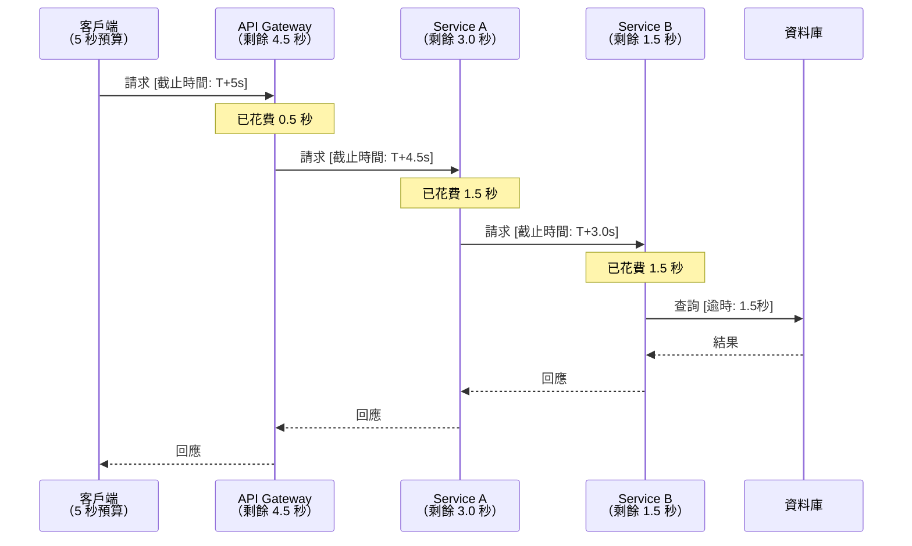

# [BEE-262] 逾時與截止時間

:::info
每個整合點都必須設定逾時。截止時間必須跨服務邊界傳遞，確保當上游呼叫方已放棄等待時，下游的工作也能同步中止。
:::

## 背景

分散式系統透過不可靠的網路進行通訊。遠端呼叫可能無限期掛起：網路封包遺失、遠端主機記憶體不足、資料庫鎖被持有，或 GC 暫停凍結了程序。若沒有逾時設定，呼叫端的執行緒或連線槽將永久被佔用。在高負載下，單一緩慢的依賴服務可能在幾秒內耗盡整個執行緒池，阻塞所有請求——即使是與該緩慢依賴毫無關聯的請求——這是典型的級聯故障。

Amazon Builders' Library 記錄到，缺少或過於寬鬆的逾時設定是大型分散式系統中可用性事故最常見的根本原因之一（[逾時、重試與抖動退避](https://aws.amazon.com/builders-library/timeouts-retries-and-backoff-with-jitter/)）。

## 原則

**在每個整合點設定逾時。將截止時間傳遞給每個下游呼叫。永遠不要讓下游逾時比上游呼叫方的剩餘預算更長。**

## 核心概念

### 逾時類型

| 類型 | 保護目標 | 典型設定 |
|------|---------|---------|
| **連線逾時** | 建立 TCP/TLS 握手的等待時間 | 1–5 秒 |
| **讀取逾時** | 連線建立後，等待接收第一個（或下一個）位元組的時間 | 依依賴服務的 P99 設定 |
| **寫入逾時** | 完成傳送請求主體的時間 | 依酬載大小與頻寬設定 |
| **閒置逾時** | Keep-alive 連線閒置的最長時間 | 大多數 HTTP 伺服器為 60–90 秒 |
| **請求逾時** | 完整請求/回應週期的端對端時間預算 | 預期處理時間 + 網路 RTT + 緩衝 |

連線逾時與讀取逾時是開發者最常設定錯誤的兩個設定。將任一項留為預設值——或設為 `0`（無限）——會造成緩慢的資源洩漏，僅在高負載下才會顯現。

### 為何沒有逾時等同於資源洩漏

每個進行中的 HTTP 呼叫、資料庫查詢或訊息佇列操作，至少會佔用一項資源：執行緒、檔案描述符、連線池槽位，或記憶體中的緩衝。若沒有逾時：

1. 緩慢或卡住的遠端端點將無限期持有資源。
2. 在高並發下，池位被填滿。
3. 新請求開始排隊，然後失敗或在等待槽位時逾時。
4. 服務對其呼叫方顯得不可用——即使根本原因只是一個緩慢的下游服務。

### 截止時間 vs. 逾時

**逾時（Timeout）**是從當前跳點開始計算的持續時間。**截止時間（Deadline）**是一個絕對時間點（或從原始客戶端請求開始計算的相對持續時間）。在多服務呼叫鏈中，截止時間更為理想，因為它表達的是總剩餘預算，而非單一跳點的限制。

gRPC 原生支援截止時間。客戶端設定截止時間；gRPC 將其轉換為 `grpc-timeout` 傳輸標頭，表示剩餘持續時間；每個伺服器在接收時重建絕對截止時間，減去已花費的時間，並將剩餘時間傳遞給它發出的任何下游呼叫（[gRPC Deadlines 指南](https://grpc.io/docs/guides/deadlines/)）。這保護系統不受時鐘偏移影響，並消除手動計算每跳逾時的心理負擔。

### 逾時預算與傳遞

```
客戶端總預算 = 5 秒
  └─ API Gateway 收到請求，已花費 0.5 秒 → 傳遞剩餘 4.5 秒
      └─ Service A 收到請求，已花費 1.5 秒 → 傳遞剩餘 3.0 秒
          └─ Service B 收到請求，已花費 1.5 秒 → 傳遞剩餘 1.5 秒
              └─ 資料庫查詢必須在 1.5 秒內完成
```

下圖展示這個逐漸縮減的預算：



每個跳點在發出下游呼叫前，先檢查剩餘預算。若預算已耗盡，服務立即回傳錯誤，而非發出一個已知會被取消的呼叫。

## 設定適當的逾時值

**先量測，再設定。**

1. 在正常負載下，收集所呼叫依賴服務的 P99（以及 P999）延遲數據。
2. 加上安全邊際——對於非關鍵路徑，通常在 P99 之上加 50–100%；對於需要快速卸載的熱路徑則稍少。
3. 確認逾時比上游呼叫方在該呼叫鏈位置的剩餘預算更短。
4. 在容量變更、重大版本發布或事故回顧後重新評估。

一個常見的錯誤是設定「安全」的值，例如 30 秒，因為感覺很保守。若 P99 是 200 毫秒，30 秒的逾時完全無法在事故中提供保護——它只是將故障延遲了 30 秒，同時讓執行緒持續被佔用。

## 逾時設定錯誤的範例

**錯誤設定（問題版本）：**

```
客戶端 → API Gateway（逾時：30 秒）
              └─ 後端服務（逾時：60 秒）
                       └─ 資料庫查詢（無逾時）
```

情境：資料庫正在鎖定競爭。查詢執行了 60 秒。
- API Gateway 的 30 秒逾時觸發，向客戶端回傳 `504 Gateway Timeout`。
- 後端服務執行緒仍被阻塞等待資料庫——再等 30 秒。
- 資料庫持有鎖定和連線槽位長達 60 秒。
- 結果：客戶端立即收到錯誤；後端在無人接收結果的工作上浪費了 60 秒的資源。

**正確設定（修正版本）：**

```
客戶端 → API Gateway（逾時：5 秒）
              └─ 後端服務（逾時：4 秒）
                       └─ 資料庫查詢（逾時：3 秒）
```

- 資料庫查詢在 3 秒後被取消，釋放鎖定和連線槽位。
- 後端服務有足夠的時間（4 秒預算）處理錯誤並回傳結構化回應。
- API Gateway 有足夠的時間（5 秒預算）從後端接收錯誤回應。
- 客戶端在 5 秒內收到有意義的錯誤訊息。

核心規則：**在每個跳點，下游逾時必須嚴格小於上游逾時**。下游逾時等於或大於上游逾時，意味著上游先行取消，讓下游持續做無人接收結果的無用功。

## 在每個整合點設定逾時

對每個外部呼叫套用逾時，無一例外：

| 整合點 | 需設定的逾時類型 |
|--------|----------------|
| 對外 HTTP 呼叫 | 連線逾時 + 讀取逾時（大型上傳加寫入逾時） |
| 資料庫客戶端 | 查詢逾時 + 連線取得逾時 |
| 快取（Redis、Memcached） | 指令逾時 + 連線逾時 |
| 訊息佇列（Kafka、RabbitMQ、SQS） | 生產逾時、消費輪詢逾時 |
| gRPC 呼叫 | 每個 RPC 的截止時間 |
| 內部任務 / goroutine / 非同步任務 | Context deadline 或 `WithTimeout` |

許多 HTTP 客戶端函式庫預設沒有逾時（例如 Go 的 `http.Client`、不帶 `timeout=` 的 Python `requests`）。務必明確設定。

## 常見錯誤

### 1. 未設定逾時

最危險的錯誤。執行緒持續累積，服務在高負載下悄然停止回應。修正方式：永遠明確設定連線逾時和讀取逾時，即使對「快速」的依賴服務也不例外。

### 2. 逾時設定過於寬鬆

當 P99 是 200 毫秒時，30 秒的逾時在事故發生時毫無保護作用——它只是將故障延遲 30 秒。修正方式：根據實際量測的延遲百分位數設定逾時，而非直覺。

### 3. 未將截止時間傳遞給下游

服務對自身的傳入請求設定了 5 秒逾時，但對外呼叫時沒有逾時，或使用了全新的 10 秒逾時。上游呼叫方在 5 秒後放棄，但下游呼叫繼續執行 10 秒——浪費工作、洩漏連線。修正方式：從傳入請求截止時間的剩餘預算推導下游逾時。

### 4. 下游逾時比上游更長

```
API Gateway：5 秒
  └─ 服務：10 秒   ← 永遠是浪費——Gateway 早已回傳 504
```

修正方式：強制每個下游逾時嚴格小於上游預算，並為該跳點自身的處理時間保留足夠的餘量。

### 5. 將逾時錯誤視為未知錯誤

逾時是已知、預期的故障模式。它們通常是可重試的（需配合冪等性保護——參見 [BEE-12002](retry-strategies-and-exponential-backoff.md)），不應與 `500 Internal Server Error` 混為一談。在錯誤處理邏輯中區分 `DEADLINE_EXCEEDED` / `408 Request Timeout` / `504 Gateway Timeout`，讓呼叫方能做出明智的重試決策。

## 級聯逾時故障

當下游服務緩慢時，逾時可以保護上游——但前提是逾時設定正確。需要避免的故障模式：

1. Service A 對 Service B 的呼叫設定了 10 秒逾時。
2. Service B 對其資料庫查詢設定了 15 秒逾時。
3. 在高負載下，資料庫變慢，Service B 的查詢開始耗時 12 秒。
4. Service A 在 10 秒後逾時，但 Service B 每個請求仍被阻塞另外 5 秒。
5. Service B 的執行緒池被填滿。
6. Service A 重試（進一步加重過載——參見 [BEE-12002](retry-strategies-and-exponential-backoff.md)）。
7. Service B 的熔斷器（參見 [BEE-12001](circuit-breaker-pattern.md)）應該開啟，但由於 Service B 從未回傳錯誤（只是掛起），熔斷器無法反應。

修正方式：將 Service B 的資料庫查詢逾時設定為小於 Service A 對 Service B 的逾時。Service B 會快速回傳錯誤，熔斷器得以反應，Service A 的重試會觸發已開啟的熔斷器，而非打到一個掛起的伺服器。

## 相關 BEE

- [BEE-3001](../networking-fundamentals/tcp-ip-and-the-network-stack.md) — TCP Keepalive 與 Socket 層級逾時
- [BEE-12001](circuit-breaker-pattern.md) — 熔斷器：當依賴服務持續逾時時的自動降級
- [BEE-12002](retry-strategies-and-exponential-backoff.md) — 逾時後重試：冪等性、退避與重試預算
- [BEE-13003](../performance-scalability/connection-pooling-and-resource-management.md) — 連線池：取得逾時與池大小調整

## 參考資料

- [Timeouts, retries and backoff with jitter — Amazon Builders' Library](https://aws.amazon.com/builders-library/timeouts-retries-and-backoff-with-jitter/)
- [gRPC Deadlines — grpc.io](https://grpc.io/docs/guides/deadlines/)
- [gRPC and Deadlines (blog) — grpc.io](https://grpc.io/blog/deadlines/)
- [Reliable gRPC services with deadlines and cancellation — Microsoft Learn](https://learn.microsoft.com/en-us/aspnet/core/grpc/deadlines-cancellation)
- [Timeout strategies in microservices architecture — GeeksforGeeks](https://www.geeksforgeeks.org/system-design/timeout-strategies-in-microservices-architecture/)
- [Connection Timeouts vs Read Timeouts: Why They Matter in Production — Medium](https://medium.com/@manojbarapatre13/connection-timeouts-vs-read-timeouts-why-they-matter-in-production-50b9261cd8ed)
