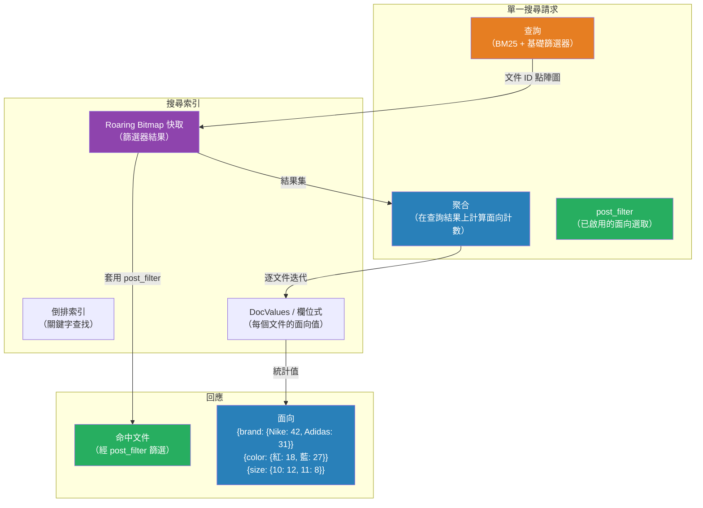

# [BEE-17003] 多面向搜尋與篩選

:::info
多面向搜尋讓使用者能透過選取屬性值，逐步縮小大型結果集的範圍——這個模式由加州大學柏克萊分校的 Flamenco 專案所奠定，現已是電子商務、圖書館與企業搜尋介面的標準設計。
:::

## 情境

在多面向導覽出現之前，想在早期電子商務網站找到一個商品，要嘛得知道它的確切名稱，要嘛就是在僵硬的分類樹裡一層層翻找。2002 年，加州大學柏克萊分校資訊學院的 Marti Hearst 教授及其團隊啟動了 Flamenco 專案（FLexible information Access using MEtadata in Novel COmbinations，使用元資料進行靈活資訊存取的新穎組合），這是一套運用階層式多面元資料引導使用者在大型資料集中瀏覽的研究系統。Flamenco 在 2006 年以開源形式發布，彼時亞馬遜、eBay 和圖書館系統已將這個模式投入商業應用。如今，每個電子商務網站側邊的篩選面板，都是這項研究的直接後裔。

多面向搜尋解決的是一個切實的工程問題：擁有一百萬件商品的語料庫無法靠捲動頁面來瀏覽。使用者需要透過逐步精煉來表達意圖——「顯示尺寸 10、售價 100 元以下、有庫存的跑鞋」——而且他們事先不知道想套用哪些屬性，或要以什麼順序套用。系統不只要回傳符合條件的商品，還要顯示每個剩餘篩選選項下有多少商品，讓使用者在點選前就能看到資料的分布情形。

這個計數需求——在單一查詢中，針對每個面向計算已篩選結果集下各值的出現頻率——正是讓多面向搜尋成為獨特工程問題的原因，它無法用重複執行 SQL `COUNT(*)` 查詢來天真解決；在規模化場景下，它需要專門的資料結構與查詢執行策略。

## 設計思維

多面向搜尋橫跨資訊架構與後端基礎設施兩個領域。在設計階段所做的兩個決定，幾乎決定了系統的一切效能表現：

**面向基數（Facet Cardinality）**——面向有多少個不同值。「性別」面向有 {男性、女性、中性} 三個值，屬於低基數。「品牌」面向有 5 萬個廠商，屬於高基數。低基數面向可以窮舉列出所有值；高基數面向通常需要截取前 N 名、提供面向內搜尋，或進行近似計數。

**篩選邏輯**——多個面向選取如何組合。標準 UX 慣例為：
- **同一面向內**：OR（或）邏輯。同時選取「Nike」和「Adidas」，顯示來自任一品牌的商品。
- **跨面向之間**：AND（且）邏輯。在「品牌」下選取「Nike」，在「分類」下選取「跑步」，顯示 Nike 跑鞋。

這個不對稱性看似違反直覺，卻至關重要。它意味著「品牌」面向的聚合查詢，MUST（必須）排除任何已套用的品牌篩選（讓使用者看到其他品牌的計數），同時仍套用其他所有已啟用的面向（顏色、尺寸、分類）。若處理錯誤，面向將靜默地顯示零計數，即使那些選項實際上是有效的。

## 最佳實踐

### 將聚合與結果篩選分離

MUST NOT（不得）在計算聚合時，將面向篩選放入主搜尋查詢內部。若在查詢中篩選 `color:red`，顏色面向的 terms 聚合將只看到紅色文件，使其他顏色看起來不存在。

正確模式將兩件事分開處理：

1. 執行搜尋查詢，套用所有非顏色篩選條件。
2. 在該結果集上計算顏色 terms 聚合（顯示在其他篩選條件下所有可用顏色）。
3. 透過 `post_filter` 在聚合完成後才套用顏色篩選——縮小回傳的命中文件，但不影響聚合範圍。

在 Elasticsearch 和 OpenSearch 中，`post_filter` 正是為此目的而存在：

```json
{
  "query": {
    "bool": {
      "filter": [
        { "term": { "category": "running-shoes" } },
        { "range": { "price": { "lte": 100 } } }
      ]
    }
  },
  "aggs": {
    "brand-facet": {
      "terms": { "field": "brand.keyword", "size": 20 }
    },
    "color-facet": {
      "terms": { "field": "color.keyword", "size": 10 }
    },
    "size-facet": {
      "terms": { "field": "size.keyword", "size": 15 }
    }
  },
  "post_filter": {
    "term": { "brand.keyword": "nike" }
  }
}
```

聚合能看到 100 元以下的所有跑鞋。回傳的命中文件則進一步縮限為 Nike 商品。品牌面向仍顯示所有品牌的計數——這正是使用者切換品牌前所需要知道的資訊。

### 面向聚合使用 keyword 欄位

MUST（必須）將面向欄位索引為 `keyword` 類型（或在你的儲存引擎中對應的非分析欄位類型）。經過分析的文字欄位會被斷詞，這意味著 `brand: "New Balance"` 這個商品會產生 `["new", "balance"]` 兩個 token，造成面向條目為 `"new"` 和 `"balance"`，而非 `"New Balance"`。在已分析欄位上執行 terms 聚合會產生毫無意義的結果。

在 Elasticsearch 中，使用多欄位（multi-fields）同時保留可搜尋的分析版本和 keyword 版本：

```json
"brand": {
  "type": "text",
  "fields": {
    "keyword": { "type": "keyword" }
  }
}
```

在 `brand`（已分析）上搜尋；在 `brand.keyword`（精確）上做面向計數。

### 限制面向數量上限，並為高基數提供面向內搜尋

SHOULD（應該）不要在單一回應中回傳高基數面向的所有值。擁有 5 萬個值的品牌面向，在每次搜尋請求中都會傳輸龐大的資料量。為 terms 聚合設定 `size`，限制在 UI 能有效展示的最大值數量（通常為 10–20）。為需要找到特定值（未在前 N 名中出現）的使用者提供面向內搜尋輸入框。

在分散式搜尋叢集中，`size` 設定會影響分片層級的聚合準確性。每個分片回傳自己的前 N 名，協調節點再進行合併。在分片 A 排名第 15、在分片 B 排名第 12 的面向值，全域可能排名第 8，但若 `size` 設為 10 則會遺漏。SHOULD（應該）將 `shard_size` 設為 `size` 的倍數（通常為 1.5 到 3 倍），以減少這種過度請求誤差，代價是增加網路與計算開銷。

### 保持面向索引與資料來源同步

MUST（必須）確保搜尋索引中的面向欄位值反映當前商品或內容的狀態。一個已無庫存但在「有庫存」面向中仍顯示非零計數的商品，會造成破碎的使用者體驗。索引更新 SHOULD（應該）在使用者能接受的延遲時間窗內完成——電子商務通常是秒到分鐘級，而非小時級。

當使用獨立搜尋引擎與主資料庫並存時，MUST（必須）維護明確的同步管線。將搜尋索引視為衍生視圖，而非資料來源，並設計能應對其暫時落後或需從頭重建的情況。

### 刻意設計面向的顯示順序

MAY（可以）依以下方式排序面向：（a）商業優先級（最具影響力的篩選條件排在前面）；（b）鑑別力（最能縮小結果集的面向排在前面）；（c）查詢時的信號（根據查詢時計算的值分布最廣的面向排在前面）。依商業優先級進行靜態排序最易實作，對大多數場景也已足夠。基於結果集分布的動態排序會增加延遲與複雜性，多數使用案例中 UX 改善有限。

SHOULD（應該）折疊零結果的面向，而非顯示為灰色。零計數的面向是視覺干擾，會誤導使用者認為自己篩選掉了某些從一開始就不存在的內容。

## 深入探討

### 搜尋引擎如何在內部計算面向計數

面向計數需要知道，在當前結果集中，每個可能的面向值出現在多少文件中。天真的做法——對每個值，將其倒排索引的 posting list 與查詢結果集取交集並計數——複雜度為 O(V × N)，其中 V 為面向值數量，N 為結果集大小。對高基數欄位而言，這會變得不可行。

現代搜尋引擎使用兩種優化：

**DocValues / 欄位式儲存**：面向聚合不讀取倒排索引（從詞彙映射到文件），而是讀取一種欄位式結構，它將文件 ID 映射到其欄位值。迭代結果集並查找每個文件的面向值，比逐個詞彙遍歷 posting list 對快取更友善。

**Roaring Bitmaps**：結果集本身以壓縮點陣圖（roaring bitmaps，Lucene 5 採用）表示在文件 ID 上。將此點陣圖與每個面向值的 posting list 取交集計數，可化簡為位元 AND 運算後跟 popcount——這些操作現代 CPU 可以批量執行。Apache Lucene 將 roaring bitmaps 用於篩選器快取；每個快取的篩選器都是一個符合文件 ID 的 roaring bitmap，在聚合期間可以瞬間與其他點陣圖取交集。

對於極高基數的面向，Elasticsearch 和 Solr 支援透過抽樣進行近似計數。例如，LinkedIn 的 Galene 搜尋引擎將文件 ID 空間分割成區間，並使用線性插值估計面向密度函數，從而在 CPU 負載降低 7 倍、p99 延遲降低 11 倍的情況下，達成中位數誤差率低於 5% 的近似計數。

### 範圍面向

數值和日期欄位需要範圍面向，而非詞彙面向。擁有 500 個不同值的價格欄位，若以詞彙面向呈現，會產生 500 個無法使用的選項；將其分桶為「$0–$25」、「$25–$50」、「$50–$100」、「$100+」才是使用者所需。

範圍面向策略：

- **固定邊界**：在索引或查詢時定義。簡單但缺乏彈性——必須在知道資料分布之前就決定桶的範圍。
- **直方圖 / 自動區間**：引擎依照資料範圍除以請求的桶數自動計算邊界。適用於日期：「依月分組」或「依年分組」。
- **根據結果統計動態設定範圍**：查詢當前結果集的最小值/最大值，再按比例定義桶的邊界。更精確，但需要兩個查詢階段。

在 Elasticsearch 中，`date_histogram` 聚合支援能正確處理月份長度差異和閏年的日曆感知區間（`month`、`year`）：

```json
"year-facet": {
  "date_histogram": {
    "field": "published_at",
    "calendar_interval": "year",
    "format": "yyyy",
    "min_doc_count": 1
  }
}
```

設定 `min_doc_count: 1` 可抑制空桶，保持面向顯示的整潔。

### 樞紐與階層式面向

樞紐面向（Solr 術語）或巢狀聚合（Elasticsearch）產生樹狀結構：欄位 A 的面向值，以及每個值下欄位 B 的面向值。這適用於「國家 → 地區 → 城市」的下鑽導覽。

```json
"geography": {
  "terms": { "field": "country.keyword" },
  "aggs": {
    "region": {
      "terms": { "field": "region.keyword" }
    }
  }
}
```

階層式面向在樹狀結構較淺（2–3 層）且每層基數低至中等時效果最佳。每層基數都高的深層階層，會在聚合大小和延遲上造成組合爆炸。

## 視覺化



## 範例

以下虛擬碼說明完整的多面向搜尋請求，以及如何解析回應以渲染 UI。

```
// -- 請求建構器 --

function buildFacetedSearchRequest(query, activeFilters, activeFacetFilters):
    // 基礎篩選器：非面向限制條件（如有庫存、價格區間）
    baseFilters = activeFilters                          // 例如 {price: {lte: 100}}

    // 面向篩選器：使用者已選取的面向條件
    // 透過 post_filter 套用，不放入主查詢內部
    postFilter = buildBoolFilter(activeFacetFilters)     // 例如 {brand: "Nike", color: "Red"}

    return {
        query: {
            bool: {
                must:   buildTextQuery(query),           // BM25 相關性
                filter: buildBoolFilter(baseFilters)     // 價格、庫存等
            }
        },
        aggs: {
            "brand-agg":  { terms: { field: "brand.keyword",  size: 20, shard_size: 60 } },
            "color-agg":  { terms: { field: "color.keyword",  size: 10, shard_size: 30 } },
            "size-agg":   { terms: { field: "size.keyword",   size: 15, shard_size: 45 } },
            "price-hist": {
                histogram: { field: "price", interval: 25, min_doc_count: 1 }
            }
        },
        post_filter: postFilter,
        size: 20,         // 每頁命中數
        from: page * 20   // 分頁偏移量
    }

// -- 回應解析器 --

function parseFacets(response):
    facets = {}

    for facetName, aggResult in response.aggregations:
        if aggResult has "buckets":
            facets[facetName] = {
                bucket.key: bucket.doc_count
                for bucket in aggResult.buckets
                if bucket.doc_count > 0       // 略過零計數值
            }

    return facets

// -- UI 渲染 --

function renderSidebar(facets, activeFilters):
    for facetName, valueCounts in facets:
        renderFacetGroup(
            title:  facetName,
            values: [
                { label: value, count: count, checked: value in activeFilters[facetName] }
                for value, count in valueCounts
                sorted by count descending
            ]
        )
```

**結果：單一來回傳輸**同時回傳分頁命中文件和面向側邊欄資料，且計數反映當前篩選狀態。

## 失敗模式

**寫入後面向計數過時** — 搜尋索引與資料來源之間存在最終一致性。從資料庫刪除的商品，可能在面向計數中仍存在數分鐘乃至數小時，取決於同步間隔。使用者可能選取某個面向值後發現零結果，因為底層文件已被移除。可透過在結果渲染時加入零計數防護，以及縮短高可見度資料的索引同步延遲來緩解。

**無界 `size` 導致面向爆炸** — 將 terms 聚合的 `size` 設為 10000 以「顯示所有值」，會傳輸龐大資料量，並帶來與基數成比例的聚合開銷。MUST（必須）設定合理的 `size` 上限，並為長尾提供面向內搜尋。

**依賴 `post_filter` 確保正確性但未理解其代價** — `post_filter` 在主查詢階段之後才執行，無法受益於查詢層篩選優化（如篩選器快取）。對於 post-filtering 會過濾掉大量文件的結果集，浪費的評分與檢索成本會累積。在選擇 `post_filter` 與重構查詢本身之前，SHOULD（應該）先分析篩選器的分布情況。

**分散式叢集中的聚合準確性** — 在分片索引中，terms 聚合產生的是近似結果。預設的 `size: 10` 可能遺漏在部分分片上才進入前 N 名的全域熱門面向值。當準確性很重要時，MUST（必須）增加 `shard_size`，並記錄準確性與網路/計算成本之間的取捨。

**忽略多選邏輯** — 許多團隊將多面向搜尋實作成同一面向中選取兩個值時套用 AND 邏輯，只顯示同時具備兩者的商品。這幾乎從來都是錯誤的——選取「紅色」和「藍色」的使用者想看到任何紅色或藍色的商品，而非同時是兩種顏色的商品。MUST（必須）在實作期間明確測試多選行為。

## 相關 BEE

- [BEE-17001](full-text-search-fundamentals.md) -- 全文搜尋基礎：倒排索引、分析管線和 BM25 評分，是實作多面向搜尋所用搜尋引擎的基礎。
- [BEE-17002](search-relevance-tuning.md) -- 搜尋相關性調校：如何衡量並改善面向所操作的命中集合中的結果排名。
- [BEE-4004](../api-design/pagination-patterns.md) -- 分頁模式：多面向搜尋回應需要分頁；偏移量、游標和 keyset 分頁均適用。
- [BEE-9003](../caching/cache-eviction-policies.md) -- 快取驅逐策略：熱門的面向查詢可受益於聚合結果的應用層快取。

## 參考資料

- [Faceted Metadata for Information Architecture and Search -- Marti A. Hearst, CHI 2006](https://flamenco.berkeley.edu/talks/chi_course06.pdf)
- [Flamenco Project Home -- UC Berkeley School of Information](https://flamenco.berkeley.edu/)
- [The Many Facets of Faceted Search -- LinkedIn Engineering](https://engineering.linkedin.com/faceting/many-facets-faceted-search)
- [Filter search results (post_filter) -- Elasticsearch Reference](https://www.elastic.co/guide/en/elasticsearch/reference/current/filter-search-results.html)
- [Faceted Search Tutorial -- Elasticsearch Labs](https://www.elastic.co/search-labs/tutorials/search-tutorial/full-text-search/facets)
- [Faceting -- Apache Solr Reference Guide](https://solr.apache.org/guide/solr/latest/query-guide/faceting.html)
- [Frame of Reference and Roaring Bitmaps -- Elastic Blog](https://www.elastic.co/blog/frame-of-reference-and-roaring-bitmaps)
- [Better bitmap performance with Roaring bitmaps -- Lemire et al., arXiv:1402.6407](https://arxiv.org/abs/1402.6407)
- [Design Patterns: Faceted Navigation -- A List Apart](https://alistapart.com/article/design-patterns-faceted-navigation/)
