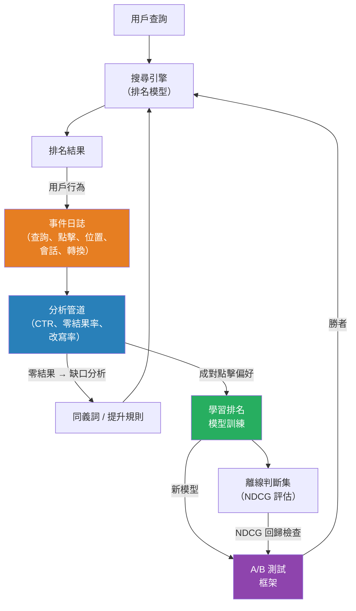

# [BEE-17009] 搜尋分析與反饋循環

:::info
搜尋分析將用戶行為——點擊、查詢改寫、放棄——轉換為持續改善相關性的信號。若沒有檢測，搜尋是個黑箱；有了它，每次查詢都成為下一次迭代的數據點。
:::

## Context

一個上線後從不改變的搜尋引擎，隨著時間推移會相對於用戶期望而退化。目錄會演變，語言會轉移，新的使用模式也會出現。搜尋分析的學科彌合了用戶行為與排名模型響應之間的差距。

這個領域的基礎洞見來自 Joachims 等人 2005 年在 SIGIR 發表的論文「Accurately Interpreting Clickthrough Data as Implicit Feedback」。他們受控的眼動追蹤研究表明，點擊是有偏見的——用戶無論實際相關性如何，都更可能點擊頁面頂部的結果——但這種偏見是一致且可預測的。在同一會話中的相對比較（用戶點擊了結果 A 但未點擊顯示在其上方的結果 B？）攜帶了關於偏好的真實信號，即使絕對點擊率不然。這篇論文確立了生產流量的隱式反饋可用於訓練排名模型，開創了從點擊數據中學習排名的領域。

**在線指標**衡量用戶在生產環境中的行為：

- **點擊率（CTR）**：導致至少一次點擊的查詢比例。自然搜尋結果第一位歷史上獲得約 28–30% 的 CTR；位置越低急劇下降（Sistrix，2020 年）。CTR 本身具有誤導性，因為存在位置偏見：排名第 1 的差結果比排名第 5 的好結果獲得更多點擊。使用相對於該位置預期 CTR 的 CTR。
- **零結果率**：返回無結果的查詢比例。零結果查詢是完全失敗。行業實踐將任何超過 5–8% 的情況視為需要調查的信號。根本原因包括庫存缺口、過激過濾或稀有詞彙的分詞失敗。
- **查詢改寫率**：用戶在第一次查詢後立即發出第二次查詢的會話比例。高改寫率表明第一次查詢失敗。區分富有成效的改寫（用戶縮小範圍）和沮喪的改寫（用戶在零結果後嘗試同義詞）。
- **搜尋放棄率**：用戶離開而未點擊任何結果。零結果後放棄是預期的；顯示結果後放棄表明相關性失敗。
- **點擊時間 / 首次結果交互時間**：從查詢提交到用戶選擇結果的時間。時間越長可能表明排名不佳導致的掃描疲勞。

**離線指標**根據人工判斷集評估排名模型：

- **NDCG（歸一化折扣累計增益）**：標準的學術和行業相關性指標。結果被評級（例如，0 = 不相關，1 = 部分相關，2 = 相關，3 = 高度相關）。增益按 log₂(位置 + 1) 折扣，因此排名較低的結果影響較小。分數相對於理想排名進行歸一化。NDCG@10——衡量前 10 個結果——是網頁和電子商務搜尋中最常見的變體。
- **MRR（平均倒數排名）**：在所有查詢中第一個相關結果排名的 1/rank 的平均值。當只有第一個相關結果重要時很有用（導航查詢、答案檢索）。比 NDCG 更簡單，但丟棄第一個命中之後的所有信號。
- **Recall@K**：在前 K 個結果中檢索到的已知相關文件的比例。對於檢索召回率評估特別重要，尤其是在向量搜尋中，調整 HNSW 參數影響召回率與延遲的權衡。

**反饋循環架構**有三個階段。檢測捕獲原始事件（查詢文本、結果 ID、位置、點擊、轉換）到流或事件日誌中。分析將這些事件聚合為指標——零結果儀表板、按查詢分類的 CTR 報告、改寫漏斗。學習將分析轉換為模型更新：從改寫對中衍生的同義詞規則、從點擊數據中提取的提升規則，或從會話日誌中提取的成對偏好訓練的梯度提升樹。

**學習排名（LTR）**是成熟反饋循環的終態。逐點 LTR（每個結果訓練一個相關性分類器）、成對 LTR（RankNet，Burges 等人 2005 年在微軟）和列表式 LTR（LambdaRank、LambdaMART）都消耗隱式反饋作為訓練信號。LambdaMART 特別在 2010 年代成為主導的生產 LTR 算法；它作為 XGBoost 和 LightGBM 的一部分開源提供。

## Best Practices

工程師 MUST（必須）至少用以下最低限度的數據對每次查詢進行檢測：查詢字串、按排名順序的結果 ID、每次點擊的位置和會話標識符。沒有這個基線，就無法進行有意義的分析或學習。

工程師 MUST（必須）將零結果率作為一級運營指標監控，而非事後的品質補救。當超過閾值（通常為 5–8%）時發出警報。零結果查詢是缺少同義詞、目錄缺口或分詞錯誤的直接信號。

工程師 SHOULD（應該）按位置分解 CTR，以將排名品質與位置偏見分開。在排名第 3 時獲得與排名第 1 結果相同點擊率的結果優於其位置——這是它應該排名更高的信號。

工程師 MUST NOT（不得）將原始 CTR 作為唯一的優化目標。優化原始 CTR 會驅使結果走向獲得點擊但不服務於用戶意圖的流行內容。將 CTR 與停留時間、轉換率和明確的負面信號結合（快速返回——用戶點擊，立即返回，點擊下一個結果）。

工程師 SHOULD（應該）在將排名更改部署到生產環境之前運行 A/B 測試。在查詢級別分流流量（將查詢 ID 哈希到變體組）。衡量兩個分組的 CTR、改寫率和轉換率。拒絕改善 CTR 但增加改寫率的更改——它們可能在操縱指標。

工程師 SHOULD（應該）建立查詢聚類管道，以聚合語義相似查詢的信號。個別稀有查詢積累的信號太少，無法進行學習。通過嵌入相似度進行聚類可以匯集信號：「running shoes」結果的點擊可以為「jogging footwear」的排名提供信息。

工程師 MUST（必須）將日誌記錄與查詢路徑分開。在請求處理程序中同步寫入分析事件會增加延遲並引入脆弱性。使用「fire-and-forget」到本地事件緩衝區（Kafka 生產者、Kinesis 客戶端）並異步處理。

工程師 SHOULD（應該）維護用於離線評估的相關性判斷集。整理一組帶有人工評級相關性標籤的高流量查詢樣本。在任何模型更改後，在部署前對該集合計算 NDCG@10。離線指標可以捕獲 A/B 測試可能需要數天流量才能檢測到的退化。

## Visual



## Example

**從點擊日誌中提取成對偏好：**

```
// 給定一個會話的排名結果列表和哪些項目被點擊，
// 為 LTR 提取成對訓練例子。
// 規則：位置 i 的被點擊結果優於位置 j < i 的未點擊結果。
// （Joachims 2005：被跳過的結果可能相關性較低。）

function extract_pairs(session):
    clicked = {r.id for r in session.results if r.clicked}
    pairs = []

    for result in session.results:
        if result.clicked:
            // 此結果上方的任何未點擊結果是負對
            for other in session.results:
                if other.position < result.position and other.id not in clicked:
                    pairs.append(Pair(preferred=result.id, rejected=other.id, query=session.query))

    return pairs

// 這些對饋入成對 LTR 訓練（RankNet、LambdaMART）。
// 跨數百萬個會話聚合以克服每個會話的噪聲。
```

**NDCG@10 計算：**

```python
import math

def dcg(relevances, k=10):
    """排名 k 處的折扣累計增益。"""
    return sum(
        (2**rel - 1) / math.log2(rank + 2)
        for rank, rel in enumerate(relevances[:k])
    )

def ndcg(predicted_order, ideal_order, k=10):
    """NDCG@k：預測排名的 DCG 除以理想 DCG 歸一化。"""
    ideal_dcg = dcg(sorted(ideal_order, reverse=True), k)
    if ideal_dcg == 0:
        return 0.0
    return dcg(predicted_order, k) / ideal_dcg

# 範例：
# 排名模型順序中的相關性：[3, 2, 1, 0, 3]
# 理想順序（降序排序）：[3, 3, 2, 1, 0]
print(ndcg([3, 2, 1, 0, 3], [3, 3, 2, 1, 0], k=5))  # → ~0.95
```

## Related BEEs

- [BEE-17001](full-text-search-fundamentals.md) -- 全文搜尋基礎：分析所要改善的倒排索引和 BM25 評分
- [BEE-17002](search-relevance-tuning.md) -- 搜尋相關性調優：分析數據告知並最終替代的手動調優過程
- [BEE-17004](vector-search-and-semantic-search.md) -- 向量搜尋與語義搜尋：離線 Recall@K 指標直接適用於 ANN 索引評估

## References

- [Accurately Interpreting Clickthrough Data as Implicit Feedback -- Joachims et al., SIGIR 2005](https://dl.acm.org/doi/10.1145/1076034.1076063)
- [From RankNet to LambdaRank to LambdaMART: An Overview -- Burges, Microsoft Research 2010 (PDF)](https://www.microsoft.com/en-us/research/wp-content/uploads/2016/02/MSR-TR-2010-82.pdf)
- [NDCG (Normalized Discounted Cumulative Gain) -- Evidently AI](https://www.evidentlyai.com/ranking-metrics/ndcg-metric)
- [Learning to Rank -- Wikipedia](https://en.wikipedia.org/wiki/Learning_to_rank)
- [Sistrix: Why (almost) everything you knew about Google CTR is no longer valid](https://www.sistrix.com/blog/why-almost-everything-you-knew-about-google-ctr-is-no-longer-valid/)
