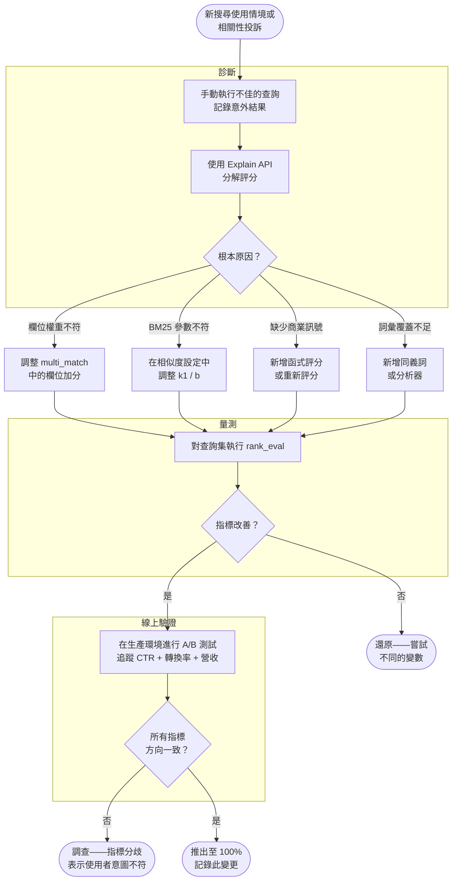

# [BEE-17002] 搜尋相關性調校

:::info
相關性調校是一門衡量並改善正確文件為何能排在頂端的學問——從 BM25 參數和欄位權重開始，在任何變更上線前先以離線指標加以驗證。
:::

## 情境

能運作的搜尋索引與*相關*的搜尋索引是兩回事。索引會回傳結果；相關性調校決定的是那些結果是否真的是使用者想要的。多數團隊交付了前者，卻誤以為已完成後者。

預設的 BM25 評分——k1 = 1.2、b = 0.75——對於一般語料庫是合理的起點。對於商品目錄、知識庫或職缺列表網站，「一般」還不夠好。標題中的短商品名稱命中，理應優先於 5,000 字評論內文中的相同詞彙。最近發布的文件應排在詞頻略高的舊文件之上。10,000 個使用者點擊過的文件，應排在評分相同但無任何互動的文件之上。這些改善都不會自動發生。

相關性調校也是一門量測的學問。在未衡量效果的情況下調整加權，是迷信而非工程。工具已然存在——解釋 API、離線排名評估、A/B 測試——有系統地使用它們的團隊能交付更好的搜尋體驗，並以數據為依據捍衛決策。

**參考資料:**
- [Practical BM25 - Part 2: The BM25 Algorithm and its Variables](https://www.elastic.co/blog/practical-bm25-part-2-the-bm25-algorithm-and-its-variables)
- [Practical BM25 - Part 3: Considerations for Picking b and k1 in Elasticsearch](https://www.elastic.co/blog/practical-bm25-part-3-considerations-for-picking-b-and-k1-in-elasticsearch)
- [Function Score Query — Elasticsearch Reference](https://www.elastic.co/docs/reference/query-languages/query-dsl/query-dsl-function-score-query)
- [Elasticsearch Scoring and the Explain API](https://www.elastic.co/search-labs/blog/elasticsearch-scoring-and-explain-api)
- [Test-Driven Relevance Tuning Using the Ranking Evaluation API](https://www.elastic.co/blog/test-driven-relevance-tuning-of-elasticsearch-using-the-ranking-evaluation-api)
- [Evaluating the Best A/B Testing Metrics for Your Search](https://www.algolia.com/blog/engineering/a-b-testing-metrics-evaluating-the-best-metrics-for-your-search)

## 原則

### 1. 調校前先理解 BM25

BM25 使用三個因素為文件對查詢詞彙評分：

- **IDF（逆文件頻率）**：詞彙在語料庫中的稀有程度。出現在 90% 文件中的詞彙貢獻幾乎為零；出現在 0.1% 文件中的詞彙貢獻極大。
- **TF 正規化**：詞彙在此文件中出現的次數，呈邊際遞減形狀，第 50 次出現的貢獻遠低於第 1 次。
- **欄位長度正規化**：較短的文件優先於較長的文件，前提是包含查詢詞彙且內容較少的文件比含有相同詞彙但夾雜大量雜訊的長文件更為聚焦。

兩個參數控制這些曲線的形狀：

| 參數 | 預設值 | 效果 |
|------|--------|------|
| `k1` | 1.2 | 控制 TF 飽和度。越低 = 重複詞彙的命中越快達到平台期。範圍：0–3；觀察到的最佳範圍：0.5–2.0。 |
| `b` | 0.75 | 控制長度正規化強度。`b = 0` 完全停用；`b = 1` 套用完整正規化。範圍：0–1；觀察到的最佳範圍：0.3–0.9。 |

調整 `k1` 和 `b` 應是最後手段——在欄位權重、同義詞和函式評分都已窮盡之後才進行。在沒有測試語料庫和離線指標的情況下調整，等同於猜測。

**何時增加 `k1`：** 文件長且主題多元（技術手冊、書籍）。重複詞彙應持續貢獻評分，因為主題深度至關重要。

**何時降低 `k1`：** 文件短而聚焦（新聞標題、商品名稱）。幾次出現已足以表示強相關性；額外出現只會增加雜訊。

**何時降低 `b`：** 文件因結構性原因而本身就很長（法律合約、專利）。長度正規化會對這類文件造成不公平的懲罰。

### 2. 在調整 BM25 參數之前先套用欄位權重

查詢詞彙出現在 `title` 欄位，是比出現在 `body` 更強的相關性訊號。欄位加權將這一知識編碼進去：

```json
{
  "query": {
    "multi_match": {
      "query": "database connection pooling",
      "fields": ["title^4", "tags^2", "body"],
      "type": "best_fields"
    }
  }
}
```

`^N` 乘數縮放欄位對最終評分的貢獻。標題 `^4`、標籤 `^2`、內文 `^1` 是大多數知識庫內容合理的預設值。根據語料庫調整：

- **短標題、密集內文**（商品目錄）：`title^6`、`description^2`、`brand^3`
- **結構化內容**（API 文件）：`title^5`、`summary^3`、`parameters^2`、`body^1`
- **社群內容**（論壇貼文）：`title^3`、`tags^4`、`body^1`

`type: best_fields` 使用單一最佳匹配欄位的評分。當查詢詞彙可能分散在多個欄位時（例如名字在 `first_name`、姓氏在 `last_name`），使用 `type: cross_fields`。

### 3. 使用函式評分注入商業訊號

純文字相關性無法涵蓋所有排名訊號。在其他條件相同的情況下，銷售量 10,000 件的商品理應排在評分相同但只賣了 5 件的商品之上。函式評分將數值訊號疊加在 BM25 之上：

```json
{
  "query": {
    "function_score": {
      "query": { "multi_match": { "query": "hiking boots", "fields": ["title^4", "body"] } },
      "functions": [
        {
          "field_value_factor": {
            "field": "sales_count",
            "modifier": "log1p",
            "factor": 0.5,
            "missing": 0
          }
        },
        {
          "gauss": {
            "published_at": {
              "origin": "now",
              "scale": "30d",
              "decay": 0.5
            }
          }
        }
      ],
      "score_mode": "sum",
      "boost_mode": "sum"
    }
  }
}
```

關鍵決策：

- **數值欄位使用 `modifier: log1p`** 可壓縮極端值。銷售量 1,000,000 件的文件不應完全支配銷售量 10,000 件的文件；`log1p` 壓縮了範圍。
- **日期欄位的 `decay: 0.5`** 意味著恰好在 `scale` 天前發布的文件，評分為同齡文件的 50%。在 2× scale 時約為 25%。
- **`boost_mode: sum`** 將函式結果以加法方式疊加到 BM25 評分上。當你希望訊號與文字相關性成比例縮放時使用 `multiply`（流行但不相關的文件不應排在結果頂端）。

### 4. 使用 Explain API 除錯評分

在調校任何東西之前，先了解文件為何以現有方式排名。Explain API 將評分分解為各貢獻因素：

```bash
GET /products/_explain/doc-42
{
  "query": {
    "match": { "title": "hiking boots" }
  }
}
```

回應（簡化版）：

```json
{
  "matched": true,
  "explanation": {
    "value": 3.7,
    "description": "weight(title:hiking in doc-42)",
    "details": [
      {
        "value": 2.2,
        "description": "idf, computed for term 'hiking': docFreq=1200, docCount=50000"
      },
      {
        "value": 1.68,
        "description": "tfNorm, computed from: termFreq=2, k1=1.2, b=0.75, fieldLen=4, avgFieldLen=18"
      }
    ]
  }
}
```

閱讀說明樹來回答：這份文件排名過高是因為欄位長度較短嗎？IDF 是否異常低，因為詞彙在語料庫中太常見？函式評分的貢獻是否主導了文字相關性？

若要對整個搜尋結果集進行批次除錯，可在 `_search` 請求中加上 `?explain=true`。

### 5. 在生產環境變更前先進行離線量測

相關性調校必須以量測為驅動。工作流程如下：

1. **收集查詢集**：來自生產搜尋日誌的 100–500 個代表性查詢。
2. **判斷相關性**：對每個查詢，將前 N 個結果標記為相關（1）或不相關（0）。使用領域專家或分級標籤（0–3）以獲得更精細的解析度。
3. **建立基準線**：使用排名評估 API 對當前配置執行查詢集，記錄 Precision@5 或 DCG。
4. **做出一項變更**：調整欄位權重、k1，或新增函式評分。
5. **重新量測**：執行相同的查詢集。
6. **接受或還原**：如果指標改善則接受；如果退步或無變化則還原並嘗試其他變更。

```bash
POST /products/_rank_eval
{
  "requests": [
    {
      "id": "hiking boots query",
      "request": { "query": { "match": { "title": "hiking boots" } } },
      "ratings": [
        { "_index": "products", "_id": "42", "rating": 1 },
        { "_index": "products", "_id": "17", "rating": 0 }
      ]
    }
  ],
  "metric": {
    "precision": { "k": 5, "relevant_rating_threshold": 1 }
  }
}
```

品質分數範圍從 0（前 k 名中無相關結果）到 1（前 k 名全部相關）。一項在完整查詢集上將 Precision@5 從 0.62 提升至 0.71 的變更是有意義的。從 0.62 到 0.63 的變更則在誤差範圍內。

### 6. 透過 A/B 測試進行線上驗證

離線指標衡量排名品質，但無法衡量使用者行為。將 Precision@5 提升的變更可能增加 CTR，也可能不會——使用者意圖是複雜的。線上 A/B 測試是全面推出前的最終驗證步驟。

同時追蹤多個指標：

| 指標 | 靈敏度 | 商業訊號 |
|------|--------|----------|
| 點擊率（CTR） | 高（所需流量最少即可偵測變化） | 衡量感知相關性 |
| 轉換率 | 中 | 衡量下游價值 |
| 營收 / 加入購物車 | 低（需要最多流量） | 最強商業訊號 |

獲勝的變體應在所有三個指標上顯示一致的方向。CTR 提升但轉換率下降的變體並非勝利——這意味著使用者在點擊卻找不到所需內容。永遠不要只根據單一指標來判定相關性變更。

### 7. 使用重新評分處理昂貴的訊號

某些排名訊號過於昂貴，無法應用於索引中的每份文件。重新評分（Rescore）僅對主查詢檢索的前 N 份文件進行第二次排名：

```json
{
  "query": { "match": { "body": "connection pooling" } },
  "rescore": {
    "window_size": 50,
    "query": {
      "rescore_query": {
        "slop": 3,
        "query": {
          "match_phrase": { "body": "connection pooling" }
        }
      },
      "query_weight": 0.7,
      "rescore_query_weight": 1.5
    }
  }
}
```

主查詢快速檢索候選文件。重新評分查詢僅對前 50 個候選文件執行昂貴的詞組匹配，提升詞彙相鄰出現的文件（slop ≤ 3）。最終評分結合兩者：`0.7 × 主查詢 + 1.5 × 重新評分`。

適用於：詞組鄰近度加分、基於腳本的訊號、向量相似度重新排名（混合搜尋）。


## 相關性調校工作流程




## 實際案例：電商商品搜尋

一個電商網站有 200 萬個 SKU，搜尋由 Elasticsearch 提供支援。工程團隊收到投訴：「搜尋『wool blanket』（羊毛毯）時，聚酯纖維刷毛毯排在真正的羊毛毯之前。」

**步驟 1——使用 Explain 診斷**

Explain API 顯示排名最高的刷毛毯在 900 字的商品描述中出現了 3 次「blanket」。羊毛毯結果在 60 字的描述中只出現 1 次。BM25 在獎勵長文件中的詞頻，而非聚焦匹配在短而精確描述中的詞彙。

根本原因：帶有重複行銷語言的長商品描述，主導了準確標題中的精確匹配。

**步驟 2——調整欄位權重**

團隊將查詢從單一 `match`（作用於 `body`）改為跨欄位的 `multi_match`：

```json
"fields": ["title^6", "brand^4", "material_tags^5", "description^1"]
```

`title^6` 和 `material_tags^5` 確保標題或材質標籤包含「wool」的商品，排名遠高於「wool」只出現在描述文字中的商品。

**步驟 3——離線量測**

團隊有一個由 2 名商品規劃師判斷的 300 個代表性查詢集。基準線 Precision@5：0.58。欄位權重變更後：0.71。改善了 13 個百分點。

**步驟 4——新增人氣訊號**

團隊在 `purchase_count` 上新增 `field_value_factor`，使用 `modifier: log1p` 和 `factor: 0.3`。這提升了已驗證的暢銷商品，同時不完全覆蓋文字相關性。

重新量測 Precision@5：0.74。（邊際改善——訊號增加了價值，而不會對低流量查詢扭曲相關性。）

**步驟 5——A/B 測試**

組合變更（欄位權重 + 人氣加分）以 50/50 的比例進行為期 2 週的 A/B 測試：

- 點擊率：+8%（實驗組）
- 轉換率：+5%（實驗組）
- 每次搜尋營收：+6%（實驗組）

三個指標方向一致。團隊以 100% 比例全面推出。


## 常見錯誤

**1. 在沒有查詢集和基準指標的情況下調校**

憑直覺更改加分值，然後確認「這一個查詢看起來有改善嗎？」不是相關性調校——這是以軼事為驅動的配置。你需要查詢集（100 個以上）、相關性標籤和離線指標，才能動任何參數。改善一個查詢的變更，往往會使另外十個退步。

**2. 對加法商業訊號使用 `boost_mode: multiply`**

如果銷售量為零的文件獲得函式評分 0，而 `boost_mode: multiply`，則無論文字相關性如何，其最終評分都是 0。不熱門但相關的文件從結果中完全消失。使用 `boost_mode: sum` 或設定 `missing` 值，讓訊號增加而非控制文字評分。

**3. 對本身就很長的文件套用長度正規化**

法律合約語料庫使用 `b = 0.75` 會以相同方式懲罰每份文件。語料庫中的每份文件因正當理由而很長。為此類語料庫設定 `b = 0.2` 或 `b = 0`，可防止系統將「長」視為「不聚焦」的代理指標。

**4. 離線改善後跳過線上驗證**

離線指標在固定的查詢和標籤集上衡量排名品質。它們無法捕捉使用者實際點擊的內容。將 DCG 提升 15% 的相關性變更，如果將視覺上不同的結果推高，或打亂使用者已習慣的排名，仍可能降低轉換率。離線改善後務必進行真實的 A/B 測試。

**5. 不壓縮直接以原始計數加分**

使用 `modifier: none` 的 `field_value_factor`，會讓 1,000,000 次購買的商品獲得比 1 次購買的商品高 1,000,000 倍的評分貢獻。應套用 `log1p` 或 `sqrt` 壓縮範圍。極端值應產生對數而非線性的影響。

**6. 將相關性調校視為一次性工作**

語料庫組成會改變。使用者意圖會轉移。新文件類型會被加入。針對 18 個月前語料庫調校的相關性配置，對今天的語料庫可能是錯誤的。每季重新審視離線指標，尤其是在目錄或內容有重大變更之後。


## 相關 BEP

- [BEE-17001](full-text-search-fundamentals.md) — 全文搜尋基礎：倒排索引、BM25 評分，以及構成相關性底層的分析管線
- [BEE-13004](../performance-scalability/profiling-and-bottleneck-identification.md) — 分析與瓶頸識別：適用於搜尋查詢延遲與相關性品質
- [BEE-15006](../testing/testing-in-production.md) — 在生產環境中測試：A/B 測試方法論直接適用於相關性實驗
