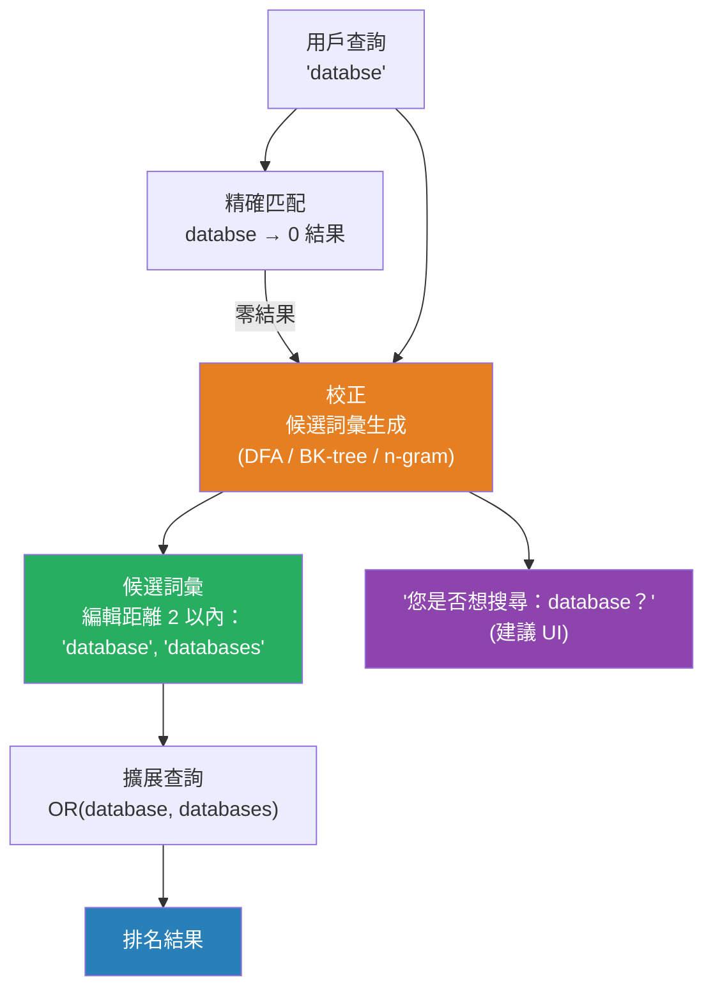

# [BEE-17008] 拼寫校正與模糊搜尋

:::info
模糊搜尋尋找與查詢大致匹配的結果，能夠容忍錯字和拼寫錯誤——代價是更高的查詢延遲，而延遲由索引中唯一詞彙的數量決定，而非文件數量。
:::

## Context

用戶會拼錯查詢。對搜尋日誌資料的研究持續表明，大約 10–15% 的查詢至少包含一個拼寫錯誤。對於「recieve」（正確應為「receive」）或「databse」（正確應為「database」）不返回結果的搜尋引擎會令用戶沮喪，並降低系統的實用性。

拼寫校正的數學基礎是**編輯距離**——衡量將一個字串轉換為另一個字串所需的單字元操作次數。Vladimir Levenshtein 在 1965 年定義了最廣泛使用的變體，以他的名字命名。「kitten」和「sitting」之間的 Levenshtein 距離為 3：用 s 替換 k，用 i 替換 e，在末尾插入 g。拼寫校正系統找到 Levenshtein 距離與查詢詞彙相差很小（通常為 1 或 2）的字典單詞。

天真的方法——計算查詢與字典中每個詞彙之間的編輯距離——時間複雜度為 O(|query| × |dict_size|)，對於互動式搜尋來說太慢了。三種技術使大規模模糊匹配變得實用：

**確定性有限自動機（DFA）：** Lucene 及因此 Elasticsearch 使用的方法。給定查詢詞彙和最大編輯距離，算法構建一個接受與查詢在該編輯距離內任何字串的有限自動機。然後在排序的詞彙字典上運行這個自動機，有效地修剪整個分支。成本取決於索引中唯一詞彙的數量（而非文件數量），大約比精確詞彙查詢慢一個數量級。

**BK-tree：** 建立在 Levenshtein 距離上的度量樹結構。每個節點存儲一個單詞；子節點存儲在標有其與父節點距離的邊上。查詢修剪其與查詢的距離不可能在模糊閾值內產生結果的分支。BK-tree 非常適合對固定字典進行進程內拼寫檢查。

**N-gram 索引：** 索引每個詞彙的每個連續 n-gram（通常是三元組）。查詢生成自己的 n-gram，並找到共享最少數量的詞彙。N-gram 相似度每個候選詞彙查找為 O(1)，對替換和插入處理良好，但對刪除的精確度低於編輯距離。這是 PostgreSQL 的 `pg_trgm` 擴展用於模糊文字匹配和相似性搜索的方法。

超越單詞校正，**詞組級拼寫校正**（「您是否想搜尋...？」）需要語言模型。Google 的方法在其網路搜索系統的背景下描述，將詞組校正視為噪聲信道問題：給定觀察到的查詢，找到使語言模型概率和編輯概率乘積最大化的預期查詢。在實踐中，大規模系統在查詢日誌上訓練——看到輸入「recieve」的用戶立即重新搜尋「receive」提供了強大的訓練信號。

**Damerau-Levenshtein 距離**通過添加轉置（以代價 1 交換兩個相鄰字元）作為基本操作來擴展 Levenshtein。轉置佔現實打字錯誤的很大比例（人們在鍵盤上交換相鄰鍵），因此 Damerau-Levenshtein 中的 fuzziness=1 比純 Levenshtein 中的 fuzziness=1 捕獲更多真實的錯字。Lucene 使用 Damerau-Levenshtein。

## Design Thinking

模糊搜尋和拼寫校正服務於重疊但不同的目的：

- **模糊搜尋**返回與查詢大致匹配的結果。用戶可能知道也可能不知道他們犯了錯誤。系統只是找到近似匹配並返回它們。
- **拼寫校正**（「您是否想搜尋？」）保留原始結果，但提供一種替代解讀。它適合在原始查詢返回結果時——您不想靜默地覆蓋一個有效但不尋常的搜尋詞彙。

兩者可以組合：顯示原始查詢的結果，如果查詢有可能的校正則顯示「您是否想搜尋」建議，只有在原始查詢返回零結果時才自動更正。

一個關鍵的設計決策是何時不應用模糊匹配：產品代碼、ID、版本字串和技術標識符必須精確匹配。`v1.0` 和 `v1.0.0` 是不同的；`SKU-12345` 和 `SKU-12346` 是不同的產品。按欄位類型選擇性地應用模糊匹配，而非全局應用於所有索引欄位。

## Best Practices

工程師 MUST NOT（不得）在所有欄位上全局啟用模糊匹配。將其應用於自然語言欄位（標題、描述、名稱），並對標識符、代碼和結構化欄位保持精確匹配。對包含 UUID 或 SKU 的欄位進行模糊匹配會以高延遲成本產生無意義的結果。

工程師 SHOULD（應該）將模糊性限制在最大編輯距離 1 或 2。距離 1 捕獲大多數單字元錯字（一個按鍵錯誤）。距離 2 捕獲更多情況，但大幅擴展搜尋空間，可能返回用戶認為令人驚訝的結果。Fuzziness 0 表示精確匹配；AUTO 模式（Elasticsearch 使用）對短詞彙應用 fuzziness=0，中等長度應用 1，長詞彙應用 2。

工程師 MUST（必須）在使用基於 DFA 的模糊搜尋時設置 `prefix_length`（或其等效項）。要求前 N 個字元精確匹配（通常為 2–3 個）大幅減少自動機的擴展空間，可以使 10 倍慢的模糊查詢接近普通查詢的速度。用戶很少錯誤地輸入單詞的前幾個字元；這是一個安全的優化。

工程師 SHOULD（應該）將「您是否想搜尋？」實現為一個單獨的建議傳遞（詞彙或詞組建議器），而非作為主查詢的替代。建議與主查詢並行運行。如果原始查詢存在結果且高置信度的校正存在，則同時顯示兩者。如果原始查詢返回零結果，則自動使用更正後的查詢重新運行並標示更正。

工程師 SHOULD（應該）在查詢量高且詞彙字典相對穩定時使用 n-gram 索引作為運行時模糊查詢的替代。預先索引的三元組支持模糊過濾而無需每個查詢的自動機構建。PostgreSQL `pg_trgm` 和類似擴展使這對中等規模語料庫的文字搜尋變得簡單直接。

工程師 MUST（必須）單獨監控模糊查詢的延遲分佈，與精確查詢分開。模糊查詢延遲隨索引大小（特別是唯一詞彙計數）下降，而非文件計數。大幅增加唯一詞彙的 schema 重構可能導致在 1000 萬文件時速度較快的模糊查詢在 5000 萬文件時變得無法接受地慢。

工程師 SHOULD（應該）對面向用戶的搜尋應用查詢級模糊性（查詢時模糊），對需要最高吞吐量的場景應用索引時 ngram 擴展。權衡：查詢時模糊維護更簡單，始終反映當前索引；索引時 ngram 需要更多存儲，但無論唯一詞彙計數如何都能提供一致的延遲。

## Visual



## Example

**Levenshtein 距離（動態規劃）：**

```
// 計算兩個字串之間的編輯距離——O(m × n) 時間和空間
function editDistance(a, b):
    m = len(a)
    n = len(b)
    dp = 大小為 (m+1) × (n+1) 的矩陣，初始化為 0

    for i in 0..m:  dp[i][0] = i    // 刪除 a 的所有字元
    for j in 0..n:  dp[0][j] = j    // 插入 b 的所有字元

    for i in 1..m:
        for j in 1..n:
            if a[i-1] == b[j-1]:
                dp[i][j] = dp[i-1][j-1]   // 字元匹配——無需操作
            else:
                dp[i][j] = 1 + min(
                    dp[i-1][j],    // 從 a 中刪除
                    dp[i][j-1],    // 插入到 b 中
                    dp[i-1][j-1]   // 替換
                )

    return dp[m][n]

editDistance("database", "databse")  // → 1（一次刪除）
editDistance("recieve", "receive")   // → 2（兩次替換）
```

**帶前綴錨定的模糊查詢（Elasticsearch 風格 DSL）：**

```json
{
  "query": {
    "match": {
      "title": {
        "query": "databse",
        "fuzziness": "AUTO",
        "prefix_length": 2,
        "max_expansions": 50
      }
    }
  },
  "suggest": {
    "term_suggest": {
      "text": "databse",
      "term": {
        "field": "title",
        "suggest_mode": "missing"
      }
    }
  }
}
// prefix_length=2：'da' 必須精確匹配（快速修剪）
// max_expansions=50：限制每個分片的自動機擴展到 50 個候選詞彙
// suggest_mode=missing：僅在查詢沒有匹配文件時建議
```

**PostgreSQL 三元組相似度（n-gram 方法）：**

```sql
-- 啟用三元組擴展
CREATE EXTENSION IF NOT EXISTS pg_trgm;
CREATE INDEX products_name_trgm_idx ON products USING GIST (name gist_trgm_ops);

-- 找到與可能拼錯的名稱相似的產品
SELECT name, similarity(name, 'databse') AS sim
FROM products
WHERE name % 'databse'          -- % 運算符：相似度 > 閾值（默認 0.3）
ORDER BY sim DESC
LIMIT 10;

-- 閾值調整：較低 = 更寬鬆，較高 = 更嚴格
SET pg_trgm.similarity_threshold = 0.4;
```

## Related BEEs

- [BEE-17001](full-text-search-fundamentals.md) -- 全文搜尋基礎：模糊查詢所操作的分析管道和倒排索引
- [BEE-17002](search-relevance-tuning.md) -- 搜尋相關性調優：模糊匹配在相關性評分中應獲得比精確匹配更低的加權分數
- [BEE-17006](autocomplete-and-typeahead-search.md) -- 自動完成與預輸入搜尋：自動完成是拼寫校正的補充——自動完成防止錯誤；校正在錯誤發生後處理它們

## References

- [Levenshtein distance -- Wikipedia](https://en.wikipedia.org/wiki/Levenshtein_distance)
- [How to Use Fuzzy Searches in Elasticsearch -- Elastic Blog](https://www.elastic.co/blog/found-fuzzy-search)
- [Elasticsearch Suggestion: Term Suggester, Phrase & Completion -- Opster](https://opster.com/guides/elasticsearch/how-tos/elasticsearch-suggestion-term-phrase-completion/)
- [SymSpell: 1 million times faster spelling correction through Symmetric Delete -- GitHub](https://github.com/wolfgarbe/symspell)
- [pg_trgm: Trigram Matching for PostgreSQL -- PostgreSQL Docs](https://www.postgresql.org/docs/current/pgtrgm.html)
- [Fuzzy Search: A Comprehensive Guide to Implementation -- Meilisearch](https://www.meilisearch.com/blog/fuzzy-search)
