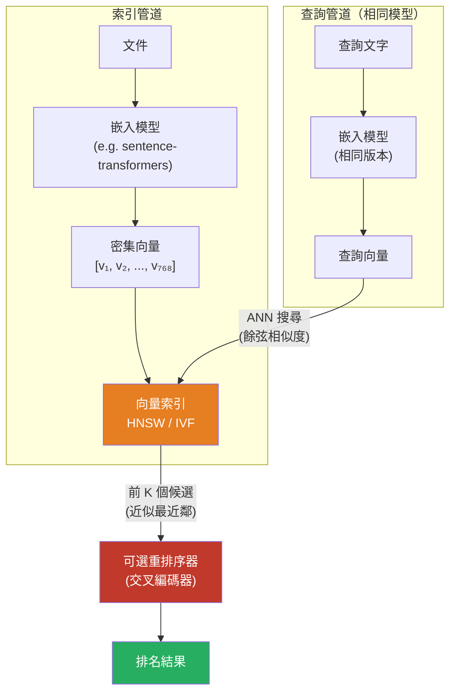

# [BEE-383] 向量搜尋與語意搜尋

:::info
向量搜尋透過在高維度嵌入空間中進行幾何鄰近性比較來尋找結果，讓查詢能夠匹配語意而非精確的關鍵詞。
:::

## Context

傳統的全文搜尋（BEE-380）將查詢詞彙與倒排索引進行匹配。當使用者確切知道目標文件中的詞彙時，這種方式表現出色，但當使用者不知道時便會失效：搜尋「心臟病發作」會漏掉說「心肌梗塞」的文件，搜尋「便宜」也會漏掉說「實惠」或「低成本」的頁面。根本問題在於關鍵詞搜尋將文字視為詞彙的集合，忽略了語意。

語意搜尋透過在連續向量空間而非離散詞彙空間中運作來解決這個問題。機器學習模型——通常是基於 Transformer 的編碼器，如 BERT、Sentence-BERT，或來自 OpenAI、Cohere 嵌入 API 的模型——將每段文字映射到固定維度的密集數值向量（*嵌入*）中（常見維度為 384、768 或 1536 維）。模型經過訓練，使語意相似的文字在這個空間中相互靠近，無論使用了哪些特定詞彙。

搜尋問題因此變成：給定一個查詢嵌入，在儲存的文件嵌入中找出在某種距離度量（通常是餘弦相似度或歐幾里得距離）下最接近的嵌入。這就是*最近鄰搜尋*問題。

精確地執行此操作——將查詢與每個儲存的向量進行比較——稱為*精確最近鄰搜尋*（或暴力搜尋）。在數百萬個向量和 100ms 以下的延遲預算下，精確搜尋太慢了。*近似最近鄰*（ANN）搜尋領域以些微的召回率下降換取數個數量級的速度提升。生產系統中兩種主流的 ANN 索引結構是 **HNSW** 和 **IVF**。

HNSW（Hierarchical Navigable Small World，分層可導航小世界）由 Yury Malkov 和 Dmitry Yashunin 在 2020 年的 IEEE TPAMI 論文（arXiv:1603.09320）中提出，建立在 2012 年 SISAP 會議早期研究的基礎上。它將向量組織成受跳躍列表啟發的分層圖：上層包含稀疏的長距離連結用於粗略導航，下層包含密集的短距離連結用於精確局部搜尋。查詢從頂部向下遍歷，每一層對數地縮小候選集。在給定查詢速度下，HNSW 在所有 ANN 演算法中持續實現最高的召回率，但隨著向量數量和 `M` 連通性參數的增加，記憶體佔用也會大幅增長。

IVF（倒排文件索引）使用 k-means 聚類將向量空間劃分為 `nlist` 個 Voronoi 單元格。在查詢時，引擎識別最近的 `nprobe` 個單元格質心，僅搜尋那些單元格，大幅減少比較次數。IVF 比 HNSW 使用少得多的記憶體，可很好地擴展到數億個向量，但召回率取決於初始聚類的品質和 `nprobe` 設定。

## Design Thinking

語意搜尋和關鍵詞搜尋是互補的，而非競爭關係。關鍵詞搜尋對精確詞彙具有高精確度——產品 SKU、名稱、錯誤代碼、縮寫。語意搜尋對概念查詢具有更好的召回率。生產系統通常在*混合搜尋*架構中結合兩者：分別通過關鍵詞索引和向量索引執行查詢，然後融合排名列表（通常使用倒數排名融合或學習型重排序器）。

嵌入模型是最大的品質槓桿。通用的現成模型可能在一般知識查詢上優於 BM25，但針對專業語料庫（醫療、法律、程式碼）進行微調的特定領域模型將顯著優於它。嵌入模型和向量索引必須作為耦合系統來對待：每當模型更改時都需要重新索引，因為不同模型版本的嵌入無法相互比較。

向量搜尋也是檢索增強生成（RAG）系統的檢索層，其中語言模型獲得檢索到的上下文，而非依賴記憶的知識。檢索步驟的品質決定了生成步驟的上限。

## Best Practices

工程師 MUST（必須）在索引時和查詢時使用相同的嵌入模型。在不重新索引所有儲存向量的情況下切換模型會產生靜默的錯誤結果，因為不同模型版本之間的嵌入幾何關係不同。

工程師 MUST（必須）選擇與模型訓練目標匹配的距離度量。Sentence-BERT 和大多數現代嵌入模型都使用餘弦相似度訓練；對其輸出使用歐幾里得距離會降低召回率。將嵌入標準化為單位長度，使餘弦相似度等同於點積，從而實現更快的 SIMD 優化計算。

工程師 SHOULD（應該）在構建向量數量少於 5000 萬的新向量存儲時，且召回率比記憶體成本更重要時，從 HNSW 開始。HNSW 的 `efSearch` 參數可在查詢時調整，以在不重新索引的情況下在召回率和速度之間進行權衡。

工程師 SHOULD（應該）在向量規模達數億或記憶體成本是硬性限制時，優先選擇 IVF（可選配乘積量化進行壓縮）。IVF+PQ 可以在召回率小幅下降的情況下將記憶體減少 90%+。

工程師 MUST NOT（不得）假設語意搜尋單獨就足夠了。語意搜尋在精確匹配上表現不佳：搜尋「RFC 9110」應該返回關於 RFC 9110 的文件，而不是語意相關的關於 HTTP 的文件。結合關鍵詞和向量檢索以實現強健的覆蓋率。

工程師 SHOULD（應該）將原始文字與嵌入一起儲存。嵌入無法解碼回文字；顯示、重排序和除錯檢索失敗都需要原始內容。

工程師 MUST（必須）對嵌入模型構件進行版本控制和固定。模型更新會改變所有嵌入幾何關係並需要完整重新索引。將模型識別碼視為索引 schema 的一部分。

工程師 SHOULD（應該）使用明確的指標評估檢索品質：Recall@K（前 K 個結果中相關文件的比例）和 MRR（平均倒數排名）。不要依賴端到端應用品質來發現檢索退化。

工程師 MAY（可以）使用兩階段管道——廉價的 ANN 用於候選檢索，昂貴的交叉編碼器用於對前 K 個結果重排序——以平衡吞吐量和品質。交叉編碼器看到完整的（查詢、文件）對，比雙編碼器嵌入相似度更準確地對其評分。

## Visual



## Example

以下偽程式碼展示了完整的生命週期：嵌入生成、索引構建和查詢時檢索。

```
// --- 索引 ---

model = load_embedding_model("sentence-transformers/all-MiniLM-L6-v2")
index = create_hnsw_index(dim=384, metric="cosine", M=16, efConstruction=200)

for each document in corpus:
    embedding = model.encode(document.text)   // 返回 float32[384]
    index.add(embedding, metadata=document.id)

// 持久化到磁碟；模型版本更改時必須重建。
index.save("search.index")

// --- 查詢 ---

query_embedding = model.encode("實惠的雲端存儲選項")

// 返回近似最近鄰——快速但不保證精確
results = index.search(
    vector   = query_embedding,
    top_k    = 20,
    ef_search = 100    // 越高 = 召回率越高，延遲越高
)

// 可選：使用交叉編碼器對前 20 個重排序以提高精確度
reranker = load_cross_encoder("cross-encoder/ms-marco-MiniLM-L-6-v2")
scored   = reranker.predict([(query_text, corpus[r.id].text) for r in results])
final    = sort_by_score(scored)[:5]
```

**使用倒數排名融合的混合搜尋：**

```
// 獨立運行兩個檢索系統
keyword_results = bm25_search(query_text, top_k=20)   // BEE-380
vector_results  = hnsw_search(query_embedding, top_k=20)

// RRF: 分數 = Σ 1 / (排名 + k)，k=60 是標準值
function rrf_score(rank):
    return 1.0 / (rank + 60)

scores = {}
for (rank, doc) in enumerate(keyword_results):
    scores[doc.id] += rrf_score(rank)

for (rank, doc) in enumerate(vector_results):
    scores[doc.id] += rrf_score(rank)

final = sort_by_score(scores)[:10]
```

## Implementation Notes

**嵌入 API 與自託管模型：** 雲端嵌入 API（OpenAI `text-embedding-3-small`、Cohere `embed-v3`）不需要基礎設施，但會引入每個請求的延遲和成本，且其模型版本可能被棄用。自託管模型（通過 Python 使用 sentence-transformers、通過 ONNX Runtime 進行跨平台推理）有固定開銷，但對版本控制和吞吐量具有完全控制。

**向量索引整合選項：**
- *獨立向量資料庫*（Qdrant、Weaviate、Milvus）：專為搜尋設計，支援混合搜尋、元數據過濾和水平擴展。最適合以搜尋為主的工作負載。
- *對現有資料庫的擴展*：`pgvector` 為 PostgreSQL 添加 HNSW 和 IVF 支援；Redis Stack 為 Redis 添加向量搜尋。操作更簡單；適合語料庫規模適中且團隊已運作該資料庫的情況。
- *嵌入式函式庫*：FAISS（Facebook AI 相似性搜尋）和 HNSWlib 是可從 Python、Go、Java 和 Rust 調用的原生函式庫。無網路跳轉；適合在數百萬向量的服務內進行進程內搜尋。

**過濾向量搜尋：** 在 ANN 搜尋前應用元數據過濾器（例如「只搜尋類別 X 的文件」）比看起來更難。先按元數據預過濾再對子集進行 ANN 需要動態索引切片；ANN 後再後過濾的風險是，如果許多候選被過濾掉，返回的結果少於 K 個。Qdrant 和 Weaviate 等系統實現了高效的過濾 HNSW 來正確處理這個問題。在依賴向量存儲的過濾策略保證正確性之前，請先了解其過濾策略。

## Related BEEs

- [BEE-17001](full-text-search-fundamentals.md) -- 全文搜尋基礎：倒排索引、BM25 和關鍵詞檢索層，與向量搜尋配合構成混合架構
- [BEE-17002](search-relevance-tuning.md) -- 搜尋相關性調優：欄位加權和評分策略，適用於關鍵詞和混合搜尋管道
- [BEE-17003](faceted-search-and-filtering.md) -- 分面搜尋與過濾：元數據過濾，與過濾 ANN 搜尋問題相交

## References

- [Malkov, Y. A., & Yashunin, D. A. (2020). Efficient and robust approximate nearest neighbor search using Hierarchical Navigable Small World graphs. IEEE TPAMI. arXiv:1603.09320](https://arxiv.org/abs/1603.09320)
- [Hierarchical navigable small world -- Wikipedia](https://en.wikipedia.org/wiki/Hierarchical_navigable_small_world)
- [Nearest Neighbor Indexes for Similarity Search -- Pinecone](https://www.pinecone.io/learn/series/faiss/vector-indexes/)
- [Approximate Nearest Neighbor Search Explained: IVF vs HNSW vs PQ -- TiDB / PingCAP](https://www.pingcap.com/article/approximate-nearest-neighbor-ann-search-explained-ivf-vs-hnsw-vs-pq/)
- [Filtered Approximate Nearest Neighbor Search in Vector Databases: System Design and Performance Analysis -- arXiv:2602.11443](https://arxiv.org/abs/2602.11443)
- [pgvector: Open-source vector similarity search for PostgreSQL -- GitHub](https://github.com/pgvector/pgvector)
- [FAISS: A Library for Efficient Similarity Search -- GitHub](https://github.com/facebookresearch/faiss)
