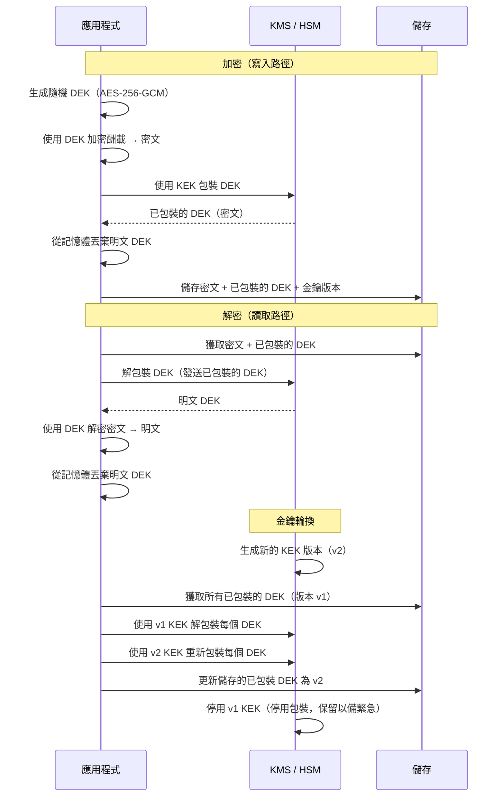

# [BEE-490] 密碼學金鑰管理與金鑰輪換

:::info
密碼學金鑰管理是生成、分發、儲存、使用、輪換及銷毀加密金鑰的學科——金鑰與其所保護的資料一樣敏感，其生命週期決定了任何加密方案的現實安全性。
:::

## 背景

加密的強度只有保護金鑰的強度那麼強。取得明文加密金鑰的攻擊者，無論演算法有多強大，都能解密所有被該金鑰保護過的資料。在現實世界的資安事件中，演算法本身很少是失敗點——金鑰管理才是。

NIST SP 800-57 第一部分（「金鑰管理建議」），首次發布於 2006 年，並經過多次修訂至第 5 版（2020 年），是金鑰管理實踐的權威標準。它定義了金鑰生命週期各階段、密碼期（每種金鑰類型的有效持續時間）、金鑰類型，以及必須生成和儲存金鑰的密碼模組要求。每個主要的雲端 KMS、HSM 廠商和企業安全框架的金鑰管理要求，都可追溯至 SP 800-57。

實際的失敗模式是一致的。2022–2023 年的 LastPass 和 GoTo 資安事件共享相同的根本失敗：加密金鑰儲存在與其所保護資料相同的存取範圍內。在 GoTo 事件中，攻擊者從第三方雲端儲存供應商那裡竊取了加密的客戶備份檔案——以及這些檔案的加密金鑰，後者可透過相同的洩露憑證存取。由於金鑰和密文共置，加密完全沒有提供任何保護。LastPass 事件跨兩個升級階段遵循相似模式，最終原因是生產主金鑰可從個人設備存取，而無 HSM 強制執行。

BEE-34（工程師的密碼學基礎）涵蓋演算法選擇——選擇哪種加密演算法、哪種模式、哪種金鑰長度。本文涵蓋選定演算法後發生的事：金鑰如何生成、由誰持有、存活多久，以及如何在不中斷系統的情況下進行變更。

## 設計思維

金鑰管理的核心洞察是：**機密的保密性本身是一個生命週期問題**。在生成時因弱 PRNG 而洩露的金鑰，在使用前就已被破解。以明文形式儲存在磁碟上的金鑰，在磁碟可被存取時隨時可能洩露。從不輪換的金鑰，對任何曾獲取它的攻擊者持續有效——可能在初始入侵後數月或數年。

兩個設計決策決定了金鑰管理架構：

**1. 金鑰層級深度。** 平面架構使用一個金鑰加密所有資料——易於實作，但洩露時影響範圍災難性。兩層層級（資料加密金鑰/金鑰加密金鑰，即 DEK/KEK）將接觸資料的金鑰與受信任保護其他金鑰的金鑰分離。這允許在不重新加密資料的情況下輪換根金鑰。三層層級（信任根 → KEK → DEK）新增了一個永不離開硬體的 HSM 支持根。深度增加了操作複雜性，同時也限制了爆炸半徑。

**2. 金鑰所有權。** 控制金鑰加密金鑰（KEK）的人決定了入侵的爆炸半徑和服務的合規義務。服務控制的 KEK 意味著服務運營者可以讀取任何客戶資料。客戶控制的 KEK（BYOK——自帶金鑰）意味著客戶可以撤銷其 KEK，永久阻止服務解密其資料。BYOK 無需刪除記錄即可滿足 GDPR 被遺忘權要求。

## 最佳實踐

### 在密碼模組內部生成金鑰

**MUST（必須）在通過 FIPS 140-2 Level 2（或 Level 3）驗證的模組內部生成金鑰**——即 HSM 或雲端 KMS 硬體分區。模組的隨機數生成器已通過驗證；應用層的 `rand()` 呼叫則未通過。由弱 PRNG 生成的金鑰在使用前就已被破解。

**MUST NOT（不得）在源代碼、配置檔案或二進制製品中硬編碼密碼學金鑰**（CWE-321）。硬編碼的金鑰可被任何讀取源代碼、反編譯二進制或轉儲程序映像的人恢復。2024 年的 PKfail 揭露發現，明確標記為「DO NOT TRUST」的測試 AMI 安全啟動金鑰，已在生產環境中出現在估計 10% 的設備韌體中。這是固件規模的 CWE-321。

### 使用信封加密（DEK/KEK 層級）

對於加密使用者資料或資料庫欄位，**SHOULD（應該）使用信封加密**而非直接使用 KMS 加密：

1. 在本地或可信執行環境中生成一個隨機的資料加密金鑰（DEK）——AES-256-GCM。
2. 使用 DEK 加密酬載。
3. 將 DEK 發送到 KMS 進行包裝（使用金鑰加密金鑰加密）。KMS 回傳已包裝的 DEK。
4. 將加密的酬載與已包裝的 DEK 一起儲存。從記憶體中丟棄明文 DEK。
5. 解密時：將已包裝的 DEK 發送至 KMS → 接收明文 DEK → 解密酬載 → 立即丟棄 DEK。

此模式解決了兩個問題。首先，它消除了 AWS KMS、Google Cloud KMS 及大多數 HSM 對直接加密/解密操作施加的 64 KiB 酬載限制——KMS 只看到 32 位元組的 DEK，而非資料本身。其次，它使金鑰輪換獨立於資料：輪換 KEK 需要重新包裝 DEK，而非重新加密資料。資料保持在其 DEK 下的加密狀態；只有 DEK 的包裝器發生變化。

**MUST NOT（不得）當酬載超過幾 KB 時使用 KMS 直接加密資料。** 除了大小限制外，每個直接 KMS 呼叫還會增加 2–10 毫秒的延遲和 API 成本。擁有數百萬行的資料庫，無法在每次查詢時對每行呼叫 KMS。

### 強制執行密碼期

NIST SP 800-57 定義了密碼期——金鑰用於特定目的的最大時間間隔。這些不是建議性的；超過密碼期意味著金鑰材料洩露的統計概率已累積超過設計風險閾值。

| 金鑰類型 | 最大密碼期（NIST SP 800-57 Rev. 5） |
|---|---|
| 對稱資料加密金鑰（發起方使用） | 2 年 |
| 對稱資料加密金鑰（接收方使用） | 5 年 |
| 私鑰——數位簽章 | 1–3 年 |
| 私鑰——金鑰協商 | 1–2 年 |
| 對稱認證金鑰（MAC） | 1 年 |
| 短暫金鑰協商金鑰 | 單次交易 |

**MUST（必須）在密碼期到期時強制執行自動輪換。** 手動輪換是一個過程，而非一個控制措施——在操作壓力下它會被跳過。所有主要 KMS 平台都支援自動輪換排程：AWS 客戶管理金鑰預設每年輪換一次（可配置）；AWS 管理金鑰強制性地按年度排程輪換；HashiCorp Vault Transit 支援最低 1 小時的 `auto_rotate_period`。

**SHOULD（應該）跟蹤每個加密資料旁的金鑰版本元資料**——哪個金鑰 ID 和哪個金鑰版本加密了此密文。若無此資訊，輪換需要重新加密所有內容，才能知道哪個密文使用了哪個版本。

### 維護金鑰分離

**MUST（必須）每個金鑰只用於一個目的。** 同時用於加密和簽章的金鑰會同時削弱兩者的安全屬性——對簽章用途的密碼分析攻擊可能揭示加密金鑰材料的相關資訊。以下必須使用獨立的金鑰：資料加密、資料簽章、傳輸（TLS session 金鑰）、認證令牌，以及備份加密。跨用途金鑰也使得在洩露後評估爆炸半徑變得不可能。

**MUST（必須）為每個資料分類層級使用獨立的金鑰。** 個人識別資訊和非個人識別資訊應在不同的 DEK 下加密。高度受監管的資料（PHI、金融記錄）應在專用的 KEK 下加密，且擁有比通用 KEK 更嚴格的存取控制和審計記錄。

### 將金鑰儲存在其所保護資料之外

**MUST NOT（不得）將加密金鑰儲存在與其所保護資料相同的系統、相同的存儲桶或相同的憑證範圍內。** 這正是 GoTo 事件中的失敗：備份檔案和解密這些檔案的金鑰，可被同一攻擊者透過相同的洩露憑證存取。加密完全失效。

正確的分離方式：
- 資料在關聯式資料庫中 → KEK 在雲端 KMS 中（不在資料庫中，也不在資料庫的憑證範圍內）
- 資料在雲端物件儲存中 → KEK 在獨立的 KMS 帳戶或租戶中
- 備份檔案 → 備份加密金鑰儲存在具有獨立存取控制的獨立金鑰託管系統中，而非同一備份檔案中

### 為應用程式使用加密即服務

**SHOULD（應該）設計應用程式，使其在執行時永不持有原始金鑰材料。** 不要獲取金鑰然後在本地加密，而是呼叫執行操作並回傳密文的密碼學服務：

- HashiCorp Vault Transit Engine：應用程式以明文呼叫 `POST /transit/encrypt/{key-name}`，接收密文。金鑰永不離開 Vault 伺服器。
- AWS KMS `GenerateDataKey` API：接收明文 DEK 和已包裝的 DEK。使用明文 DEK 在本地加密資料，丟棄它，儲存已包裝的 DEK。應用程式接觸一個短暫的明文金鑰，但永不接觸 KEK。
- Google Cloud KMS 對稱加密：與 AWS 相同的模式。

此模式將明文金鑰的暴露限制在程序記憶體中的單次解密操作——金鑰永遠不會被持久化。

### 為洩露情況規劃輪換

**MUST（必須）在發生事件之前定義並記錄洩露情況下的金鑰輪換程序。** 事件觸發的輪換不同於排程輪換：

1. **立即停用**洩露的金鑰版本（不是刪除——在重新包裝期間現有密文仍需要可解密）。
2. **生成新的金鑰版本**，並將其設為活躍的包裝金鑰。
3. **重新包裝所有 DEK**（在洩露版本下加密的）。這需要一個後台作業，使用洩露的金鑰版本（已停用但仍可用於解密）解密每個包裝的 DEK，然後使用新版本重新包裝。
4. **所有 DEK 重新包裝並驗證後，停用洩露版本**。
5. **評估資料暴露**：哪些記錄在攻擊者可能使用洩露的 KEK 解包裝的 DEK 下加密？

若沒有事先記錄和測試此程序，團隊將在壓力下即興應對——而即興的金鑰管理會產生額外的漏洞。

### 密碼學清除

金鑰銷毀是一種符合合規標準的資料刪除機制。**MAY（可以）使用每記錄或每租戶的 DEK 銷毀，在不進行物理刪除的情況下實施 GDPR 被遺忘權。**

當 DEK 被銷毀時，在該 DEK 下加密的所有資料都將永久無法存取——它被密碼學清除了。密文記錄仍保留在資料庫中，但它們在計算上與隨機位元組無法區分。對於難以物理刪除記錄的系統（歸檔日誌、備份磁帶、最終一致的分散式存儲），此方法滿足了清除義務。

前提條件：每個使用者或租戶的資料必須在專用的 DEK 下加密（不是共享的 DEK）。若 DEK 在使用者之間共享，銷毀它會同時清除所有人的資料。

## 視覺化

## 常見錯誤

**在一個全域 DEK 下加密所有資料。** 一個金鑰，一個災難性的失敗模式。單個 DEK 洩露——或單次輪換事件——影響系統中的每條記錄。應按記錄、按使用者，或至少按資料分類層級劃分 DEK。

**設置輪換排程但從不驗證輪換是否發生。** 如果自動化中斷、KMS 服務在輪換視窗期間中斷，或配置被更改，KMS 輪換排程可能靜默失敗。輪換 MUST（必須）被監控：在金鑰版本元資料上進行斷言。若任何金鑰超過其密碼期，發出警報。

**輪換後立即刪除舊金鑰版本。** 在舊版本下加密的任何密文將永久無法讀取。在新版本下重新包裝的 DEK 可以安全地丟棄其舊包裝副本，但 KEK 版本必須保持可用於解密，直到每個 DEK 都已重新包裝和驗證。

**以明文形式將金鑰材料儲存在環境變數中。** 環境變數對在同一使用者下運行的每個程序都可見，對程序列表工具可見，並且經常記錄在崩潰報告和協調平台日誌中。對金鑰材料使用執行時的 KMS API 呼叫，而非環境變數注入。

**將資料庫級加密作為應用層金鑰管理的替代品。** 透明資料加密（TDE）保護靜態資料免受存儲級攻擊者（竊取磁碟、備份磁帶）的侵害。它不能保護擁有資料庫存取憑證的攻擊者——資料庫引擎會透明地解密。對於資料庫級威脅隔離，需要在資料庫引擎無法存取的金鑰下進行應用層加密。

## 相關 BEE

- [BEE-2003](secrets-management.md) -- 機密管理：將機密（密碼、令牌）注入程序的執行時注入；本文涵蓋超越機密注入的密碼學金鑰生命週期
- [BEE-2005](cryptographic-basics-for-engineers.md) -- 工程師的密碼學基礎：演算法和模式選擇；本文涵蓋選定演算法後發生的事——金鑰生命週期管理
- [BEE-2009](http-security-headers.md) -- HTTP 安全標頭：TLS 和 HSTS 保護傳輸金鑰；應用層金鑰管理保護資料金鑰
- [BEE-2007](zero-trust-security-architecture.md) -- 零信任安全架構：金鑰管理是零信任的組成部分；對 KMS 操作的基於身份的存取取代了網路邊界信任

## 參考資料

- [NIST SP 800-57 Part 1 Rev. 5: Recommendation for Key Management — NIST (2020)](https://csrc.nist.gov/pubs/sp/800/57/pt1/r5/final)
- [OWASP Key Management Cheat Sheet — OWASP](https://cheatsheetseries.owasp.org/cheatsheets/Key_Management_Cheat_Sheet.html)
- [OWASP Cryptographic Storage Cheat Sheet — OWASP](https://cheatsheetseries.owasp.org/cheatsheets/Cryptographic_Storage_Cheat_Sheet.html)
- [Envelope Encryption — Google Cloud KMS](https://docs.cloud.google.com/kms/docs/envelope-encryption)
- [AWS KMS Concepts — AWS](https://docs.aws.amazon.com/kms/latest/developerguide/concepts.html)
- [Transit Secrets Engine — HashiCorp Vault](https://developer.hashicorp.com/vault/docs/secrets/transit)
- [CWE-321: Use of Hard-coded Cryptographic Key — MITRE](https://cwe.mitre.org/data/definitions/321.html)
- [GoTo says hackers stole customers' backups and encryption key — BleepingComputer (2023)](https://www.bleepingcomputer.com/news/security/goto-says-hackers-stole-customers-backups-and-encryption-key/)
