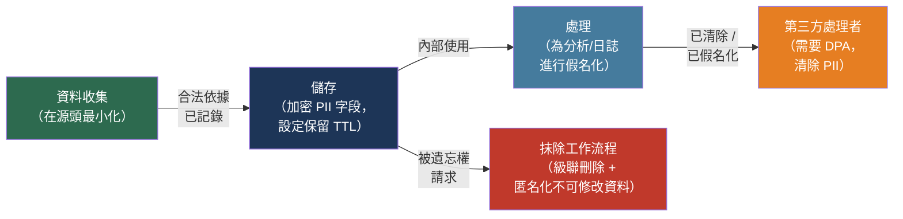

# [BEE-2017] 資料隱私與 PII 處理

:::info
正確處理個人識別資訊（PII）意味著只收集必要的資料、在傳輸和靜態儲存時保護它、從日誌中清除它、並依需求刪除它——不是事後補救，而是將其作為工程約束內建於每個接觸使用者資料的系統中。
:::

## 背景

當歐盟的一般資料保護規則（GDPR）於 2018 年 5 月 25 日生效時，隱私法規從合規文書工作轉變為工程約束。GDPR 適用於任何處理歐盟居民個人資料的組織，無論該組織的總部位於何處。它引入了高達全球年營業額 4% 的罰款，並建立了一套可執行的個人權利——包括被遺忘權——這些權利需要明確的工程實作。加州消費者隱私法（CCPA，2020 年 1 月生效）隨後為加州居民提供了類似的權利，這種模式已擴展：巴西的 LGPD、加拿大的 PIPEDA，以及美國各州的法律，對任何擁有大量使用者群的產品而言，隱私義務現在是全球性的。

執法紀錄是具體的。Meta 旗下的 WhatsApp 在 2021 年因對 PII 如何被處理和轉移的透明度不足而被罰款 2.25 億歐元。Meta 在 2023 年因未透過有效法律機制將歐盟使用者資料轉移至美國而收到創紀錄的 12 億歐元罰款。英國航空因安全控制不足導致 40 萬名客戶的付款卡資料洩露而被罰款 2000 萬英鎊（從 1.83 億英鎊減少）。TikTok 在 2023 年因預設將青少年帳戶設為公開而被罰款 3.45 億歐元。這些不是邊緣案例的法律糾紛：它們是工程決策——記錄什麼、如何傳輸資料、預設設定是什麼——導致了九位數的罰款。

NIST 特別出版物 800-122 將 PII 定義為「任何可單獨或與其他個人或可識別資訊結合使用，以區分或追蹤個人身份的資訊」。這個定義對後端工程師有一個關鍵含義：PII 不僅僅是姓名和 SSN。它包括任何在與其他資料結合時變得具有識別性的資料——即準識別符問題。

## PII 分類

了解什麼構成 PII 決定了哪些工程控制措施適用。

**直接識別符**單獨即足以識別一個人：全名、電子郵件地址、電話號碼、政府簽發的 ID 號碼（SSN、護照、駕照）、生物特徵資料（指紋、臉部辨識掃描），以及映射到特定個人的帳戶識別符。

**間接識別符（準識別符）**單獨無法識別，但結合起來可以實現再識別。Latanya Sweeney 在 1997 年的研究表明，僅使用郵遞區號、出生日期和性別這三個字段，87% 的美國人可以被唯一識別——這三個字段單獨看起來無害。IP 位址、裝置 ID、瀏覽器指紋、精確 GPS 座標和行為事件序列都屬於此類。將間接識別符視為非 PII 是一個常見且後果嚴重的錯誤。

GDPR 第 9 條定義了需要加強保護和明確同意的特殊類別個人資料：健康資料、遺傳資料、用於識別的生物特徵資料、種族或民族來源、政治觀點、宗教信仰、工會成員資格和涉及性取向的資料。這些類別需要額外控制——資料保護影響評估、明確同意（而非僅依賴合法利益），以及比普通 PII 更嚴格的存取控制。

## 設計思考

兩個區別形成了每個隱私工程決策的基礎：

**假名化與匿名化。**GDPR 第 4(5) 條將假名化定義為以使個人資料在不使用額外資訊的情況下不再能歸因於特定個人的方式處理個人資料——額外資訊需單獨保存，並受防止再歸因的技術措施約束。假名化資料在 GDPR 下*仍然*是個人資料。如果你用 UUID 替換使用者的電子郵件，並在另一個表中保存映射，資料是假名化的：它減少了曝露，但所有 GDPR 義務依然適用。匿名化資料——真正無法再識別的資料，包括從間接識別符組合——不在 GDPR 的範圍之內。真正的匿名化比看起來要困難得多；大多數「匿名化」資料集實際上是假名化的。

**控制者與處理者。**資料控制者決定為何以及如何處理個人資料，承擔主要的 GDPR 責任。資料處理者代表控制者並按其指示處理資料。當你整合 Datadog 進行日誌聚合、Sentry 進行錯誤追蹤或 Mixpanel 進行分析時，你仍是控制者，這些供應商成為處理者。你發送給處理者的每個 PII 都受 GDPR 約束，無論處理者位於何處。

## 最佳實踐

### 了解並記錄每個 PII 字段

**MUST（必須）維護資料清單**——記錄包含或可能包含 PII 的每個字段、哪個表或儲存持有它、什麼合法依據證明其收集的合理性，以及適用什麼保留期限。GDPR 第 30 條要求控制者維護處理活動記錄。除了合規之外，清單是一個工程產物：你無法刪除你不知道自己擁有的資料，也無法從日誌中清除你尚未識別的字段。

適用於每個表的分類架構：

| 字段 | PII 類型 | 合法依據 | 保留期限 | 需要加密 |
|------|---------|---------|---------|---------|
| `email` | 直接識別符 | 合約 | 帳戶生命週期 | 是 |
| `ip_address` | 準識別符 | 合法利益 | 90 天 | 否 |
| `full_name` | 直接識別符 | 合約 | 帳戶生命週期 | 是 |
| `stripe_customer_id` | 假名（外部）| 合約 | 帳戶生命週期 | 否 |
| `session_id` | 假名 | 合約 | 30 天 | 否 |

### 從日誌中清除 PII

**MUST NOT（不得）將 PII 寫入應用程式日誌。**日誌保留 30–90 天，由多個團隊（待命工程師、安全審計員、SRE）存取，並且經常傳送到第三方日誌聚合器（Datadog、Splunk、Loggly），這些聚合器成為資料處理者。帶有 `user_email` 的結構化日誌行是傳送到接收這些日誌的每個下游系統的資料轉移。

模式：記錄內部識別符（使用者 ID、訂單 ID、追蹤 ID），絕不記錄顯示名稱、電子郵件地址、電話號碼或付款詳情：

```python
import logging
import re

# 錯誤：日誌中包含 PII
logger.info("Processing order for user %s <%s>", user.name, user.email)

# 正確：僅使用內部識別符
logger.info("Processing order", extra={
    "user_id": user.id,          # 內部不透明識別符
    "order_id": order.id,
    "trace_id": request.trace_id,
})
```

對於處理現有日誌的日誌管線，在傳送到聚合器之前添加清除中介軟體：

```python
import re

EMAIL_PATTERN = re.compile(r'[a-zA-Z0-9._%+\-]+@[a-zA-Z0-9.\-]+\.[a-zA-Z]{2,}')

def scrub_pii(record: dict) -> dict:
    """將日誌訊息中的電子郵件模式替換為 [REDACTED]。"""
    record['message'] = EMAIL_PATTERN.sub('[REDACTED]', record.get('message', ''))
    return record
```

錯誤追蹤服務（Sentry、Rollbar）在異常點捕獲完整的堆疊追蹤和局部變數值。變數值通常包含 PII——使用者物件、請求主體、資料庫行。在傳輸前配置這些服務清除敏感字段，或使用資料處理協議和 Sentry 的資料清除規則。

### 對敏感 PII 欄位應用欄位級加密

**SHOULD（應該）對分類為需要高度保護的資料（健康資料、付款資料、政府 ID、生物特徵）的 PII 欄位進行欄位級加密。**磁碟級加密（透明資料加密）防止儲存媒體被盜，但無法防止已被入侵的資料庫使用者或應用程式。欄位級加密意味著密文儲存在資料庫中；讀取該欄的攻擊者獲得的是加密的位元組，而非明文：

```sql
-- PostgreSQL 搭配 pgcrypto：插入前加密
INSERT INTO users (id, email_encrypted, name_encrypted)
VALUES (
    gen_random_uuid(),
    pgp_sym_encrypt('user@example.com', current_setting('app.pii_key')),
    pgp_sym_encrypt('Alice Smith', current_setting('app.pii_key'))
);

-- 讀取時解密
SELECT
    id,
    pgp_sym_decrypt(email_encrypted::bytea, current_setting('app.pii_key')) AS email,
    pgp_sym_decrypt(name_encrypted::bytea, current_setting('app.pii_key')) AS name
FROM users
WHERE id = $1;
```

在資料庫外部管理加密金鑰——在專用 Secrets 管理器（AWS KMS、HashiCorp Vault、GCP Cloud KMS）中。絕不將金鑰與它所加密的資料儲存在同一個資料庫中；金鑰和密文放在一起等同於明文。

欄位級加密有真實的成本：加密欄不能為全文搜索建立索引，範圍查詢變得不可能，每次涉及加密欄的讀取都會產生解密開銷。在採用欄位級加密之前，請圍繞這些限制設計資料存取模式。

### 實作被遺忘權

**MUST（必須）實作可驗證的刪除工作流程**，以處理 GDPR 第 17 條或 CCPA 下的抹除請求。工程挑戰在於使用者資料不存在於一個地方——它分散在交易資料庫、事件儲存、搜索索引、快取、審計日誌、備份存檔和第三方處理者中。

每個資料儲存的決策樹：

```
資料是否在可修改的儲存中（RDBMS、文件 DB）？
  → 級聯刪除使用者記錄及所有具有外鍵的相關記錄
  → 使用 ON DELETE CASCADE 約束強制引用完整性

資料是否在不可修改/僅附加的儲存中（事件日誌、審計日誌、資料倉儲）？
  → 匿名化：將 PII 字段替換為確定性雜湊或 NULL
  → 出於法律/審計目的，絕不刪除不可修改的記錄；抹除 = 移除 PII

資料是否在衍生儲存中（搜索索引、快取、具體化視圖）？
  → 在主要刪除完成後重建或使其失效

資料是否在備份中？
  → 在隱私聲明中記錄備份保留政策
  → 直到備份到期並被清除前，備份將包含該資料
  → 通常可接受：記錄保留窗口（例如「在備份到期後 30 天內刪除」）

資料是否在第三方處理者處？
  → 按照 DPA 透過處理者的 API 或刪除工作流程觸發刪除
```

追蹤抹除請求需要在刪除後仍然存在的審計記錄：

```sql
-- 抹除請求日誌（不包含被刪除的 PII）
CREATE TABLE erasure_requests (
    id          UUID PRIMARY KEY DEFAULT gen_random_uuid(),
    subject_id  UUID NOT NULL,          -- 被刪除主體的內部 ID
    requested_at TIMESTAMPTZ NOT NULL,
    completed_at TIMESTAMPTZ,
    status      TEXT NOT NULL DEFAULT 'pending', -- pending | completed | failed
    scope       TEXT[] NOT NULL         -- 哪些儲存已被清除
);
```

### 應用資料最小化

**SHOULD NOT（不應該）收集沒有文件記錄的、當前用途的 PII。**資料最小化是 GDPR 第 5(1)(c) 條——資料必須「足夠、相關且限於必要」。工程翻譯：在向使用者記錄或事件負載添加字段之前，回答：哪個功能使用這個？如果答案是「以後可能有用」，就不要收集它。

在建立時為時間限制的資料附加基於 TTL 的到期，而非幾個月後作為清理工作添加：

```sql
-- Session 令牌：自動到期
CREATE TABLE sessions (
    id          UUID PRIMARY KEY,
    user_id     UUID NOT NULL REFERENCES users(id) ON DELETE CASCADE,
    created_at  TIMESTAMPTZ NOT NULL DEFAULT now(),
    expires_at  TIMESTAMPTZ NOT NULL DEFAULT now() + INTERVAL '30 days'
);

-- 排程清理（pg_cron、雲端排程器）
DELETE FROM sessions WHERE expires_at < now();
```

**SHOULD（應該）在入庫前對分析資料進行假名化。**如果你將原始使用者事件傳送到資料倉儲（BigQuery、Snowflake），在事件落地前在管線層對使用者識別符進行假名化。用使用者 ID 的一致 HMAC 替換 `user_id`：

```python
import hmac, hashlib

def pseudonymize_user_id(user_id: str, secret_key: bytes) -> str:
    """分析用的一致假名——在不知道金鑰的情況下無法還原。"""
    return hmac.new(secret_key, user_id.encode(), hashlib.sha256).hexdigest()
```

假名允許按使用者進行分析，同時將分析儲存與身份儲存分離。

### 在向第三方發送 PII 之前要求簽署資料處理協議

**MUST（必須）在沒有簽署資料處理協議（DPA）的情況下，不將 PII 發送給第三方供應商。**每一行帶有電子郵件地址的日誌、每一個帶有使用者 ID 的錯誤報告、每一個帶有裝置指紋的分析事件都是向資料處理者的轉移。GDPR 第 28 條要求處理者僅在控制者的指示下處理資料，並採取適當的保障措施。簽署的 DPA 是該合約的證明。

在啟用新供應商整合之前的實用清單：

1. 映射整合將接收的 PII（日誌字段、請求上下文、事件屬性）
2. 檢查供應商是否提供標準 DPA（AWS、GCP、Datadog、Sentry 都有）
3. 在啟用資料流之前簽署 DPA
4. 在處理活動記錄中記錄供應商（GDPR 第 30 條）
5. 如果供應商在歐盟以外處理資料，驗證其具有合法的國際轉移機制（標準合約條款或等效機制）

消除許多 DPA 複雜性的工程捷徑：在向第三方發送之前清除 PII。沒有電子郵件地址的日誌、沒有使用者名稱的錯誤報告，以及沒有直接識別符的分析，可以消除或大幅減少接收供應商的 GDPR 義務。

## 視覺圖示



## 相關 BEE

- [BEE-2003](secrets-management.md) -- Secrets 管理：PII 字段的加密金鑰是 Secrets，必須相應地管理——絕不與它們所保護的資料儲存在一起
- [BEE-19041](../distributed-systems/soft-deletes-and-data-retention.md) -- 軟刪除與資料保留：軟刪除本身無法滿足被遺忘權——軟刪除的記錄仍然包含 PII；刪除工作流程必須移除或匿名化 PII 字段
- [BEE-19043](../distributed-systems/audit-logging-architecture.md) -- 審計日誌架構：審計日誌必須記錄抹除請求而不保留被抹除的 PII；將審計架構設計為引用內部 ID，而非個人資料
- [BEE-18007](../multi-tenancy/database-row-level-security.md) -- 資料庫行層級安全：RLS 可以強制應用程式使用者只能讀取自己的 PII 行，減少 BOLA 漏洞對 PII 資料的影響範圍
- [BEE-7004](../data-modeling/encoding-and-serialization-formats.md) -- 編碼與序列化格式：預設包含所有物件字段的序列化函式庫可能在 API 響應中意外暴露 PII——使用明確的字段允許清單

## 參考資料

- [GDPR 第 5 條 — 個人資料處理原則 — gdpr-info.eu](https://gdpr-info.eu/art-5-gdpr/)
- [GDPR 第 17 條 — 被遺忘權 — gdpr-info.eu](https://gdpr-info.eu/art-17-gdpr/)
- [ICO. 資料最小化 — ico.org.uk](https://ico.org.uk/for-organisations/uk-gdpr-guidance-and-resources/data-protection-principles/a-guide-to-the-data-protection-principles/data-minimisation/)
- [ICO. 假名化 — ico.org.uk](https://ico.org.uk/for-organisations/uk-gdpr-guidance-and-resources/data-sharing/anonymisation/pseudonymisation/)
- [ICO. 控制者和處理者 — ico.org.uk](https://ico.org.uk/for-organisations/uk-gdpr-guidance-and-resources/controllers-and-processors/controllers-and-processors/what-are-controllers-and-processors/)
- [ICO. 被遺忘權 — ico.org.uk](https://ico.org.uk/for-organisations/uk-gdpr-guidance-and-resources/individual-rights/individual-rights/right-to-erasure/)
- [加州司法部長. 加州消費者隱私法 — oag.ca.gov](https://oag.ca.gov/privacy/ccpa)
- [NIST. SP 800-122：保護個人識別資訊保密性指南 — csrc.nist.gov](https://csrc.nist.gov/pubs/sp/800/122/final)
- [GDPR 執法追蹤器 — enforcementtracker.com](https://www.enforcementtracker.com/)
- [Latanya Sweeney. 簡單人口統計通常能唯一識別個人 — 卡內基梅隆大學, 2000](https://dataprivacylab.org/projects/identifiability/paper1.pdf)
- [Piiano. 為何將 PII 洩漏到日誌是危險的 — piiano.com](https://www.piiano.com/blog/spilling-pii)
