# [BEE-489] HTTP 安全標頭

:::info
HTTP 安全回應標頭指示瀏覽器如何處理渲染、資源載入、框架嵌入與傳輸——形成一道縱深防禦層，強化任何面向 Web 的後端服務之客戶端安全。
:::

## 背景

當瀏覽器載入一個頁面時，會自動做出數十個行為決策：是否跟隨從 HTTPS 到 HTTP 的重新導向、是否渲染外部腳本、是否允許頁面被嵌入 iframe 中、是否在跨域導航時將完整 URL 發送到 `Referer` 標頭。這些決策是瀏覽器的預設值——這些預設值的存在是為了最大相容性，而非最大安全性。

HTTP 安全標頭賦予伺服器覆蓋這些預設值的能力。它們是回應標頭——在伺服器設定或中介軟體中設置——向瀏覽器傳達該回應來源的安全策略。它們不能取代傳輸安全（TLS）、身份驗證或授權，但可以彌補一類漏洞，否則這些漏洞無論應用層邏輯是否正確都將存在。

此領域的正式標準化始於 RFC 6797（Strict-Transport-Security，2012 年 11 月），隨後是 RFC 7034（X-Frame-Options）。W3C 於 2012 年推出 Content Security Policy Level 1，Level 3 目前為候選推薦標準。OWASP 安全標頭專案維護所有現行、草案及已棄用標頭的生命週期分類。截至 2023 年，該專案定義了十二個現行安全標頭、一個工作草案標頭，以及五個已棄用標頭——其中包括若存在則會產生新漏洞、因此 MUST NOT（不得）使用的標頭。

2018 年的英國航空 Magecart 攻擊事件說明了安全標頭在實務中能夠預防什麼。攻擊者在支付頁面注入了一個 22 行的 JavaScript 信用卡側錄腳本。該腳本在瀏覽器中持續運行 15 天，竊取了 38 萬名客戶的支付資料。一個正確部署了帶有 `script-src 'nonce-xyz' 'strict-dynamic'` 的 Content-Security-Policy，本可阻止注入的腳本——因為它沒有匹配的 nonce。ICO 依 GDPR 開出了 2000 萬英鎊的罰款。此次攻擊無需任何伺服器端漏洞；它只需要瀏覽器端安全策略的缺失。

## 最佳實踐

### Strict-Transport-Security（HSTS）

HSTS——定義於 RFC 6797——告知瀏覽器，在宣告的 `max-age` 期間，此來源 MUST（必須）只能透過 HTTPS 連線。一旦透過 HTTPS 接收到此標頭，瀏覽器將拒絕與該來源建立任何純 HTTP 連線，靜默升級任何 `http://` 導航，並拒絕任何呈現無效憑證的伺服器。

**MUST（必須）在每個 HTTPS 回應上設置：**

```
Strict-Transport-Security: max-age=63072000; includeSubDomains; preload
```

`max-age=63072000` 為兩年，是 hstspreload.org 要求的最低值。`includeSubDomains` 將策略延伸至每個子網域——MUST（必須）只在驗證所有子網域均支援 HTTPS 後才設置。`preload` 表示將被列入瀏覽器內建 HSTS 預載清單（由 Google 維護，嵌入於 Chrome、Firefox、Edge 和 Safari）的意願。預載實際上是永久性的：從清單中移除需要數個月時間，且無法強制執行。

**MUST NOT（不得）在 HTTP 回應上設置 HSTS**——在該情境下標頭會被忽略，但在 HTTP 回應上出現 `Strict-Transport-Security` 是一個配置錯誤，可能造成偵錯困擾。

部署順序：先在測試環境使用 `max-age=300`（五分鐘），驗證沒有子網域中斷，再增加至 `max-age=86400`，然後 `max-age=31536000`（一年），最後提交至 hstspreload.org 加入 `preload`。

### Content-Security-Policy（CSP）

CSP 是最強大也最複雜的安全標頭。它定義了瀏覽器被允許從哪些來源載入各類資源——腳本、樣式表、圖片、字型、媒體、API 呼叫——以及內聯內容執行的條件。正確部署的 CSP 可使 XSS 攻擊無法執行：即使攻擊者在頁面中注入了 `<script>` 標籤，瀏覽器也會拒絕執行它。

**MUST NOT（不得）在 `script-src` 中使用 `unsafe-inline` 或 `unsafe-eval`。** 這些指令分別允許所有內聯腳本和 `eval()`，完全破壞 XSS 保護。它們僅作為舊版應用程式的相容性逃生艙而存在。

OWASP CSP 速查表推薦的嚴格方法使用每次回應的 nonce：

```
Content-Security-Policy:
  default-src 'none';
  script-src 'nonce-{random}' 'strict-dynamic';
  style-src 'self' 'nonce-{random}';
  img-src 'self' https:;
  font-src 'self';
  connect-src 'self';
  frame-ancestors 'none';
  form-action 'self';
  base-uri 'self';
  report-to default
```

`{random}` 是每次回應生成的密碼學隨機值——來自 CSPRNG 的至少 128 位元，以 base64 編碼。nonce 也作為屬性（`nonce="..."`）注入到 HTML 模板中的每個 `<script>` 和 `<style>` 標籤。`strict-dynamic` 將信任從帶有 nonce 的腳本傳播到這些腳本動態載入的腳本——防止策略破壞在執行時注入子腳本的現代 JavaScript 打包工具。

對於沒有伺服器端模板的應用程式（靜態網站、CDN 提供的 SPA），基於雜湊的 CSP 是替代方案：每個內聯腳本的 SHA-256 雜湊離線計算，並放置在 `script-src` 中：

```
Content-Security-Policy: script-src 'sha256-abc123...=' 'strict-dynamic';
```

**SHOULD（應該）首先以 Report-Only 模式部署 CSP：**

```
Content-Security-Policy-Report-Only: default-src 'self'; report-to default
```

此標頭將違規記錄到 `report-to` 端點而不阻止任何內容。在切換到執行模式之前，監控違規報告兩到四週，以識別被策略阻止的合法資源。

`frame-ancestors 'none'` 是 CSP 對 `X-Frame-Options: DENY` 的替代，MUST（必須）優先使用——它更具表達力，在現代瀏覽器中執行更一致。

### X-Frame-Options

**SHOULD（應該）設置以與不支援 CSP `frame-ancestors` 的瀏覽器相容：**

```
X-Frame-Options: DENY
```

`SAMEORIGIN` 允許在相同來源內嵌入。`ALLOW-FROM`——允許從特定第三方來源嵌入——從未在瀏覽器中一致實作，MUST NOT（不得）使用；對於精細的來源允許清單，MUST（必須）改用 CSP `frame-ancestors`。

### X-Content-Type-Options

**MUST（必須）在所有回應上設置：**

```
X-Content-Type-Options: nosniff
```

若無此標頭，瀏覽器會執行 MIME 類型嗅探：如果宣告的 `Content-Type` 是 `text/plain` 但內容看起來像 JavaScript，瀏覽器可能將其作為 JavaScript 執行。`nosniff` 強制瀏覽器精確遵守宣告的 `Content-Type`，防止內容類型混淆攻擊。

### Referrer-Policy

**MUST（必須）設置以控制 `Referer` 標頭中的資訊洩漏：**

```
Referrer-Policy: strict-origin-when-cross-origin
```

此策略對同源導航發送完整 URL（`https://example.com/private/settings?token=abc`），但對跨域導航只發送來源（`https://example.com`），對降級（HTTPS → HTTP）則不發送任何內容。這防止 session 權杖、使用者 ID 或內部路徑結構洩漏給第三方分析腳本、CDN 或外部連結目標。

### Permissions-Policy

Permissions-Policy（前身為 Feature-Policy）控制當前頁面及其嵌入 iframe 對瀏覽器 API 的存取——攝影機、麥克風、地理位置、支付、USB。對大多數後端服務，適當的基準是明確停用所有不需要的 API：

```
Permissions-Policy: geolocation=(), camera=(), microphone=(), usb=(), payment=()
```

空括號 `()` 表示該 API 對頁面及其所有子框架被拒絕。

### 跨域標頭（COOP、COEP、CORP）

2018 年的 Spectre CPU 漏洞證明，JavaScript 計時器精度可透過推測執行側通道洩漏跨程序邊界的資料。作為回應，瀏覽器預設限制了 `SharedArrayBuffer` 和高精度 `performance.now()`。只有當頁面實現**跨域隔離**時，這些 API 才會解鎖，這需要：

```
Cross-Origin-Opener-Policy: same-origin
Cross-Origin-Embedder-Policy: require-corp
```

COOP `same-origin` 將頁面置於其自己的瀏覽上下文組中，防止跨域視窗（彈窗）獲取對此頁面的引用。COEP `require-corp` 要求頁面載入的所有跨域資源明確選擇加入，方式是提供：

```
Cross-Origin-Resource-Policy: cross-origin
```

或透過 CORS 載入。只有需要 `SharedArrayBuffer` 的服務（例如 WebAssembly 多執行緒、音頻工作器或視頻處理）才需要部署 COOP+COEP。對於所有其他服務，API 端點上的 CORP 單獨使用即可防止跨域資源讀取。

### 敏感回應的 Cache-Control

身份驗證頁面、帳戶資料頁面、付款確認頁面，以及包含個人識別資訊的 API 回應 MUST NOT（不得）儲存在共享快取中：

```
Cache-Control: no-store
```

`no-store` 防止任何快取實體——瀏覽器、CDN、反向代理——持久化回應。`no-cache`（需要重新驗證但仍儲存回應）對敏感資料而言不夠充分。

### 移除資訊洩漏標頭

**MUST（必須）移除或替換揭示技術堆疊的標頭：**

- `Server: Apache/2.4.51` → 設為通用值（`Server: webserver`）或移除
- `X-Powered-By: PHP/8.1` → 完全移除
- `X-AspNet-Version`、`X-AspNetMvc-Version` → 在框架配置中停用

這些標頭使被動指紋識別成為可能：攻擊者可枚舉確切的伺服器版本，並查詢已知 CVE 資料庫以找到適用的漏洞利用。移除它們無法阻止有決心的攻擊者，但消除了被動枚舉向量。

### 需停用的已棄用標頭

**MUST（必須）若存在此標頭，設置 `X-XSS-Protection: 0`。** 內建於 Internet Explorer 和早期 Chrome 中的 XSS 審計器被發現創造了新的 XSS 漏洞，而非防止它們。所有主流瀏覽器已移除審計器。必須明確設置為 `0` 以防止任何殘留審計器激活，且 MUST（必須）改用 CSP。

**MUST NOT（不得）部署 HTTP 公開金鑰固定（HPKP）。** HPKP 允許網站聲明哪些 CA 或公鑰對其憑證有效。在實務中，配置錯誤導致了永久性的網站封鎖。所有主流瀏覽器已移除 HPKP 支援。它不在 OWASP 現行清單中。

`Expect-CT` 同樣已被淘汰：憑證透明度現在對所有公開受信任的 CA 發行強制執行，並在 CA 層面而非應用層面執行。

## 視覺化

```mermaid
flowchart TD
    Browser["瀏覽器"]:::client
    Server["後端伺服器"]:::server

    subgraph "傳輸"
        HSTS["Strict-Transport-Security\n強制 HTTPS，預載清單"]:::transport
    end

    subgraph "內容執行"
        CSP["Content-Security-Policy\n腳本/樣式/資源允許清單\nnonce + strict-dynamic"]:::content
        XCTO["X-Content-Type-Options: nosniff\n防止 MIME 嗅探"]:::content
        XFO["X-Frame-Options: DENY\n防點擊劫持"]:::content
    end

    subgraph "資訊控制"
        RP["Referrer-Policy\n跨域不洩漏 URL"]:::info
        PP["Permissions-Policy\n停用攝影機/麥克風/地理位置"]:::info
        Server_hdr["移除 Server / X-Powered-By\n防止指紋識別"]:::info
    end

    subgraph "跨域隔離"
        COOP["Cross-Origin-Opener-Policy\n同源瀏覽上下文"]:::isolation
        COEP["Cross-Origin-Embedder-Policy\n子資源需要 require-corp"]:::isolation
        CORP["Cross-Origin-Resource-Policy\n選擇加入跨域讀取"]:::isolation
    end

    subgraph "敏感資料"
        CC["Cache-Control: no-store\n個人資料/驗證頁面不快取"]:::cache
    end

    Server -->|"傳送標頭"| Browser
    Browser -->|"執行策略"| HSTS
    Browser -->|"執行策略"| CSP
    Browser -->|"執行策略"| XCTO
    Browser -->|"執行策略"| XFO
    Browser -->|"執行策略"| RP
    Browser -->|"執行策略"| PP
    Browser -->|"執行策略"| COOP
    Browser -->|"執行策略"| COEP

    style Browser fill:#2980b9,color:#fff
    style Server fill:#27ae60,color:#fff
    style HSTS fill:#8e44ad,color:#fff
    style CSP fill:#c0392b,color:#fff
    style XCTO fill:#c0392b,color:#fff
    style XFO fill:#c0392b,color:#fff
    style RP fill:#e67e22,color:#fff
    style PP fill:#e67e22,color:#fff
    style Server_hdr fill:#e67e22,color:#fff
    style COOP fill:#16a085,color:#fff
    style COEP fill:#16a085,color:#fff
    style CORP fill:#16a085,color:#fff
    style CC fill:#7f8c8d,color:#fff
```



## 範例

**Express.js（Node.js）— Helmet 中介軟體：**

Helmet 是 Express 的標準安全標頭函式庫。它預設正確設置了大多數標頭：

```js
import helmet from 'helmet'
import express from 'express'

const app = express()

// Helmet 預設值：HSTS、X-Content-Type-Options、X-Frame-Options、
// Referrer-Policy、X-DNS-Prefetch-Control、X-Download-Options、
// X-Permitted-Cross-Domain-Policies。預設不設置 CSP。
app.use(helmet())

// CSP 需要明確配置，因為它是應用程式特定的。
// 每次請求生成一個 nonce，並使其可在模板中使用。
app.use((req, res, next) => {
  res.locals.cspNonce = crypto.randomBytes(16).toString('base64')
  next()
})

app.use(
  helmet.contentSecurityPolicy({
    directives: {
      defaultSrc: ["'none'"],
      scriptSrc: ["'strict-dynamic'", (req, res) => `'nonce-${res.locals.cspNonce}'`],
      styleSrc: ["'self'", (req, res) => `'nonce-${res.locals.cspNonce}'`],
      imgSrc: ["'self'", 'https:'],
      connectSrc: ["'self'"],
      fontSrc: ["'self'"],
      frameAncestors: ["'none'"],
      formAction: ["'self'"],
      baseUri: ["'self'"],
      reportTo: 'default',
    },
  })
)

// Permissions-Policy 尚未在 Helmet 預設值中；手動新增。
app.use((req, res, next) => {
  res.setHeader('Permissions-Policy', 'geolocation=(), camera=(), microphone=()')
  next()
})

// 抑制揭示技術堆疊的標頭。
app.disable('x-powered-by') // 移除 X-Powered-By: Express
```

**Nginx — 靜態標頭配置：**

```nginx
server {
    listen 443 ssl;

    # HSTS：兩年、子網域、符合預載條件
    add_header Strict-Transport-Security "max-age=63072000; includeSubDomains; preload" always;

    # 防止 MIME 嗅探
    add_header X-Content-Type-Options "nosniff" always;

    # 防點擊劫持（配合 CSP frame-ancestors 雙重保護）
    add_header X-Frame-Options "DENY" always;

    # 控制 Referer 洩漏
    add_header Referrer-Policy "strict-origin-when-cross-origin" always;

    # 停用未使用的瀏覽器 API
    add_header Permissions-Policy "geolocation=(), camera=(), microphone=()" always;

    # 停用已損壞的 XSS 審計器（舊版瀏覽器）
    add_header X-XSS-Protection "0" always;

    # 抑制伺服器版本
    server_tokens off;

    # CSP：應用程式特定——必須由上游應用設置，而非 Nginx，
    # 因為 nonce 生成需要每次請求的伺服器端邏輯。
    # 對於完全靜態、無內聯腳本的網站，基於雜湊的策略可行：
    # add_header Content-Security-Policy "default-src 'none'; script-src 'sha256-abc123=='; ..." always;
}
```

**驗證標頭——命令列：**

```bash
# 檢查來自實際端點的所有回應標頭
curl -sI https://example.com | grep -iE '(strict-transport|content-security|x-content-type|x-frame|referrer|permissions|x-xss)'

# 檢查 HSTS 預載狀態
# https://hstspreload.org/?domain=example.com

# Mozilla Observatory：跨所有標頭的自動評分
# https://observatory.mozilla.org/analyze/example.com
```

## 常見錯誤

**在網域的所有子網域支援 HTTPS 之前部署 HSTS。** `includeSubDomains` 適用於每個子網域。任何沒有有效憑證的測試或內部子網域，對任何已快取 HSTS 策略的瀏覽器都將無法存取。請先驗證每個子網域。

**在未理解後果的情況下向 HSTS 新增 `preload`。** 預載實際上是不可逆的：請求從預載清單中移除需要全域快取清除，需要六至十二個月。過早預載且之後需要 HTTP 存取的網域（例如無法處理 HSTS 的物聯網設備或企業代理）將被永久封鎖。

**在 CSP 中使用 `unsafe-inline`。** 這是最常見的 CSP 錯誤。大多數工程師在部署 CSP 後遺留的內聯腳本中斷時添加 `unsafe-inline`。正確的修復方式是將內聯腳本提取到外部檔案，或為它們添加 nonce。`unsafe-inline` 完全取消了 XSS 保護，使 CSP 標頭對腳本注入防禦而言功能上毫無意義。

**僅在 HTML `<meta>` 標籤中設置 CSP。** `<meta http-equiv="Content-Security-Policy">` 標籤可以執行資源載入指令，但無法執行 `frame-ancestors`、`sandbox` 或 `report-to`——這些指令在透過 meta 設置時會被靜默忽略。安全標頭必須設置為 HTTP 回應標頭。

**設置 `X-Frame-Options: ALLOW-FROM origin`。** `ALLOW-FROM` 變體定義於 RFC 7034，但從未在瀏覽器中一致實作。它在 Chrome 或 Firefox 中不起作用。請使用 CSP `frame-ancestors 'https://trusted.example.com'` 建立每來源允許清單。

## 相關 BEE

- [BEE-2004](cors-and-same-origin-policy.md) -- CORS 與同源策略：控制跨域資料讀取的機制；安全標頭控制內容本身的瀏覽器行為
- [BEE-2005](cryptographic-basics-for-engineers.md) -- 工程師的密碼學基礎：SHA-256 雜湊計算是基於雜湊的 CSP 的基礎；nonce 生成背後的密碼學
- [BEE-2007](zero-trust-security-architecture.md) -- 零信任安全架構：安全標頭是零信任模型的瀏覽器端執行層
- [BEE-2008](owasp-api-security-top-10.md) -- OWASP API 安全 Top 10：安全標頭解決了多項 API 安全風險，包括資訊洩漏和透過 XSS 的注入

## 參考資料

- [OWASP HTTP Headers Cheat Sheet — OWASP](https://cheatsheetseries.owasp.org/cheatsheets/HTTP_Headers_Cheat_Sheet.html)
- [OWASP Content Security Policy Cheat Sheet — OWASP](https://cheatsheetseries.owasp.org/cheatsheets/Content_Security_Policy_Cheat_Sheet.html)
- [RFC 6797: HTTP Strict Transport Security (HSTS) — IETF (2012)](https://datatracker.ietf.org/doc/html/rfc6797)
- [RFC 7034: HTTP Header Field X-Frame-Options — IETF](https://datatracker.ietf.org/doc/html/rfc7034)
- [Content-Security-Policy — MDN Web Docs](https://developer.mozilla.org/en-US/docs/Web/HTTP/Headers/Content-Security-Policy)
- [Strict-Transport-Security — MDN Web Docs](https://developer.mozilla.org/en-US/docs/Web/HTTP/Reference/Headers/Strict-Transport-Security)
- [OWASP Secure Headers Project — owasp.org](https://owasp.org/www-project-secure-headers/)
- [Making your website cross-origin isolated using COOP and COEP — web.dev](https://web.dev/articles/coop-coep)
- [HSTS Preload List Submission — hstspreload.org](https://hstspreload.org/)
- [Mozilla Observatory — observatory.mozilla.org](https://observatory.mozilla.org/)
