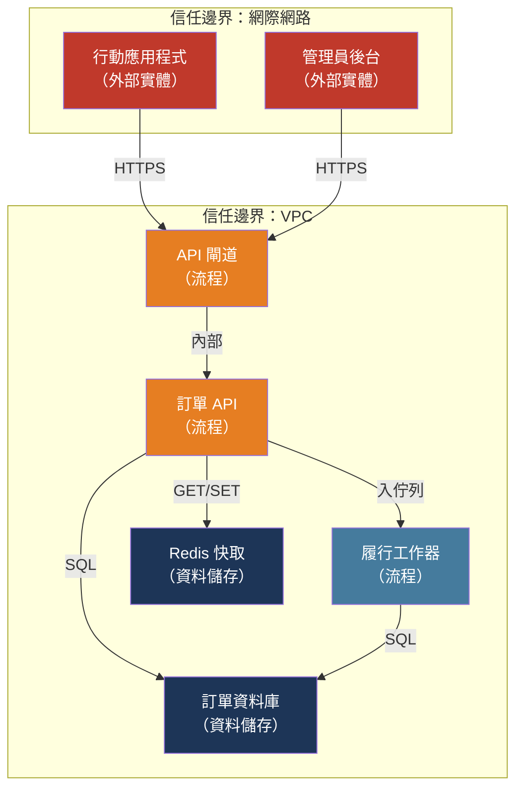

# [BEE-502] 威脅建模

:::info
威脅建模是一種結構化的設計階段演練，在任何一行生產程式碼撰寫之前，先提問「哪裡可能出錯？」——識別威脅、評估風險，並在修改成本最低時分配緩解措施。
:::

## 背景

軟體威脅建模的主流框架 STRIDE，由 Praerit Garg 與 Loren Kohnfelder 於 1999 年在微軟內部創建，作為系統性整理安全威脅的工具。2000 年代初 Windows 安全危機之後，Bill Gates 發出 2002 年「可信賴運算」備忘錄，並啟動多年計畫將安全紀律植入產品開發，微軟遂將 STRIDE 納入安全開發生命週期（SDL）。曾主導微軟威脅建模工作的 Adam Shostack 在《Threat Modeling: Designing for Security》（Wiley，2014）中將該方法論系統化，此書至今仍是業界參考標準。

威脅建模所解決的問題是順序性問題。安全漏洞在軟體開發的每個階段都會被發現，但修復成本會急劇上升：設計階段識別出的威脅只需一次白板討論；相同威脅在程式碼審查時發現需要一個 pull request；在 QA 階段發現需要一個 sprint；在生產環境發現則需要一次事故處理。IBM 系統科學研究所估計，設計階段與部署後修復缺陷的成本差異達百倍。威脅建模將安全向左移——不是口號，而是一種讓「攻擊者能做什麼？」像效能和正確性一樣成為設計約束的結構化實踐。

Bruce Schneier 於 1999 年獨立提出了攻擊樹（Attack Trees）作為互補技術：將攻擊者目標作為樹的根節點，攻擊路徑作為分支，以 AND 節點（所有子目標都必須達成）和 OR 節點（任何路徑均可）表示。攻擊樹擅長將特定攻擊目標分解為子目標進行量化風險分析。STRIDE 與攻擊樹相輔相成：STRIDE 在整個系統中列舉威脅類別；攻擊樹則深入探索單一威脅。

## 流程：資料流程圖與 STRIDE

威脅建模包含四個步驟：分解系統、識別威脅、評估風險、緩解。

### 第一步：繪製資料流程圖

資料流程圖（DFD）是 STRIDE 分析的輸入。它有五個元素：

| 元素 | 符號 | 代表含義 |
|------|------|---------|
| 外部實體 | 矩形 | 使用者、第三方服務、行動應用程式 |
| 流程 | 圓形/橢圓形 | 轉換資料的程式碼——API 處理器、工作器、服務 |
| 資料儲存 | 平行線 | 資料庫、快取、佇列、檔案系統 |
| 資料流 | 箭頭 | 在元素之間流動的資料 |
| 信任邊界 | 虛線框 | 資料跨越安全區域之處（網際網路→VPC，服務→資料庫）|

Level-0 DFD 將系統顯示為單一流程及其外部參與者。Level-1 DFD 將主要系統分解為子系統、資料儲存和關鍵流程。大多數威脅建模演練在 Level-1 進行。

對於典型的電商訂單服務，Level-1 DFD 可能顯示：行動客戶端和管理員後台作為外部實體；訂單 API 服務、履行工作器和通知服務作為流程；PostgreSQL 訂單資料庫和 Redis 快取作為資料儲存；以及 API 閘道（面向網際網路）和內部服務網格（VPC 內部）的信任邊界。

### 第二步：在每個信任邊界和元素上應用 STRIDE

STRIDE 將六種威脅類別對應到 DFD 元素。在每個信任邊界交叉點和每個元素上，詢問每個 STRIDE 類別是否適用：

| 字母 | 類別 | 目標元素 | 後端範例 |
|------|------|---------|---------|
| **S** | 偽冒（Spoofing） | 流程、外部實體 | 從 localStorage 竊取 JWT 令牌並重放；API 金鑰洩漏到客戶端日誌；服務 A 偽造服務對服務令牌冒充服務 B |
| **T** | 竄改（Tampering） | 資料流、資料儲存 | 未加密 HTTP 上傳輸時訂單總額被修改；SQL 注入重寫資料庫查詢；無完整性檢查的佇列訊息載荷被篡改 |
| **R** | 否認（Repudiation） | 流程、資料儲存 | 發出退款卻無稽核記錄；管理員刪除記錄卻無日誌記錄是誰啟動的；Webhook 在無時間戳記檢查的情況下被重放 |
| **I** | 資訊洩露（Information Disclosure） | 資料流、資料儲存、流程 | BOLA 回傳另一位使用者的訂單資料；500 回應中的堆疊追蹤暴露內部路徑；PII 出現在送往第三方聚合器的應用程式日誌中 |
| **D** | 拒絕服務（Denial of Service） | 流程、資料儲存 | 未經驗證的端點接受無限查詢參數，觸發全表掃描；缺少速率限制允許請求洪流；具有災難性回溯的正則表達式消耗一個 CPU 核心 |
| **E** | 權限提升（Elevation of Privilege） | 流程 | 普通使用者呼叫未受角色檢查保護的管理員端點（BFLA）；SSRF 漏洞讓攻擊者存取雲端元資料服務並取得 IAM 憑證 |

### 第三步：評估每個威脅

針對每個識別出的威脅，分配風險分數。由 FIRST 維護的 CVSS（通用漏洞評分系統）是業界標準。CVSS 4.0 基礎分數結合了：

- **攻擊向量**（網路/鄰近/本地/實體）
- **攻擊複雜性**（低/高）
- **攻擊需求**（無/存在）
- **所需權限**（無/低/高）
- **使用者互動**（無/被動/主動）
- **機密性/完整性/可用性影響**（無/低/高）——對易受攻擊的系統和下游系統而言皆是

對於內部分級，更簡單的替代方案是 3×3 可能性×影響矩陣，產生低/中/高/嚴重評級，無需 CVSS 學習曲線。與安全團隊或外部稽核人員溝通時使用 CVSS；內部設計審查時使用矩陣。

### 第四步：分配緩解措施並追蹤

每個威脅有四種處置方式：

- **緩解（Mitigate）**：實施降低可能性或影響的控制措施（首選）
- **接受（Accept）**：記錄風險已被理解且在容忍範圍內（需要簽核）
- **轉移（Transfer）**：將風險轉移給第三方（保險、廠商責任）
- **避免（Avoid）**：移除引入威脅的功能或設計元素

緩解措施以與功能需求相同的優先級流入開發待辦清單。產生清單但沒有票券的威脅模型毫無效果。

## 最佳實踐

**MUST（必須）在實作新服務、API 表面或資料儲存之前進行威脅建模**——而非之後。對設計文件進行威脅模型審查是一次對話。對已部署服務進行威脅模型審查需要程式碼變更，可能還需要 Schema 遷移和重新部署。事後進行此演練會使其價值崩潰。

**MUST（必須）在開始 STRIDE 分析之前識別 DFD 中的所有信任邊界。** 信任邊界是最高價值威脅的集中地：資料離開瀏覽器、資料進入 VPC、資料跨越服務帳戶、資料從應用程式層移動到資料庫。忽略信任邊界的 STRIDE 分析會錯過最易被利用的攻擊面。

**SHOULD（應該）以協作方式進行威脅建模**，至少包含一位建構該功能的工程師、一位了解攻擊面的人員（安全冠軍或安全工程師），以及理想情況下一位能代表業務接受風險的產品經理。單獨進行威脅建模會產生不完整的模型——作者的盲點仍然是盲點。

**SHOULD（應該）將威脅模型視為活的文件。** 為服務 v1 編寫的威脅模型，在新整合、新資料儲存或依賴項更新改變信任邊界地圖時會變得不準確。以下情況應觸發模型更新：新的外部整合、驗證或授權的變更、被分類為 PII 或敏感的新資料類型、重大流量模式變更，以及系統發生任何安全事故後。

**SHOULD（應該）明確記錄已接受的風險並獲得簽核。** 未記錄的已接受風險是未知風險——沒有人會審查它，它也永遠不會被重新評估。具有書面理由、風險負責人和審查日期的已接受風險是一個深思熟慮的商業決策。使用威脅登記冊追蹤所有威脅，無論其處置方式。

**MAY（可以）對中小型系統使用 OWASP Threat Dragon。** Threat Dragon 是一個免費的開源繪圖工具，可渲染 DFD 並使用內建 STRIDE 規則引擎從圖表生成威脅清單。對於較大的系統，商業工具（IriusRisk、Threatlocker、Microsoft Threat Modeling Tool）提供自動化和與問題追蹤器的整合。

## 威脅登記冊範本

```
| ID   | 元件               | STRIDE | 威脅描述                                        | 可能性 | 影響 | 風險   | 緩解措施                               | 狀態       |
|------|--------------------|--------|-------------------------------------------------|--------|------|--------|----------------------------------------|------------|
| T-01 | 訂單 API → 資料庫  | T      | 透過訂單搜尋參數進行 SQL 注入                   | 高     | 高   | 嚴重   | 預備語句；輸入驗證                     | 已緩解     |
| T-02 | 管理員後台         | E      | 管理員端點可供普通使用者存取                    | 中     | 高   | 高     | 在所有 /admin/* 路由上進行 RBAC 檢查   | 進行中     |
| T-03 | 履行工作器         | R      | 訂單狀態變更未稽核記錄                          | 低     | 中   | 中     | 在每次狀態變更時附加稽核日誌           | 已接受     |
| T-04 | 通知服務           | I      | 電子郵件地址以明文記錄到 Datadog               | 高     | 中   | 高     | 僅記錄 user_id；在日誌中遮罩電子郵件  | 進行中     |
```

## 視覺化



跨越網際網路→VPC 信任邊界的資料流是偽冒、竄改和資訊洩露威脅最嚴重的地方。VPC 內部但服務之間的資料流是權限提升威脅的集中地（服務對服務驗證）。流入資料庫邊界的資料流是竄改（注入）和資訊洩露（BOLA）威脅所在之處。

## 何時進行威脅建模

| 觸發條件 | 範圍 |
|---------|------|
| 新服務或微服務 | 新服務的完整 Level-1 DFD |
| 新的外部整合 | 到第三方系統的資料流 |
| 驗證或授權變更 | 受影響的所有端點和資料儲存 |
| 新增資料類型（尤其是 PII） | 靜態資料、傳輸中資料、日誌中的資料 |
| 重大架構變更 | 受影響的子系統 |
| 事故後審查 | 涉及事故的系統 |
| 年度審查 | 所有沒有先前模型的生產服務 |

## 相關 BEE

- [BEE-2001](owasp-top-10-for-backend.md) -- OWASP Top 10 後端：STRIDE 威脅直接對應 OWASP Top 10 類別——注入（T）、存取控制失效（E/I）、安全配置錯誤（D/I）
- [BEE-2015](server-side-request-forgery-ssrf.md) -- SSRF：在 API 服務可存取內部網路端點的 DFD 中，被識別為權限提升和資訊洩露威脅
- [BEE-2016](broken-object-level-authorization-bola.md) -- BOLA：在資料儲存存取點上，當未驗證物件層級所有權時，是一種資訊洩露威脅
- [BEE-2017](data-privacy-and-pii-handling.md) -- 資料隱私與 PII 處理：針對 PII 的資訊洩露威脅，決定哪些資料儲存需要加密和日誌清理
- [BEE-19043](../distributed-systems/audit-logging-architecture.md) -- 稽核日誌架構：透過確保每個敏感操作都被記錄在防竄改稽核日誌中來緩解否認威脅

## 參考資料

- [Adam Shostack. Threat Modeling: Designing for Security — Wiley, 2014](https://www.wiley.com/en-us/Threat+Modeling:+Designing+for+Security-p-9781118809990)
- [Adam Shostack. Threat Modeling Resources — shostack.org](https://shostack.org/resources/threat-modeling)
- [Microsoft. Threat Modeling — microsoft.com](https://www.microsoft.com/en-us/securityengineering/sdl/threatmodeling)
- [OWASP. Threat Modeling Cheat Sheet — cheatsheetseries.owasp.org](https://cheatsheetseries.owasp.org/cheatsheets/Threat_Modeling_Cheat_Sheet.html)
- [OWASP. Threat Modeling Process — owasp.org](https://owasp.org/www-community/Threat_Modeling_Process)
- [OWASP Threat Dragon — github.com/OWASP/threat-dragon](https://github.com/OWASP/threat-dragon)
- [FIRST. Common Vulnerability Scoring System v4.0 — first.org](https://www.first.org/cvss/)
- [Bruce Schneier. Attack Trees — schneier.com, 1999](https://www.schneier.com/academic/archives/1999/12/attack_trees.html)
- [CMU SEI. Threat Modeling: A Summary of Available Methods — sei.cmu.edu, 2018](https://resources.sei.cmu.edu/asset_files/WhitePaper/2018_019_001_524597.pdf)
