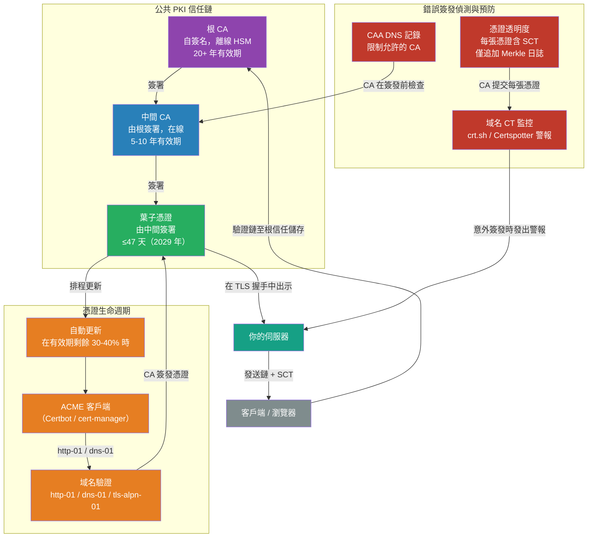

# [BEE-2011] TLS 憑證生命週期與 PKI

:::info
公開金鑰基礎建設（PKI）是使 TLS 身份可驗證的信任鏈系統——了解憑證如何被結構化、簽發、更新、撤銷與監控，對於操作任何透過網際網路或內部網路通訊的後端服務而言至關重要。
:::

## 背景

每個 TLS 連線都從憑證交換開始。憑證聲稱：「我是 `api.example.com`，這是我的公鑰。」客戶端必須回答的問題是：「我應該相信這個聲明嗎？」答案來自 PKI——一個信任錨點（根 CA）的層級結構，這些錨點已驗證了從憑證回溯至受信任根的鏈。

X.509 憑證格式定義於 RFC 5280（2008 年），是基礎標準。它編碼了主體身份、公鑰、簽發 CA 以及有效期——以及限制憑證使用方式的擴展欄位。TLS 最關鍵的擴展是 `subjectAltName`（SAN）：RFC 2818 棄用了使用通用名稱（CN）欄位進行主機名稱匹配，瀏覽器在 2017 年左右停止接受僅有 CN 的憑證。任何未在 SAN 欄位中包含預期主機名稱的憑證都將被拒絕。

憑證簽發歷史上是一個緩慢、手動、容易出錯的過程：向憑證授權機構申請，透過人工介入的驗證回應域名所有權，等待數小時後簽發，再將憑證複製貼上到伺服器配置中，並記得在到期前更新。這個過程產生了一類可預見的故障——生產服務因憑證到期而停機，因為沒有人記得更新。

ACME 協定（RFC 8555，2019 年 3 月）由 Richard Barnes、Jacob Hoffman-Andrews、Daniel McCarney 和 James Kasten 設計，並由 Let's Encrypt 付諸實現，將整個簽發和更新流程自動化。Let's Encrypt 於 2015 年 9 月簽發了第一張憑證，到 2024 年已超過 5 億張有效憑證。自動化改變了經濟格局：ACME 管理的憑證是免費的，每 60–90 天更新一次且無需手動介入，輪換是例行的後台流程而非例外事件。

CA/瀏覽器論壇，即管理公共 CA 和瀏覽器廠商的標準機構，於 2025 年 4 月 11 日批准了 SC-081v3 投票，強制規定最大憑證有效期的縮減計劃：2026 年 3 月起為 200 天，2027 年起為 100 天，2029 年 3 月起為 47 天。SAN 域名驗證資料重用期從 2026 年 3 月起降至 10 天。在 47 天有效期和 10 天驗證重用的情況下，手動憑證管理在操作上變得不可能——ACME 自動化不再是可選的。

## 憑證信任層級

公共 PKI 分為三個層級：

**根 CA** — 根憑證是自簽名的：它聲明自己的可信賴性。它被信任，因為它被嵌入到由 Apple、Microsoft、Mozilla 和 Google 維護的作業系統和瀏覽器信任儲存區中。全球大約有 130–150 個受信任的根 CA。根私鑰被嚴格保存在離線的氣隙硬體安全模組中，從不用於直接簽發，其憑證有效期為 20 年以上。

**中間 CA** — 根 CA 將簽發委託給中間 CA。中間憑證由根 CA 簽署，但保持在線，因為憑證簽發需要在線的簽名金鑰。如果中間 CA 被入侵，只需撤銷它——離線的根仍然有效。Let's Encrypt 目前從四個活躍中間簽發：R12、R13（RSA）和 E7、E8（ECDSA P-384）。每個都由 ISRG Root X1（RSA 4096，離線，有效至 2030 年）或 ISRG Root X2（ECDSA P-384，離線，有效至 2035 年）簽署。

**葉子/終端實體憑證** — 伺服器向客戶端出示的憑證。由中間 CA 簽署，透過 SAN 主機名稱識別伺服器，有效期為 CA/瀏覽器論壇規定的最大期間（目前為 398 天，到 2029 年縮短至 47 天）。

當客戶端驗證憑證時，它從葉子 → 中間 → 根建立鏈，並驗證每個簽名。伺服器 MUST（必須）在 TLS 握手中包含中間憑證——客戶端並非總能從網路上透過 AIA 擴展獲取它們，特別是在具有嚴格出站控制或高延遲連線的環境中。

## 最佳實踐

### 使用 ACME 自動化憑證簽發和更新

**MUST NOT（不得）手動管理公共憑證。** 憑證到期是可避免的 TLS 故障最常見原因。手動更新需要記住在某個任意未來日期之前採取行動——這個過程在操作壓力下會可預見地失敗。

**MUST（必須）為所有面向公眾的憑證部署 ACME 客戶端。** ACME（RFC 8555）自動化四步驟週期：帳號注冊、訂單提交、域名驗證挑戰完成和憑證最終確定。常見客戶端：

- **Certbot**（Python，由 EFF 開發）：標準 CLI 客戶端；支援 Apache、Nginx、獨立模式和 DNS 挑戰插件
- **Caddy**：內建 ACME 的 Web 伺服器；無需任何配置即可獲取和更新憑證
- **cert-manager**（Kubernetes）：管理 `Certificate` 和 `Issuer` 資源的控制器，透過 Ingress 注解或 DNS01 解析器處理 ACME 挑戰，並自動輪換 Secret
- **acme.sh**：POSIX shell 客戶端；輕量、無依賴，在 DNS-01 挑戰中廣泛使用

ACME 支援三種挑戰類型。`http-01` 最簡單（在 `/.well-known/acme-challenge/<token>` 放置一個檔案），但需要端口 80 可達。`dns-01` 需要建立 `_acme-challenge` TXT 記錄；它是唯一支援萬用字元憑證的類型，可在防火牆後運作。`tls-alpn-01` 使用 ALPN TLS 擴展；對於端口 80 被阻止的僅 TLS 環境很有用。

**SHOULD（應該）配置在有效期剩餘 30–40% 時進行更新。** 對於 90 天的 Let's Encrypt 憑證，這意味著在第 60–63 天更新。更新太晚沒有時間除錯失敗；更新太早浪費簽發容量。Let's Encrypt 預設的 Certbot 更新閾值是剩餘 30 天。

### 提供完整的憑證鏈

**MUST（必須）在伺服器的 TLS 配置中包含中間 CA 憑證**，而不僅僅是葉子憑證。無法從 AIA 擴展 URL 建立鏈的瀏覽器和 HTTP 客戶端——氣隙系統、嚴格出站環境、某些 IoT 韌體——將拒絕憑證。

驗證鏈是否完整：
```bash
# 輸出應顯示：葉子 → 中間 → 根
openssl s_client -connect example.com:443 -showcerts 2>/dev/null | openssl x509 -noout -text | grep -A1 "Issuer\|Subject"
```

Let's Encrypt ACME 客戶端將 `fullchain.pem`（葉子 + 中間）作為推薦的部署工件。永遠不要將 `cert.pem`（僅葉子）部署為伺服器憑證檔案。

### 監控憑證到期

**MUST（必須）獨立於更新自動化監控憑證到期。** 自動化可能靜默失敗：如果 DNS 更改、防火牆規則改變或 ACME 客戶端程序掛掉，ACME 挑戰完成可能中斷。獨立檢查到期的監控系統，在故障導致停機之前發現這些失敗。

到期監控選項：
- `prometheus-cert-exporter` 或 Blackbox Exporter 的 `tls` 探針：匯出 `ssl_earliest_cert_expiry` 指標；當到期少於 14 天時發出警報
- 外部監控服務（UptimeRobot、Datadog Synthetics），從基礎設施外部檢查 TLS 到期
- 排程健康檢查中的 `openssl s_client`：
  ```bash
  # 如果憑證在超過 N 天後到期，則返回 0
  openssl s_client -connect example.com:443 </dev/null 2>/dev/null \
    | openssl x509 -noout -checkend 1209600  # 14 天（以秒為單位）
  ```

**SHOULD（應該）在剩餘 14 天時針對 90 天有效期的憑證發出警報**，對於有效期較長的內部憑證在剩餘 30 天時發出警報。

### 了解並配置撤銷

當憑證的私鑰被洩露時，必須在其自然到期前撤銷憑證。存在兩種傳統機制：

**CRL（憑證撤銷清單）**：CA 定期發布的已撤銷序列號的簽名清單。客戶端下載並快取 CRL。問題：CRL 可能達到許多 MB，有效性受發布頻率限制（通常 24–72 小時），且需要客戶端追蹤和解析它們。

**OCSP（線上憑證狀態協定，RFC 6960）**：客戶端向 CA 的 OCSP 響應器查詢憑證序列號，並接收即時的 `good/revoked/unknown` 回應。問題：每個 TLS 連線增加一個網路往返，將瀏覽行為洩漏給 CA，且所有主流瀏覽器實作都使用「軟失敗」——如果 OCSP 響應器無法連線，連線仍然繼續。已洩露憑證的攻擊者可以阻止 OCSP 流量，以防止撤銷生效。

**OCSP 釘選（Stapling）** 消除了客戶端的往返：伺服器獲取並快取 OCSP 回應，透過 `status_request` TLS 擴展將其包含在 TLS 握手中。客戶端接收最近的、CA 簽名的憑證狀態認證，無需單獨的網路呼叫。在仍使用 OCSP 的伺服器上，SHOULD（應該）啟用 OCSP 釘選。

整個行業正在完全放棄即時撤銷基礎設施。CA/瀏覽器論壇在 2023 年使 OCSP 對公共 CA 成為可選。Let's Encrypt 於 2025 年 8 月 6 日終止了其 OCSP 服務。首選模型是**短期憑證**：如果憑證在 47 天後到期，無法立即撤銷的洩露憑證的最大暴露視窗被限制在數週而非數年。

### 使用 CAA 記錄防止錯誤簽發

**SHOULD（應該）發布 CAA DNS 記錄**以限制哪些 CA 被允許為域名簽發憑證。RFC 8659 中定義，CAA 記錄在簽發前由 CA 作為強制基準要求進行檢查：

```
; 只有 Let's Encrypt 可以簽發單名稱憑證
example.com.  IN  CAA  0  issue    "letsencrypt.org"
; 不允許任何人簽發萬用字元憑證
example.com.  IN  CAA  0  issuewild ";"
; 違規報告發送至此處
example.com.  IN  CAA  0  iodef    "mailto:security@example.com"
```

收到 `example.com` 簽發請求但未列在 `issue` 標籤中的 CA 必須拒絕。CAA 是預防性控制——它在錯誤簽發發生之前阻止它。它與憑證透明度（在事後偵測）互補。

局限性：被入侵或惡意的根 CA 可以忽略 CAA。CAA 限制誠實的 CA 不犯錯誤；它無法限制對抗性的 CA。

### 監控憑證透明度日誌

**SHOULD（應該）針對 CT 日誌配置域名監控**，以偵測未授權的憑證簽發。憑證透明度（RFC 9162）由 Google 的 Ben Laurie 和 Adam Langley 在 2011 年 DigiNotar 事件後設計，要求每個公開受信任的 CA 將每張簽發的憑證提交到一個僅追加的 Merkle 樹日誌。瀏覽器驗證憑證是否附帶有效的簽名憑證時間戳（SCT）——來自日誌的加密承諾，表明憑證已被（或將被）包含在日誌中。

DigiNotar 事件：2011 年 7 月 10 日，攻擊者入侵了 DigiNotar 的 CA 基礎設施，簽發了 `*.google.com` 的萬用字元憑證。伊朗使用者遭受了超過一個月的 TLS 中間人攔截。該憑證被偵測到，因為 Chrome 對 Google 屬性有硬編碼的固定——一個脆弱的、非通用的解決方案。CT 的建立就是為了使此類偵測系統化。

為域名簽發的任何憑證都會在最大合並延遲（通常 24 小時）內出現在公共 CT 日誌中。`crt.sh` 等服務索引所有 CT 日誌。域名所有者可以訂閱新簽發警報：

- **crt.sh**：`https://crt.sh/?q=example.com` — 被動搜索；可以程式化查詢
- **Certspotter**（SSLMate）：主動監控，在新簽發時發送 webhook/電子郵件警報
- **Google 憑證透明度儀表板**：`https://transparencyreport.google.com/https/certificates`

當 CT 日誌中出現域名的意外憑證時，MUST（必須）立即調查——要麼是配置錯誤的自動化合法地簽發了它，要麼是攻擊者獲取了一張錯誤簽發的憑證。

### 服務間 mTLS 的內部 PKI

公共 CA 不適合內部服務通訊：它們無法為內部主機名稱（`.internal`、`.cluster.local`、RFC 1918 IP 位址）簽發憑證，需要外部網路連線，且受 CA/瀏覽器論壇規定的最大有效期限制，這可能不符合內部輪換要求。

**SHOULD（應該）為服務間 mTLS 使用內部 CA 或服務網格管理的 PKI。** 選項：

- **HashiCorp Vault PKI Secrets Engine**：按需簽發短期憑證的內部 CA，具有可配置的最大有效期、SAN 和 IP SAN。Vault PKI 透過 vault-agent 或 CSI 驅動器與 Kubernetes 整合。
- **step-ca**（Smallstep）：ACME 相容的內部 CA；支援所有 ACME 挑戰類型、舊設備的 SCEP，以及基於 OIDC 的憑證簽發
- **AWS Private CA** / **GCP Certificate Authority Service**：具有 HSM 支持根金鑰的雲端管理內部 CA
- **SPIFFE/SPIRE**：CNCF 工作負載身份標準。SPIRE 代理透過平台元資料（Kubernetes pod 身份、AWS 執行個體身份文件、Linux 核心命名空間）認證工作負載，然後簽發 **SVID（SPIFFE 可驗證身份文件）**——在 SAN 欄位中嵌入 `spiffe://trust-domain/workload` URI 的 X.509 憑證。SVID 在到期前自動輪換。Istio、Linkerd 和 Envoy 使用 SPIFFE SVID 在服務間實現透明的 mTLS。

**MUST NOT（不得）在沒有 HSM 或等效防篡改硬體的情況下生成根 CA 金鑰。** 存在於標準伺服器文件系統上的內部 CA 根，與該伺服器上任何其他文件具有相同的信任屬性。

## 視覺化



## 常見錯誤

**部署葉子憑證而不包含中間鏈。** 無法從 AIA 獲取建立鏈的客戶端——氣隙系統、嚴格出站環境、某些 IoT 韌體——將拒絕憑證。始終部署 `fullchain.pem`（葉子 + 所有中間，不包括根，客戶端已在其信任儲存中擁有根）。

**將憑證輪換與金鑰輪換混淆。** 憑證輪換意味著用新憑證替換即將到期的憑證——這可能重用相同的私鑰。金鑰輪換意味著生成新的私鑰並為其取得新憑證。金鑰洩露後，憑證輪換是不夠的：必須為新生成的私鑰簽發新憑證。ACME 客戶端除非另行配置，否則每次更新時都會重新生成私鑰。

**信任自動化而不監控它。** ACME 客戶端具有彈性但並非萬無一失。如果伺服器的 webroot 路徑更改、反向代理過濾 `.well-known` 請求或移除端口 80 重定向，http-01 挑戰會中斷。如果 DNS 供應商的 API 憑證輪換，dns-01 挑戰會中斷。除非獨立監控到期，否則無法更新的憑證將靜默地到期。

**從公共 CA 為內部服務簽發萬用字元憑證。** 萬用字元憑證適用於 `*.example.com`，但無法覆蓋 `api.internal` 或 `service.namespace.svc.cluster.local`。即使技術上可行，萬用字元也覆蓋所有子域——萬用字元私鑰的洩露同時影響所有服務。內部服務 SHOULD（應該）使用簽發具有窄 SAN 的每服務憑證的內部 CA。

**沒有 CAA 記錄。** 若無 CAA，130+ 個受信任根 CA 中的任何一個都可以為域名簽發憑證。域名所有者可能永遠不會知道——除非他們監控 CT 日誌，而大多數團隊不這樣做。CAA 和 CT 監控一起填補了這個缺口。

## 相關 BEE

- [BEE-2005](cryptographic-basics-for-engineers.md) -- 工程師的密碼學基礎：憑證金鑰對和簽名鏈背後的非對稱密碼學（RSA、ECDSA）
- [BEE-3004](../networking-fundamentals/tls-ssl-handshake.md) -- TLS/SSL 握手：使用憑證的協定機制——連線時憑證如何被出示和驗證
- [BEE-3007](../networking-fundamentals/mutual-tls-handshake-and-server-configuration.md) -- Mutual TLS 握手與伺服器設定：mTLS 協定機制與實務伺服器設定；消費本文所描述的 PKI 層
- [BEE-19048](../distributed-systems/service-to-service-authentication.md) -- 服務間身份驗證：作為認證策略的 mTLS；本文涵蓋使 mTLS 運作的 PKI 層
- [BEE-2010](cryptographic-key-management-and-key-rotation.md) -- 密碼學金鑰管理與金鑰輪換：憑證背後的私鑰受所有金鑰管理要求約束——DEK/KEK、HSM 儲存、密碼期

## 參考資料

- [RFC 8555: Automatic Certificate Management Environment (ACME) — IETF (2019)](https://datatracker.ietf.org/doc/html/rfc8555)
- [RFC 5280: Internet X.509 PKI Certificate and CRL Profile — IETF](https://www.rfc-editor.org/rfc/rfc5280)
- [RFC 9162: Certificate Transparency Version 2.0 — IETF (2022)](https://www.rfc-editor.org/rfc/rfc9162.html)
- [RFC 8659: DNS CAA Resource Record — IETF](https://datatracker.ietf.org/doc/html/rfc8659)
- [CA/Browser Forum Ballot SC-081v3 — cabforum.org (April 2025)](https://cabforum.org/2025/04/11/ballot-sc081v3-introduce-schedule-of-reducing-validity-and-data-reuse-periods/)
- [Let's Encrypt: Chains of Trust](https://letsencrypt.org/certificates/)
- [Certificate Transparency — MDN Web Docs](https://developer.mozilla.org/en-US/docs/Web/Security/Defenses/Certificate_Transparency)
- [OWASP: Certificate and Public Key Pinning](https://owasp.org/www-community/controls/Certificate_and_Public_Key_Pinning)
- [SPIFFE/SPIRE Use Cases — spiffe.io](https://spiffe.io/docs/latest/spire-about/use-cases/)
