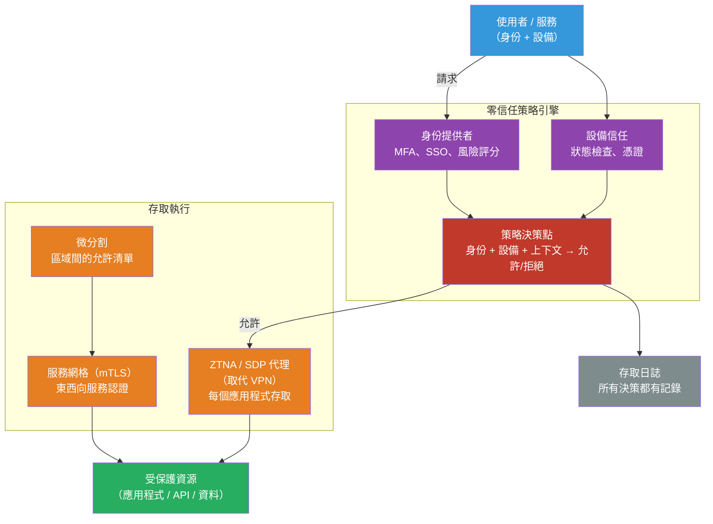

# [BEE-2007] 零信任安全架構

:::info
零信任以「永不信任，始終驗證」取代邊界安全模型——「內部可信，外部不可信」：每個存取請求，無論來自網路內部還是外部，在授予存取權限前都必須經過認證、授權和持續驗證。
:::

## 情境

傳統企業安全依賴網路邊界：防火牆將可信的內部網路與不可信的網際網路分隔開來。邊界內的員工受到隱性信任。這個模型是為辦公室大樓、桌上型工作站和單體式本地系統的世界而設計的。

那個世界已經消失了。雲服務、遠端工作、行動設備和 SaaS 應用程式意味著網路的「內部」不再與可信賴性相關。防火牆內被入侵的筆記型電腦與攜帶它進入的合法使用者具有相同的內部存取權限。能夠釣魚獲取憑證的攻擊者可以在內部網路上橫向移動，幾乎不受阻礙。

John Kindervag（Forrester Research）在 2009 年創造了「零信任」這個術語，認為基於網路位置的隱性信任從根本上是有缺陷的。這個模型在 2014 年 Google 發布「BeyondCorp：企業安全的新方法」（Rory Ward 和 Betsy Beyer，USENIX ;login:，2014 年 12 月）時獲得了運作上的證明，描述了 Google 如何消除其企業 VPN，讓工程師從不可信的網路工作——通過設備狀態和使用者身份而非網路位置進行認證。

美國政府在 **NIST SP 800-207「零信任架構」**（Scott Rose 等人，2020 年 8 月）中將零信任正式化，將其定義為「一套不斷演進的網路安全範式，將防禦從靜態的、基於網路的邊界轉移到關注使用者、資產和資源」。聯邦機構被第 14028 號行政命令（2021 年 5 月）要求採用零信任原則，推動了整個行業的採用。

## 設計思維

### 兩個核心原則

**永不信任，始終驗證**：沒有任何存取請求基於網路位置獲得隱性信任。每個請求——來自外部使用者、內部微服務或管理員——在授予存取權限前都要根據策略進行認證和授權。信任永遠不是假設的；它是每次請求都要獲得的。

**假設被入侵**：假設系統已經或將會被入侵來設計系統。分割存取權，使一個元件的入侵不會級聯。對所有內容進行監控，使入侵能被快速偵測。從「防止所有入侵」到「最小化爆炸半徑並快速偵測」的這種轉變，是關鍵的架構含義。

### 五個支柱（CISA 零信任成熟度模型 v2，2023）

CISA 零信任成熟度模型定義了五個支柱，每個都需要漸進式的成熟度：

| 支柱 | 保護對象 | 關鍵控制 |
|---|---|---|
| **身份** | 誰在存取 | MFA、SSO、條件存取、身份風險評分 |
| **設備** | 什麼在存取 | 設備狀態（EDR、補丁級別、加密）、設備憑證 |
| **網路** | 如何連接 | 微分割、加密的東西向流量、ZTNA |
| **應用程式與工作負載** | 被存取的是什麼 | 服務間 mTLS、工作負載身份（SPIFFE/SPIRE）、最小權限 API 範圍 |
| **資料** | 讀取/寫入的是什麼 | 分類、靜態和傳輸中加密、DLP、存取記錄 |

### 邊界模型 vs 零信任

| 方面 | 邊界模型 | 零信任 |
|---|---|---|
| 信任基礎 | 網路位置 | 身份 + 設備狀態 + 上下文 |
| 內部流量 | 預設可信 | 每次請求都需驗證 |
| 存取範圍 | 全網路（VPN） | 每個應用程式（ZTNA） |
| 入侵影響 | 橫向移動不受限制 | 由微分割限制 |
| 可見性 | 僅邊緣 | 完整可觀測性（所有存取都有記錄） |

## 最佳實踐

### 身份與存取

**MUST（必須）對所有人工存取（包括內部工具和管理介面）強制執行多因素認證。** 單因素密碼是最常見的初始存取向量。硬體安全金鑰（FIDO2/WebAuthn）提供最強的 MFA；TOTP 是最低可接受的標準。

**MUST（必須）將最小權限存取實作為預設值。** 沒有任何使用者、服務或應用程式應該擁有超過完成其任務所需的存取權限。為方便而授予的廣泛角色違反了零信任。使用基於屬性的存取控制（ABAC）或細粒度 RBAC 精確地界定權限範圍。

**MUST（必須）對服務身份要求短期有效的憑證。** 長期有效的 API 金鑰和服務帳戶密碼是入侵向量。使用工作負載身份提供者（SPIFFE/SPIRE、帶實例元資料的雲端 IAM）來發放以小時而非月為單位過期的短期憑證或令牌。

### 網路與服務通信

**MUST（必須）將東西向（內部服務對服務）流量視為不可信的。** 在傳統邊界模型中，內部服務之間的流量不受任何審查。在零信任中，每次服務對服務的呼叫都需要認證。在服務之間實作 mTLS——每一方都呈現憑證並驗證對方的憑證。服務網格（Istio、Linkerd）在基礎設施層自動化這一點，不需要更改應用程式代碼。

**SHOULD（應該）用零信任網路存取（ZTNA）取代用於遠端存取的 VPN。** VPN 授予網路級存取，使認證後網路上的所有內容都可到達。ZTNA 授予每個應用程式的存取：驗證身份和設備狀態後，使用者可以到達他們需要的特定應用程式——僅此而已。Cloudflare Access、Zscaler Private Access 和類似的 ZTNA 解決方案實作了這個模型。

**SHOULD（應該）實作微分割以限制橫向移動。** 將網路劃分為小區域，並在它們之間設置明確的允許清單。如果服務 A 沒有理由呼叫服務 B，就在網路層拒絕該流量——而不僅僅是應用程式層。被入侵的服務 A 則無法到達服務 B，從而限制了入侵的爆炸半徑。

### 持續驗證

**SHOULD（應該）將設備健康狀況作為每個存取決策的一部分進行評估。** 設備狀態——操作系統補丁級別、磁碟加密、EDR 代理狀態、憑證有效性——是信任計算中的信號。具有有效憑證但在未受管理或被入侵的設備上的使用者不是可信的主體。設備信任應持續重新評估，而不僅僅是在登入時。

**MUST（必須）記錄每個存取決策，並提供足夠的上下文以進行取證重建。** 零信任的「假設被入侵」原則要求能夠回答：什麼存取了什麼，何時，從哪裡，使用什麼憑證？具有身份、資源、動作、時間、源 IP 和設備 ID 的集中式存取日誌是不可或缺的。這是使「假設被入侵」可操作的偵測能力。

**MAY（可以）使用持續存取評估（CAE）近實時地撤銷會話。** 傳統的 OAuth 令牌在到期前保持有效。CAE 允許資源伺服器從身份提供者接收即時撤銷信號（帳戶停用、位置變更、風險信號）並在數秒內終止存取。Microsoft Entra ID 和 Google Workspace 為其生態系統支援 CAE。

## 視覺化



## 範例

**使用 SPIFFE/SPIRE 工作負載身份的微服務間 mTLS：**

```yaml
# Kubernetes：SPIRE 自動向工作負載發放 SVID（SPIFFE 可驗證身份文件）
# 無需更改應用程式代碼即可啟用 mTLS

# spire-server 配置摘錄
apiVersion: v1
kind: ConfigMap
metadata:
  name: spire-server
data:
  server.conf: |
    server {
      bind_address = "0.0.0.0"
      bind_port = "8081"
      trust_domain = "example.org"
      # SVID（x.509 憑證）1 小時後過期
      default_svid_ttl = "1h"
    }

---
# 註冊條目：授權 orders-service 工作負載
# spire-server entry create \
#   -spiffeID spiffe://example.org/orders-service \
#   -parentID spiffe://example.org/k8s-workload-registrar/node \
#   -selector k8s:namespace:production \
#   -selector k8s:sa:orders-service
```

```go
// orders_client.go — 從 SPIRE 代理取得 SVID 並用於 mTLS
// 實際上，Istio 或 Linkerd sidecar 自動處理這一切

import (
    "github.com/spiffe/go-spiffe/v2/spiffetls"
    "github.com/spiffe/go-spiffe/v2/workloadapi"
)

func newMTLSClient(ctx context.Context) (*http.Client, error) {
    // SPIRE 代理提供工作負載的憑證和私鑰
    source, err := workloadapi.NewX509Source(ctx)
    if err != nil {
        return nil, err
    }

    // tlsConfig 強制執行 mTLS：客戶端呈現其 SVID，驗證伺服器的 SVID
    // 伺服器必須在信任域中擁有 SPIFFE ID——不使用 IP/主機名稱
    tlsConfig := spiffetls.MTLSClientConfig(
        spiffetls.AuthorizeID(spiffeid.RequireIDFromString("spiffe://example.org/payments-service")),
        source,
    )
    return &http.Client{Transport: &http.Transport{TLSClientConfig: tlsConfig}}, nil
}
// 憑證輪換是自動的——不需要憑證刷新代碼
```

**Istio 授權策略——服務間的允許清單（微分割）：**

```yaml
# 只允許 orders-service 在 POST /charge 上呼叫 payments-service
# 所有其他呼叫者在 sidecar 代理層被拒絕（無需更改應用程式代碼）
apiVersion: security.istio.io/v1beta1
kind: AuthorizationPolicy
metadata:
  name: payments-service-policy
  namespace: production
spec:
  selector:
    matchLabels:
      app: payments-service
  action: ALLOW
  rules:
    - from:
        - source:
            principals:
              - "cluster.local/ns/production/sa/orders-service"
      to:
        - operation:
            methods: ["POST"]
            paths: ["/charge"]
```

**條件存取策略（偽代碼——策略決策點邏輯）：**

```python
# policy_engine.py — 根據零信任策略評估存取請求
from dataclasses import dataclass
from enum import Enum

class Decision(Enum):
    ALLOW = "allow"
    DENY = "deny"
    STEP_UP = "step_up"  # 需要額外的 MFA

@dataclass
class AccessRequest:
    user_id: str
    resource: str
    action: str
    device_posture: dict  # {encrypted: bool, os_patched: bool, edr_active: bool}
    risk_score: float     # 0.0–1.0 來自身份提供者
    mfa_satisfied: bool

def evaluate(req: AccessRequest) -> Decision:
    # 如果風險評分嚴重，立即拒絕
    if req.risk_score > 0.8:
        return Decision.DENY

    # 對未受管理設備上的敏感資源需要步驟提升 MFA
    is_managed = req.device_posture.get("edr_active") and req.device_posture.get("encrypted")
    is_sensitive = req.resource.startswith("/admin") or req.action in ("DELETE", "PATCH")

    if is_sensitive and not is_managed:
        return Decision.DENY  # 未受管理的設備無法存取敏感資源

    if is_sensitive and not req.mfa_satisfied:
        return Decision.STEP_UP

    # 任何存取都需要設備已打補丁
    if not req.device_posture.get("os_patched"):
        return Decision.DENY

    return Decision.ALLOW
```

## 實作注意事項

**漸進式採用**：零信任是一個架構方向，而不是二元狀態。NIST SP 800-207 和 CISA 成熟度模型都定義了成熟度級別。大多數組織從身份開始（在所有地方強制執行 MFA，採用 SSO），然後轉向網路（ZTNA、微分割），最後是資料（分類、DLP）。嘗試同時實作所有支柱是常見的失敗模式。

**服務網格 vs 應用程式層 mTLS**：服務網格（Istio、Linkerd）在 sidecar 層面透明地實作 mTLS。應用程式代碼既不生成憑證也不驗證它們——sidecar 代理處理 TLS 握手。對於不在 Kubernetes 上的團隊，使用 SPIFFE/SPIRE 或雲原生憑證管理器（AWS ACM PCA、GCP 憑證授權機構服務）的應用程式層 mTLS 可以達到相同的目標。

**ZTNA 與開發者體驗**：用 ZTNA 取代 VPN 可以改善開發者體驗：每個應用程式的存取比 VPN 隧道更快，分割隧道消除了通過企業代理路由所有流量的需要。然而，CI/CD 管道、基礎設施工具和開發者機器都需要 ZTNA 客戶端配置，這是一項重大的遷移工作。

**日誌量**：零信任的「記錄一切」要求會產生大量的日誌。高流量微服務系統中每次服務對服務呼叫的存取日誌每天可能達到數十億條記錄。實作分層保留（近期日誌使用熱存儲，合規日誌使用冷存儲）、具有一致欄位的結構化日誌記錄，以及自動異常偵測，而不是期望人工審查原始日誌。

## 相關 BEE

- [BEE-1001](../auth/authentication-vs-authorization.md) -- 認證 vs 授權：零信任要求每個請求都進行兩者；在設計零信任策略之前理解這個區別
- [BEE-1005](../auth/rbac-vs-abac.md) -- RBAC vs ABAC 存取控制模型：零信任策略結合使用者屬性、設備狀態和資源敏感性——ABAC 是自然的選擇
- [BEE-2005](cryptographic-basics-for-engineers.md) -- 工程師的密碼學基礎：mTLS 和基於憑證的工作負載身份是零信任網路的密碼學基礎
- [BEE-19048](../distributed-systems/service-to-service-authentication.md) -- 服務對服務認證：涵蓋實作服務間零信任的應用程式層模式（JWT、API 金鑰、mTLS）
- [BEE-3004](../networking-fundamentals/tls-ssl-handshake.md) -- TLS/SSL 握手：mTLS 將標準 TLS 握手擴展為需要客戶端憑證驗證

## 參考資料

- [BeyondCorp：企業安全的新方法 — USENIX（Ward & Beyer，2014）](https://www.usenix.org/publications/login/dec14/ward)
- [零信任架構 — NIST SP 800-207（Rose 等人，2020 年 8 月）](https://csrc.nist.gov/pubs/sp/800/207/final)
- [零信任成熟度模型 v2.0 — CISA（2023 年 4 月）](https://www.cisa.gov/zero-trust-maturity-model)
- [什麼是零信任？— Microsoft Learn](https://learn.microsoft.com/en-us/security/zero-trust/zero-trust-overview)
- [什麼是 ZTNA？— Cloudflare Learning](https://www.cloudflare.com/learning/access-management/what-is-ztna/)
- [SPIFFE/SPIRE — CNCF 工作負載身份](https://spiffe.io/)
