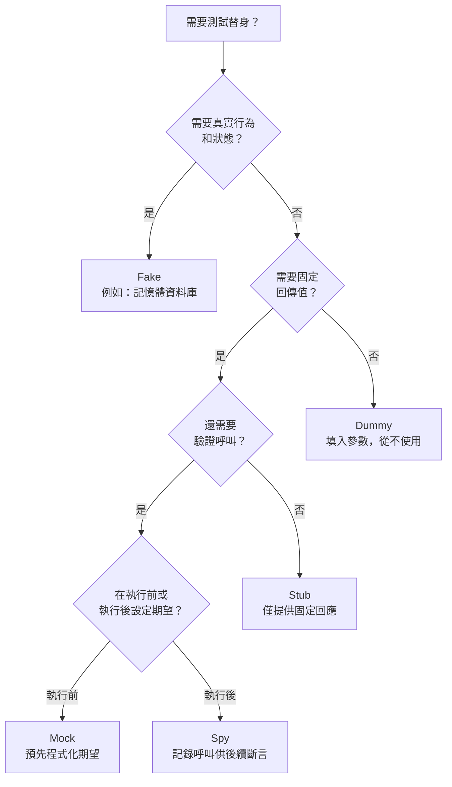

# [BEE-15005] 測試替身：Mock、Stub、Fake

:::info
五種測試替身類型、各自適用情境，以及過度 Mock 如何造成與實作細節緊耦合的脆弱測試。
:::

## 背景

撰寫自動化測試時，大多數正式程式碼都有外部依賴：資料庫、外部服務、電子郵件系統、金流閘道。這些依賴讓測試變慢、不穩定，甚至無法在隔離環境中執行。解決方案是在測試時以受控的替代物取代真實依賴。

Gerard Meszaros 在 *xUnit Test Patterns*（2007）中創造了「**測試替身（test double）**」這個術語，作為任何代替真實依賴物件的通用稱呼。Martin Fowler 的文章 ["Mocks Aren't Stubs"](https://martinfowler.com/articles/mocksArentStubs.html)（2004，2007 更新）澄清了各種替身類型之間的混淆。他也在 [martinfowler.com/bliki/TestDouble.html](https://martinfowler.com/bliki/TestDouble.html) 維護了一份簡明參考。

來自 [xunitpatterns.com](http://xunitpatterns.com/Mocks,%20Fakes,%20Stubs%20and%20Dummies.html) 的原始分類定義了五種不同類型，各自適用於不同情境。

## 五種測試替身類型

### Dummy（虛擬物件）

**Dummy** 被傳入受測系統，但從未被使用。它只是為了滿足參數簽章的需求，不參與測試的實際行為。

```typescript
// OrderService 需要 Logger，但此測試不涉及 logging
const nullLogger: Logger = { log: () => {}, error: () => {} };
const service = new OrderService(paymentGateway, database, nullLogger);
```

當依賴是建構子或函式簽章所必需，但與當前測試案例無關時，使用 Dummy。

### Stub（預設回應物件）

**Stub** 在測試期間的呼叫中提供預先程式化的固定回應，不對任何超出設定範圍的呼叫作出反應。Stub 支援**狀態驗證**：測試斷言的是受測系統的輸出或最終狀態，而非如何呼叫 Stub。

```typescript
const stubPaymentGateway: PaymentGateway = {
  charge: async (amount: number) => ({ success: true, transactionId: "txn-123" })
};

const order = await orderService.place(cart, stubPaymentGateway);
expect(order.status).toBe("confirmed"); // 斷言結果，而非 Stub 本身
```

當你需要依賴回傳已知值，以便專注於下游邏輯時，使用 Stub。

### Spy（間諜物件）

**Spy** 是一種同時記錄被呼叫資訊（呼叫了哪些方法、傳入哪些參數、呼叫幾次）的 Stub。測試可以在事後查詢這些記錄。Spy 支援**行為驗證**，但採用比 Mock 更寬鬆的事後斷言風格。

```typescript
const emailSpy = {
  sent: [] as Email[],
  send: async (email: Email) => { emailSpy.sent.push(email); }
};

await orderService.place(cart, paymentGateway, emailSpy);
expect(emailSpy.sent).toHaveLength(1);
expect(emailSpy.sent[0].to).toBe("customer@example.com");
```

當你需要斷言某個副作用確實發生，但希望在執行階段之後分開撰寫期望時，使用 Spy。

### Mock（模擬物件）

**Mock** 在受測系統執行**之前**預先設定期望。Mock 本身負責驗證預期的呼叫是否發生，若呼叫不符合預期，Mock 會讓測試失敗。Mock 強制執行**行為驗證**。

```typescript
// Jest mock 範例
const mockNotification = {
  sendOrderConfirmation: jest.fn()
};

await orderService.place(cart, paymentGateway, fakeDb, mockNotification);

expect(mockNotification.sendOrderConfirmation).toHaveBeenCalledTimes(1);
expect(mockNotification.sendOrderConfirmation).toHaveBeenCalledWith(
  expect.objectContaining({ orderId: expect.any(String) })
);
```

當驗證某個對外互動是否發生是測試的主要目的時，使用 Mock — 通常用於沒有可觀察回傳值的觸發即忘（fire-and-forget）副作用，例如發送郵件或發布事件。

### Fake（仿製物件）

**Fake** 擁有真實、可運作的實作，但使用讓它不適合正式環境的捷徑。最典型的例子是記憶體資料庫。與 Stub 不同，Fake 確實執行邏輯，並且可以跨多次呼叫維持狀態。

```typescript
class InMemoryOrderRepository implements OrderRepository {
  private store = new Map<string, Order>();

  async save(order: Order): Promise<void> {
    this.store.set(order.id, order);
  }

  async findById(id: string): Promise<Order | null> {
    return this.store.get(id) ?? null;
  }

  async findByCustomer(customerId: string): Promise<Order[]> {
    return [...this.store.values()].filter(o => o.customerId === customerId);
  }
}
```

當依賴具有有意義的內部邏輯（如查詢引擎），你不想逐一呼叫設定 Stub，並且希望測試能執行真實資料流程而不碰觸基礎設施時，使用 Fake。

## 決策流程圖



## 狀態驗證 vs. 行為驗證

這個由 Fowler 清楚劃分的區別，是測試替身使用上最重要的概念分野。

**狀態驗證**（古典/底特律學派）：執行受測系統，然後斷言結果狀態或回傳值。Stub 和 Fake 支援此風格。測試不在乎系統*如何*產生結果。

**行為驗證**（Mockist/倫敦學派）：斷言受測系統以特定方式執行了特定呼叫。Mock 和 Spy 支援此風格。測試在乎系統執行了哪些*互動*。

兩種風格都有其適用性，但取捨不同：

| | 古典（狀態導向） | Mockist（互動導向） |
|---|---|---|
| 測試與之耦合的是 | 可觀察輸出 | 內部呼叫序列 |
| 重構安全性 | 高 — 內部實作可自由更改 | 低 — 內部實作必須維持不變 |
| 診斷失敗 | 清楚 — 結果不正確 | 較難 — 呼叫不正確 |
| 最適用於 | 查詢方法、資料轉換 | 命令方法、觸發即忘 |

實務規則：**預設使用狀態驗證；僅在沒有可觀察狀態可斷言時才使用行為驗證**（例如發送郵件、發布事件）。

## 實作範例：訂單服務

考慮一個有三個依賴的 `OrderService`：`PaymentGateway`、`OrderRepository` 和 `NotificationService`。

```typescript
class OrderService {
  constructor(
    private payment: PaymentGateway,
    private orders: OrderRepository,
    private notifications: NotificationService
  ) {}

  async place(cart: Cart, customer: Customer): Promise<Order> {
    const result = await this.payment.charge(cart.total);
    if (!result.success) throw new PaymentError(result.reason);

    const order = Order.create(cart, customer, result.transactionId);
    await this.orders.save(order);
    await this.notifications.sendOrderConfirmation(order, customer);
    return order;
  }
}
```

一個結構良好的測試套件會對每個依賴使用不同的替身類型：

```typescript
describe("OrderService.place", () => {
  let fakeDb: InMemoryOrderRepository;
  let stubPayment: PaymentGateway;
  let mockNotifications: NotificationService;

  beforeEach(() => {
    // FAKE：repository 需要跨多次呼叫的真實查詢邏輯
    fakeDb = new InMemoryOrderRepository();

    // STUB：payment 只需回傳已知的成功回應；
    // 我們測試的是 OrderService 在成功扣款後的行為，
    // 不是金流閘道本身
    stubPayment = {
      charge: async () => ({ success: true, transactionId: "txn-abc" })
    };

    // MOCK：notification 是觸發即忘的副作用；
    // 沒有可斷言的回傳值，所以行為驗證是唯一選項
    mockNotifications = {
      sendOrderConfirmation: jest.fn()
    };
  });

  it("成功付款後儲存訂單", async () => {
    const service = new OrderService(stubPayment, fakeDb, mockNotifications);
    const order = await service.place(testCart, testCustomer);

    // 對 fake 進行狀態驗證
    const saved = await fakeDb.findById(order.id);
    expect(saved).not.toBeNull();
    expect(saved!.status).toBe("confirmed");
  });

  it("發送訂單確認通知", async () => {
    const service = new OrderService(stubPayment, fakeDb, mockNotifications);
    await service.place(testCart, testCustomer);

    // 對 mock 進行行為驗證
    expect(mockNotifications.sendOrderConfirmation).toHaveBeenCalledTimes(1);
  });

  it("付款失敗時拋出 PaymentError", async () => {
    const failingPayment: PaymentGateway = {
      charge: async () => ({ success: false, reason: "card_declined" })
    };
    const service = new OrderService(failingPayment, fakeDb, mockNotifications);

    await expect(service.place(testCart, testCustomer))
      .rejects.toThrow(PaymentError);
  });
});
```

各個選擇的原因：

- `fakeDb`（Fake）：服務呼叫 `save`，其他測試中也可能呼叫 `findById` 或 `findByCustomer`；逐一設定 Stub 會成為維護負擔，而使用 Mock 會讓測試與 repository 的精確呼叫序列耦合。
- `stubPayment`（Stub）：測試關注的是 `OrderService` 的行為，不是閘道。只需要一個固定的成功或失敗回應。
- `mockNotifications`（Mock）：`sendOrderConfirmation` 沒有回傳值；驗證服務完成其工作的唯一方法是斷言呼叫已發生。

## 常見錯誤

### 1. Mock 所有東西

當每個依賴都是 Mock，測試套件可以在全部通過的同時，真實系統卻根本無法運作。整合路徑、序列化和依賴中的真實邏輯從未被執行。只驗證呼叫序列的測試告訴你程式碼*有在呼叫*依賴，而不是系統*真的能正常運作*。

### 2. 測試 Mock 的行為而非真實行為

```typescript
// 錯誤：這個測試對受測系統什麼都沒斷言
it("呼叫 findById", async () => {
  mockRepo.findById.mockResolvedValue(order);
  await service.getOrder(order.id);
  expect(mockRepo.findById).toHaveBeenCalledWith(order.id); // 必然為真
});

// 正確：斷言服務回傳什麼
it("找到時回傳訂單", async () => {
  mockRepo.findById.mockResolvedValue(order);
  const result = await service.getOrder(order.id);
  expect(result).toEqual(order);
});
```

### 3. Mock 自己擁有的類型（Mock 邊界，而非內部）

只 Mock 架構邊界上的介面（HTTP 客戶端、資料庫驅動、訊息代理）。不要 Mock 內部協作者，例如領域服務、值物件或工具類別。這些是實作細節。當你 Mock 它們，每次內部重構都會破壞測試，即使行為沒有改變。

根據 [BEE-5004](../architecture-patterns/hexagonal-architecture.md)（六邊形架構），**Port 是天然的 Mock 邊界**。Mock Port 介面，而不是它背後的物件。

### 4. 脆弱的 Mock 設定

```typescript
// 脆弱：若內部引數排序或結構改變，測試就會壞掉
expect(mockService.process).toHaveBeenCalledWith("ORDER", customer.id, cart.items, "USD", 0);

// 彈性：斷言語義，而非精確形狀
expect(mockService.process).toHaveBeenCalledWith(
  expect.objectContaining({ type: "ORDER", currency: "USD" })
);
```

如果在不改變可觀察行為的情況下，僅改變實作細節就讓測試失敗，那麼這個測試測的是錯誤的東西。

### 5. 應該用 Fake 的地方卻用 Mock

當依賴有狀態邏輯 — 佇列、快取、repository — 逐一設定呼叫的 Mock 會成為維護負擔，並且往往無法真實呈現實際行為。寫一個記憶體 Fake，在整個測試套件中重複使用。當連 Fake 都不夠用、需要真實基礎設施時，請參閱 [BEE-15002](integration-testing-for-backend-services.md)（整合測試）。

## 測試替身生命週期

測試替身的範疇應該與它所驗證的東西相符：

| 範疇 | 使用時機 | 風險 |
|---|---|---|
| 每個測試（每次重新建立） | Mock 和 Spy 的預設做法 | 防止測試之間的狀態洩漏 |
| 每個套件（共用實例） | 唯讀或每次測試前重設的 Fake | 共用可變狀態會造成不穩定的測試 |
| 全域（測試基礎設施） | 放在專用 `test/fakes/` 模組中的成熟 Fake | 不可變時無風險；避免可變全域狀態 |

永遠在 `beforeEach` 中重設或重新建立 Mock。切勿跨測試共用 Mock 實例。

## 原則

使用能讓測試運作的最簡單替身：

1. **Fake**：當依賴具有對測試流程重要的邏輯時（資料庫、佇列、快取）。
2. **Stub**：當你只需要受控的回傳值時。
3. **Spy**：當你需要驗證呼叫是否發生，但想在執行後分開撰寫斷言時。
4. **Mock**：當驗證特定互動是測試的主要目的時。
5. **Dummy**：當依賴必須存在但不會被執行時。

行為驗證（Mock、Spy）只應用於架構邊界，且只在沒有可觀察狀態可斷言時使用。其他情況優先使用狀態驗證。測試替身是隔離的工具，不是替代執行真實行為的手段。

## 相關 BEE

- [BEE-5004 — 六邊形架構](103.md)：Port 是天然的 Mock 邊界。Mock Port 介面，而非其背後的物件。
- [BEE-15001 — 測試金字塔](./340.md)：使用替身的單元測試構成底層；金字塔決定各類型應寫多少。
- [BEE-15002 — 整合測試](./341.md)：何時不應 Mock — 需要真實基礎設施才能提供有意義測試覆蓋率的情況。

## 參考資料

- Martin Fowler, ["Mocks Aren't Stubs"](https://martinfowler.com/articles/mocksArentStubs.html)（2004，2007 更新）
- Martin Fowler, ["TestDouble" bliki 條目](https://martinfowler.com/bliki/TestDouble.html)
- Gerard Meszaros, [*xUnit Test Patterns: Refactoring Test Code*](http://xunitpatterns.com/Mocks,%20Fakes,%20Stubs%20and%20Dummies.html)（2007）
- Kostis Kapelonis, ["Software Testing Anti-patterns"](https://blog.codepipes.com/testing/software-testing-antipatterns.html)
