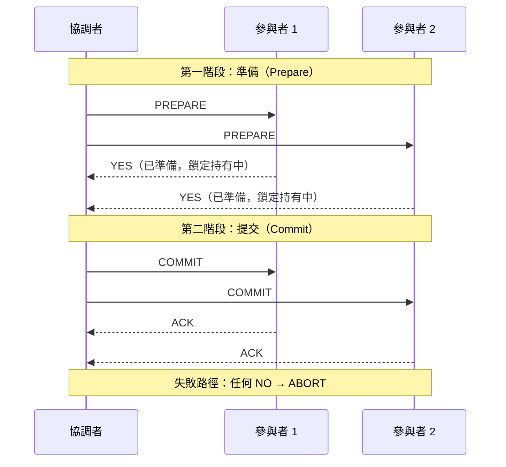
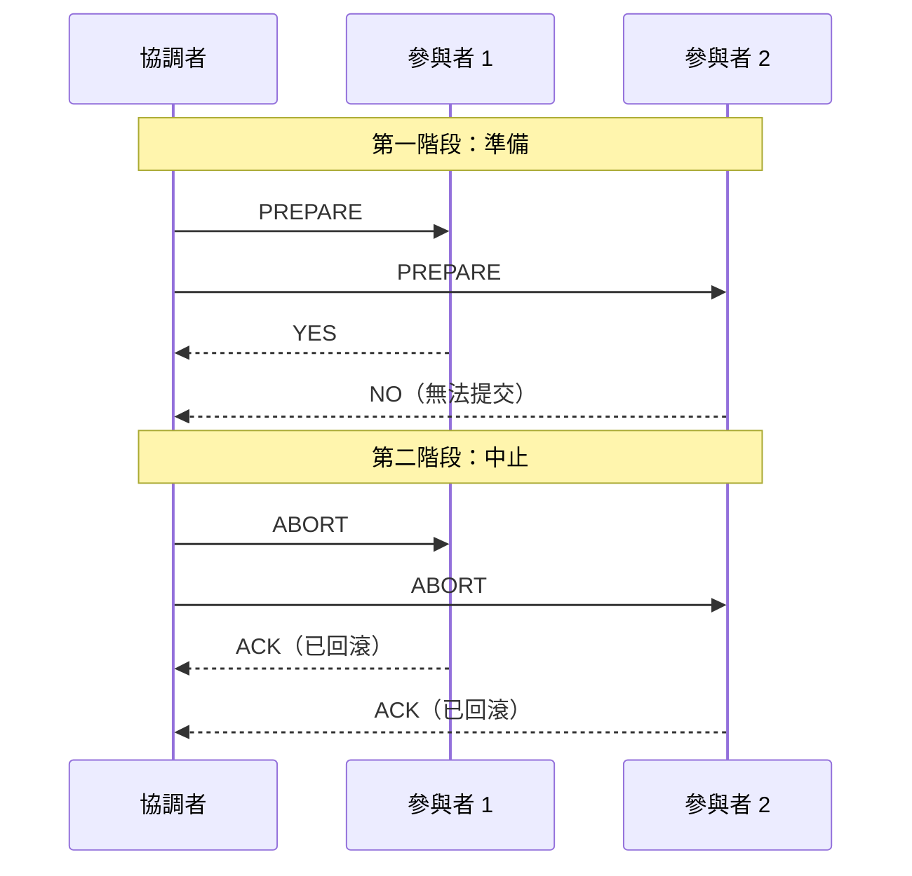

# [BEE-8003] 分散式交易與兩階段提交

:::info
分散式交易在本質上比本地交易困難得多。兩階段提交讓你在跨節點之間達成原子性——但代價是可用性、效能與營運複雜度。在使用它之前，請先理解其取捨。
:::

## 背景

在單一資料庫內，交易相對直觀：資料庫引擎在同一個地方管理鎖定、預寫日誌與回滾，且共享一致的時鐘。一旦交易必須橫跨兩個資料庫、兩個服務，或是一個資料庫加一個訊息代理，規則就完全不同了。

三個問題讓分散式交易在本質上更困難：

**沒有共享時鐘。** 分散式系統中沒有全域性的「現在」。每個節點都有自己的時鐘，且時鐘會漂移。判斷跨節點事件的先後順序需要明確的協調，而不是單靠時間戳記。

**網路分區。** 訊息可能延遲、重複或遺失。一個停止回應的參與者可能已崩潰，也可能仍在運行並已提交——從外部無法分辨。

**部分失敗。** 在本地交易中，資料庫要嘛整體提交，要嘛回滾。跨節點時，節點 A 可能已提交，而節點 B 卻無法連線。系統陷入分裂狀態，且沒有自動解決機制。

這些不是某個實作的缺陷——它們是分散式系統的基本屬性，由 CAP 定理以及 Fischer、Lynch 和 Paterson 的研究（FLP 不可能定理）所描述。任何承諾跨節點原子性的協議，都必須明確選擇在這些故障模式發生時該如何處理。

## 兩階段提交（2PC）

兩階段提交是跨多個參與者實現原子提交的經典協議。它引入了一個**協調者（coordinator）**來協調決策。

### 協議流程



**若任何參與者投票 NO（或逾時）：**



### 每個階段的作用

**第一階段——準備：**
協調者向所有參與者發送 `PREPARE` 訊息。每個參與者執行工作（寫入資料、取得鎖定）並將所有內容寫入持久儲存，但不提交。然後回覆 `YES`（準備好提交）或 `NO`（無法提交）。投票 `YES` 是一個承諾：如果收到指示，參與者將提交，並持有所有必要的鎖定直到收到最終決策。

**第二階段——提交或中止：**
若所有參與者都投票 `YES`，協調者將提交記錄寫入自身的持久日誌，然後向所有參與者發送 `COMMIT`。若任何參與者投票 `NO`，協調者發送 `ABORT`。參與者套用決策並釋放鎖定。

協調者在發送 `COMMIT` 前的日誌寫入是關鍵時刻——這是不可逆轉的節點。

### 為何 2PC 會造成阻塞

2PC 被稱為**阻塞協議**，原因在於第一階段完成後、第二階段發出之前，協調者崩潰時會發生什麼事。

參與者現在處於**不確定狀態（in-doubt state）**：他們已投票 `YES`、持有鎖定，卻不知道協調者決定提交還是中止。他們無法單方面提交（協調者可能決定中止），也無法單方面中止（協調者可能決定提交，且其他參與者可能已套用提交）。他們只能等待。

直到協調者恢復，或選出具備協調者日誌存取權的新協調者，參與者都會無限期持有鎖定。任何需要這些資料列的其他交易都會被阻塞。這不是某個實作的錯誤——這是在最糟糕時刻發生協調者故障時，2PC 協議可以被證明的必然結果。

## XA 交易

XA 是由 X/Open 標準（現為 The Open Group）定義的 2PC 標準介面。它指定了交易管理器（協調者）如何使用 `xa_prepare`、`xa_commit` 和 `xa_rollback` 呼叫與資源管理器（資料庫、訊息代理）通訊。

在 Java 生態系統中，XA 透過 Java Transaction API（JTA）暴露。JBoss 和 WebLogic 等應用伺服器歷史上使用 JTA/XA 來協調單一部署中跨多個資料庫的交易。

**為何 XA 在現代微服務中很少使用：**

- XA 要求所有參與者都能被同一個交易管理器存取。在分散式微服務架構中，服務獨立擁有各自的資料庫——沒有共享的交易管理器。
- XA 驅動程式增加了延遲與複雜度。並非所有資料庫都完整支援 XA，且某些驅動程式的 XA 支援在崩潰復原方面存在已知問題。
- 效能成本相當顯著。由於同步協調和兩個階段之間的鎖定保留，XA 交易可能比本地交易慢 10 倍。
- 微服務透過 HTTP 或 gRPC 通訊，而不是透過共享的資料庫連線。XA 不適用於服務邊界。

XA 最適合在單一 JVM 或應用伺服器中，多個資源（例如兩個資料庫）必須原子性更新，且都能被同一個交易管理器存取的情況。即使在這個狹窄的使用情境下，saga 模式或 outbox 模式通常也更簡單。

## 實際案例：訂單 + 付款

考慮一個訂單服務和一個付款服務。客戶下訂單：必須保留庫存並收取付款。兩者必須一起成功，否則都不應生效。

### 天真的方法（錯誤的）

```
// 訂單服務
POST /orders          → 建立訂單，status=pending
POST /payments/charge → 向客戶收費

// 若收費失敗：訂單停留在 status=pending，沒有付款
// 若收費後網路失敗：付款已收取，訂單建立遺失
// 沒有回滾，沒有補償
```

這會失敗，因為兩個 HTTP 呼叫是獨立的。它們之間的任何失敗都會讓系統處於不一致狀態。

### 2PC 方法

```
協調者（例如訂單服務或專用協調者）：

1. PREPARE → 訂單服務：「為訂單 #123 保留庫存」
   訂單服務：寫入保留記錄到資料庫、持有鎖定、回覆 YES

2. PREPARE → 付款服務：「為訂單 #123 保留 $49.99 收費」
   付款服務：驗證信用卡、保留資金、回覆 YES

3. 全部 YES → 協調者記錄 COMMIT 決策

4. COMMIT → 訂單服務：確認保留、釋放鎖定
5. COMMIT → 付款服務：執行收費、釋放保留

若付款服務在步驟 2 回覆 NO：
   ABORT → 訂單服務：釋放保留、捨棄變更
```

這達成了原子性，但需要：能夠在崩潰後存活的協調者、兩個服務中支援 XA 或 2PC 的客戶端，以及在兩個階段網路往返之間保留鎖定。

### Saga 方法（通常更受青睞）

```
1. 訂單服務：建立訂單（status=pending）→ 發出 OrderCreated 事件
2. 付款服務：收到 OrderCreated → 執行收費
   - 成功：發出 PaymentCharged → 訂單服務設定 status=confirmed
   - 失敗：發出 PaymentFailed  → 訂單服務執行補償：
              取消訂單（status=cancelled）、釋放庫存
```

Saga 沒有跨服務鎖定、沒有協調者、沒有阻塞。失敗透過補償交易處理。取捨是系統會短暫不一致（訂單在付款確認前保持 `pending`），且補償邏輯必須明確撰寫。

對於訂單/付款的情境，短暫的不一致是可接受的，saga 是標準推薦做法。詳見 [BEE-8004](saga-pattern.md)。

## Google Spanner 的做法（概念介紹）

Google Spanner 證明了 2PC 可以在全球規模下實作——但只有在大多數團隊永遠無法擁有的專用基礎設施下才行。

Spanner 在內部對分散式交易使用 2PC，但透過兩個機制使其實用：

**TrueTime：** 一個由 Google 資料中心的 GPS 接收器和原子鐘支援的全球同步時鐘 API。TrueTime 暴露有界的不確定性區間：`TT.now()` 回傳 `[earliest, latest]` 而非單一時間戳記。Spanner 利用這點來分配全球一致的提交時間戳記——如果交易 T1 在 T2 開始之前提交，T1 的提交時間戳記保證小於 T2 的。

**基於 Paxos 的參與者群組：** 每個 Spanner 分片都是一個 Paxos 群組，而非單一節點。這意味著 2PC 中的「參與者」本身就是一個複製的共識群組，因此阻塞問題是有界的——參與者故障不會使參與者不可用，因為 Paxos 群組會選出新的領導者。

結果是在全球規模下實現外部一致性（嚴格可序列化）。這是真正的工程成就，但需要多年的基礎設施投資，無法透過在應用程式中加入函式庫來複製。

**教訓：** 2PC 可以在規模下運作，但只有當參與節點本身高度可用（複製，而非單點）且時鐘同步在基礎設施層面解決時才行。

## 何時 2PC 是可接受的

2PC 有其合法的使用案例。預設避免使用，但在以下情況可以考慮：

- **單一資料庫的已準備交易：** PostgreSQL 和 MySQL 都支援 `PREPARE TRANSACTION` / `COMMIT PREPARED`。如果你需要協調一個資料庫寫入與另一個操作（例如，在同一基礎設施中向本地代理發布），資料庫端的已準備交易可以作為提交點。這比跨資料庫 2PC 窄得多。
- **單一應用程式內短暫、低流量的跨資料庫操作：** 由同一應用伺服器管理的兩個資料庫（不是獨立的微服務），使用支援 XA 的驅動程式，且操作在毫秒內完成。鎖定視窗短到阻塞風險可以接受。
- **基礎設施層面的協調：** ETL 管線、批次作業或在受控環境中協調兩個資料庫的資料遷移工具，協調者復原的停機時間是可接受的。

要避免的模式：透過 HTTP 跨獨立部署微服務的 2PC。這結合了 2PC 的所有成本，卻沒有任何使其可容忍的基礎設施支援。

## 2PC 的替代方案

| 模式 | 一致性 | 複雜度 | 最適用於 |
|---|---|---|---|
| Saga | 最終一致性 | 中 | 長流程工作流、微服務 |
| Outbox 模式 | 強一致性（單一資料庫內） | 低 | 服務 + 訊息代理原子性 |
| 冪等重試 | 最終一致性 | 低 | 無狀態、可重試的操作 |
| 單一資料儲存 | 強一致性（ACID） | 低 | 當服務邊界可以重新考量時 |

**Outbox 模式**通常是「原子性地寫入資料庫並發布事件」問題的正確答案。在與狀態變更相同的本地交易中，將事件寫入 `outbox` 表。一個獨立的程序輪詢 outbox 並發布到訊息代理。如果發布者失敗，它會重試——事件已經持久寫入。詳見 [BEE-8005](idempotency-and-exactly-once-semantics.md) 了解使消費者安全重試的冪等性技術。

**重新審視服務邊界**是被低估的做法。對分散式交易的需求往往表明兩個服務共享一個業務不變量的所有權。如果訂單保留和付款真的不可分割，請思考它們是否應屬於同一個服務（或至少是同一個資料庫）。

## 常見錯誤

**1. 假設資料庫交易能跨服務運作**

服務 A 資料庫中的 `BEGIN` / `COMMIT` 對服務 B 的資料庫沒有任何影響。用 `try/catch` 包裝兩個 HTTP 呼叫不是交易。它們之間的任何失敗都會讓系統處於不一致狀態，且沒有自動回滾。

**2. 對長時間運行的操作使用 2PC**

2PC 從第一階段結束到協調者發送第二階段，會在所有參與者中持有鎖定。如果第一階段涉及一個需要 2 秒的付款授權，且你有 100 個並發交易，你將同時持有 100 個付款鎖定。在你的系統達到任何有意義的規模之前，鎖定競爭就會扼殺吞吐量。

**3. 2PC 參與者沒有逾時機制**

在嚴格的 2PC 下，投票 `YES` 後從未收到第二階段決策的參與者必須永遠等待。實際上，每個實作都需要一個逾時，超過後參與者要嘛中止（如果安全）要嘛升級給人工操作員。如果你的 2PC 實作沒有逾時和不確定狀態監控，協調者崩潰就會變成無聲的服務中斷。

**4. 忽視「不確定」狀態**

不確定視窗——參與者投票 `YES` 後到協調者發送第二階段之間——是你的資料最脆弱的時刻。如果協調者在此時崩潰，參與者持有鎖定，資料既未提交也未回滾。使用 2PC 的生產系統必須具備檢查和手動解決不確定交易的工具。這個營運負擔往往被低估。

**5. 在選用 2PC 之前不考慮替代方案**

2PC 往往因為感覺像是一致性的「安全」選擇而被採用。在大多數微服務情境中，outbox 模式加上冪等性加上 saga 可以涵蓋 95% 的使用案例，且營運風險更低。請先評估這些方案。

## 原則

兩階段提交提供了跨分散式參與者的原子提交，但它是一個阻塞協議：協調者故障會讓參與者持有鎖定，陷入無法解決的不確定狀態。只在具備支援 XA 資源且鎖定視窗短暫的單一應用伺服器內使用 2PC。對於微服務中的跨服務協調，工作流程優先使用 saga 模式，服務對代理的原子性優先使用 outbox 模式。在加入任何分散式交易協議之前，先驗證服務邊界本身是否才是問題根源。

## 相關 BEPs

- [BEE-8001: ACID 屬性](acid-properties.md) -- 單一資料庫內交易語義的基礎
- [BEE-8004: Saga 模式](saga-pattern.md) -- 作為 2PC 實際替代方案的補償交易
- [BEE-8005: 冪等性與恰好一次語義](idempotency-and-exactly-once-semantics.md) -- 使分散式操作安全重試
- [BEE-8006: 最終一致性模式](eventual-consistency-patterns.md) -- 以強一致性換取可用性

## 參考資料

- [Two-Phase Commit Protocol](https://en.wikipedia.org/wiki/Two-phase_commit_protocol), Wikipedia
- Martin Fowler, ["Two-Phase Commit"](https://martinfowler.com/articles/patterns-of-distributed-systems/two-phase-commit.html), Patterns of Distributed Systems
- Martin Kleppmann, [*Designing Data-Intensive Applications*, Chapter 9: Consistency and Consensus](https://www.oreilly.com/library/view/designing-data-intensive-applications/9781491903063/), O'Reilly Media, 2017
- [Spanner: TrueTime and External Consistency](https://cloud.google.com/spanner/docs/true-time-external-consistency), Google Cloud Documentation
- Corbett et al., ["Spanner: Google's Globally Distributed Database"](https://research.google/pubs/archive/39966.pdf), OSDI 2012
- [Transactions Across Microservices](https://www.baeldung.com/transactions-across-microservices), Baeldung
